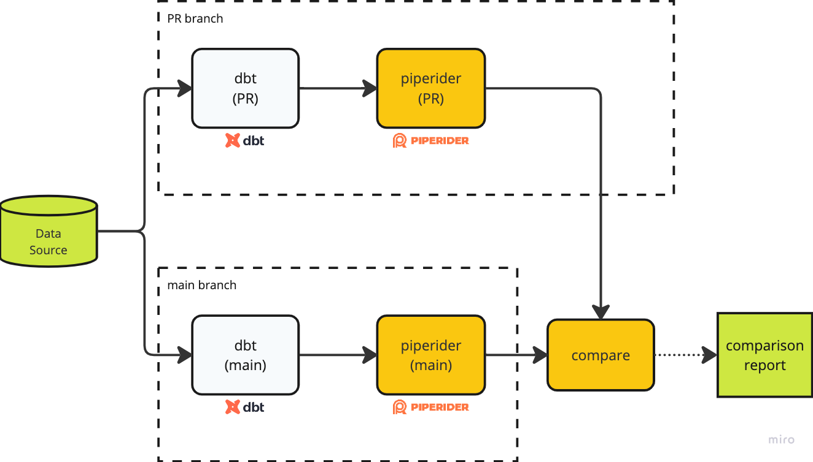

# &#x20;Example

The concept of using PipeRider with your CI process is based on PR (pull request) review.&#x20;

The following CI examples use dbt's [Jaffle Shop](https://github.com/InfuseAI/jaffle\_shop) project to demonstrate how PipeRider can integrate with your CI process.&#x20;


Example project of how PipeRider can integrate with your CI procress


## Compare the Pull Requests by PipeRider

<figure><figcaption><p>PipeRider CI procress</p></figcaption></figure>

To better understand the changes to the data pipeline when a pull request is created, you can follow these steps to automatically transform your model changes, profile the data source, and compare the changes between the pull request and main branches.&#x20;

### 1. Setup PipeRider Compare Recipe file

The pipeRider compare feature provides a way to compare two runs based on a pre-defined recipe file. The default recipe file should be located at `.piperider/compare/default.yml`


```yaml
base:
  branch: main
  dbt:
    commands:
    - dbt deps
    - dbt build --target jaffle_shop
  piperider:
    command: piperider run --data-source jaffle_shop
target:
  dbt:
    commands:
    - dbt deps
    - dbt build --target jaffle_shop
  piperider:
    command: piperider run --data-source jaffle_shop
```


### 2. Run PipeRider compare command on the PR branch

The PipeRider compare command will be based on the pre-defined recipe file to compare your PR and main branches.


```bash
piperider compare -o /tmp/piperider/comparison --summary-file /tmp/piperider/comparison/summary.md
```


### 3. Post the data profile diff to your PR comment

The compare feature outputs a Markdown-formatted data profile diff that you can attach to your pull request comment or upload to your own storage.

#### Option 1 - Use PipeRider Compare Action

The PipeRider Compare Action is a GitHub Action that executes compare command appends PR comments, and uploads the result to the artifacts.&#x20;


```yaml
# GitHub workflow snippet
name: PR with PipeRider

on: [pull_request]

jobs:
  piperider-compare:
    runs-on: ubuntu-latest
    permissions:
      pull-requests: write
    steps:
    - uses: actions/checkout@v3

    - name: PipeRider Compare
      uses: InfuseAI/piperider-compare-action@v1
        
```


#### Option 2 - Use your own script

Upload the Markdown file and the comparison report to your own storage using your own script, if required.


```bash
post-comparison-summary.sh /tmp/piperider/comparison/summary.md

upload-comparison-report.sh /tmp/piperider/comparison
```


### View the example PR job on GitHub


Example PR Job on GitHub

