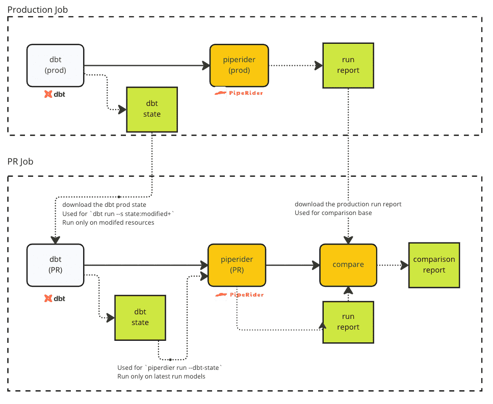
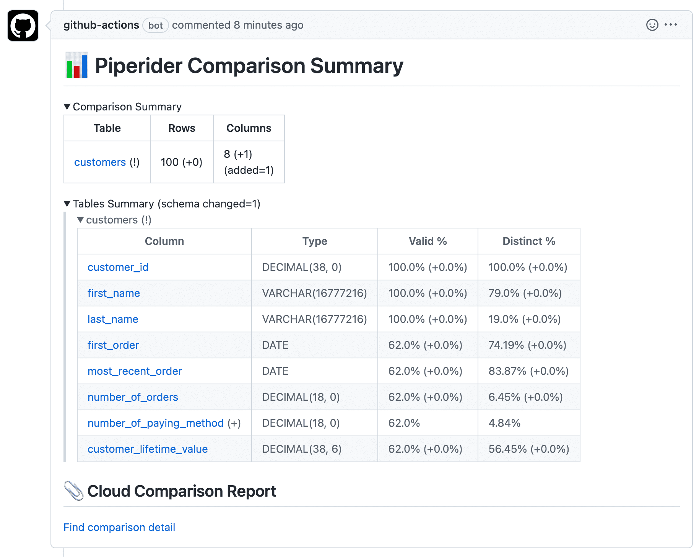

# Advanced Example (Slim CI)

Once you have a data project with many models, and a pull request only involves changing a subset of them, building all models may cost more time and computation than is necessary. This is where the concept of [Slim CI](https://docs.getdbt.com/guides/legacy/best-practices#run-only-modified-models-to-test-changes-slim-ci) comes in useful. &#x20;

In this Advanced CI workflow setup, we take the advantage of dbt 'state' to prevent unnecessary transformations. Like the [Basic Example](basic-example.md), the Slim CI version has a Production and PR workflow, however, this time dbt 'state' is used to ensure only changed models are transformed and profiled.

<figure><figcaption><p>PipeRider Slim CI Workflows</p></figcaption></figure>

## Production Job

In this daily job that transforms source data into transformed models, PipeRider takes advantage of dbt state to determine which tables to profile.

If you a dbt Cloud and PipeRider Cloud user, follow Option 1 in the steps below to utilize storage from these services. Alternatively, follow Option 2 to use your own storage.

If you choose to use your own storage, here is a good article that explains [how to use Google Cloud Storage wth dbt core](https://www.vantage-ai.com/blog/how-to-use-slim-ci-with-dbt-core). &#x20;

### 1. Run dbt on the Production environment and upload state

#### Option 1 - Use dbt Cloud

```bash
dbt-cloud job run --wait --file response.json
run_id=$(cat response.json | jq -r '.data.id')
```

#### Option 2 - Use your own script to upload to your storage

Run `dbt build` and store the state locally.

```bash
dbt build --target prod --target-path target/
upload-prod-dbt-state.sh target/
```

### 2. Run PipeRider and upload report

#### Option 1 - use PipeRider Cloud

Get the artifacts from the dbt job.&#x20;

```
mkdir -p target
dbt-cloud run get-artifact --run-id $run_id --path manifest.json -f target/manifest.json
dbt-cloud run get-artifact --run-id $run_id --path run_results.json -f target/run_results.json
```

Log into PipeRider Cloud, run PipeRider against the downloaded dbt target, then upload the report to PipeRider Cloud.

```
piperider cloud login --token <PIPERIDER_CLOUD_TOKEN> --disable-auto-upload
piperider run \
  --datasource jaffle_shop \
  --dbt-state target \
  -o /tmp/piperider
piperider cloud upload-report --run /tmp/piperider/run.json
```

#### Option 2 - Use your own storage

Run PipeRider against the locally stored dbt state, and then upload the report to your own storage.

```bash
piperider run \
  --data-source jaffle_shop  \
  --dbt-state target/ \
  -o /tmp/piperider
upload-prod-report.sh /tmp/piperider
```

### View the Production Slim CI job on GitHub


Production Slim CI Job on Github



## PR Job

This job is triggered when a pull request is created.

### 1. Download dbt state and run dbt on the PR environment

Down the production job dbt state and use that to build only the modified models in the PR environment.

#### Option 1 - Use dbt Cloud

Download the state from dbt Cloud.

```bash
dbt-cloud job run \
  --git-branch <PR Branch> \
  --schema-override <PR SCHEMA> \
  --wait \
  --file response.json
run_id=$(cat response.json | jq -r '.data.id')
```

#### Option 2 - Download from your own storage

Use your own script to download the state from your storage.

```bash
download-prod-dbt-state.sh /tmp/dbt/prod
dbt build
--target pr
-s state:modified+
--defer
--state /tmp/dbt/prod --target-path target/
```

### 2. Run PipeRider on the PR environment

#### Option 1 - Download the dbt artifacts from dbt Cloud and run PipeRider

```bash
mkdir -p target
dbt-cloud run get-artifact --run-id $run_id --path manifest.json -f target/manifest.json
dbt-cloud run get-artifact --run-id $run_id --path run_results.json -f target/run_results.json
piperider run --datasource jaffle_shop_pr --dbt-state target/ -o /tmp/piperider/pr

```

#### Option 2 - Run PipeRider on the state downloaded from your own storage

```
piperider run \
  --data-source jaffle_shop_pr \
  --dbt-state target/ \
  -o /tmp/piperider/pr
```

### 3. Compare the Production and PR reports

Compare data profile reports from Production and PR environments on PipeRider Cloud, or locally.

#### Option 1 - Compare reports on PipeRider Cloud

Since PipeRider v0.16.0, it is possible to create comparison reports on PipeRider Cloud without needing to first download the base report.

Specify the `datasource` names for  `--base` and `--target` , and the summary.md file will be downloaded to the specified location.

```
piperider cloud compare-reports \
  --base datasource:jaffle_shop \
  --target datasource:jaffle_shop_pr \
  --summary-file /tmp/piperider/comparison/summary.md \
  --tables-from target-only
```

#### Option 2 - Download the Production report to compare reports locally

It is also possible to download the `--base` (production) report from your own storage and compare it locally.&#x20;

```bash
download-prod-report.sh /tmp/piperider/prod

piperider compare-reports \
  --base /tmp/piperider/prod/run.json \
  --target /tmp/piperider/pr/run.json \
  -o /tmp/piperider/comparison
```

### 4. Post the data profile diff to your PR comment

#### Option 1 - Use a 3rd-party Action

```
# GitHub workflow snippet
- name: Create PR Comment
      uses: peter-evans/create-or-update-comment@v2.1.0
      with:
        issue-number: ${{ github.event.number }}
        body-file: /tmp/piperider/comparison/summary.md
```

#### Option 2 - Use your own script

```
post-comparison-summary.sh /tmp/piperider/comparison/summary.md
```

### 5. Store the Comparison Report

In addition to the data profile diff Markdown file, PipeRider also outputs a full comparison report. As above, you can as store this as an artifact, or upload to your own storage.

#### Option 1 - Store the comparison on PipeRider cloud

If the comparison report was created using PipeRider Cloud, then the report will be immediately available to view in your account on the PipeRider Cloud website.

The comparison summary that was generated in the previous step, and added to the PR comment, also contains deep links to the corresponding report pages on PipeRider Cloud.

<figure><figcaption><p>PipeRider data profile comparison summary</p></figcaption></figure>

#### Option 2 - Upload to your own storage

Use your own script to upload the comparison report to your own storage.

```
upload-comparison-report.sh /tmp/piperider/comparison
```

### View the Slim CI PR Job on GitHub&#x20;


PR Slim CI Job on GitHub

