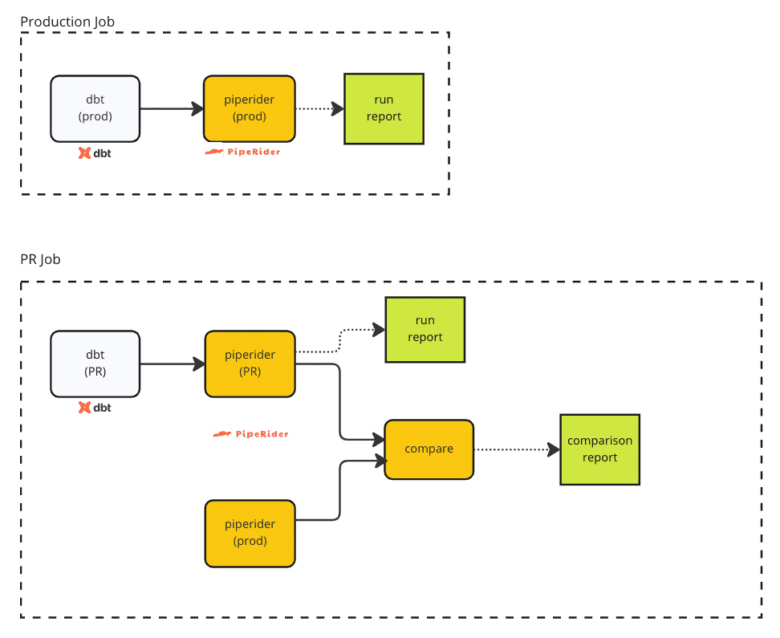

# Basic Example

The basic example has two workflows:

* **Production Job** - A daily CI job that builds the models, runs PipeRider, and then attaches the PipeRider data profile report as an artifact (or uploads to your own data storage).
* **PR Job** - A CI job that is triggered when a pull request is created and builds the models, runs PipeRider on both production _and_ pr environments, then attaches or uploads the comparison report

<figure><figcaption><p>PipeRider CI Process</p></figcaption></figure>

## Production Job

The steps for running PipeRider and creating a data profile report for the production environment are as follows.

### 1. Run dbt on the Production environment

Run `dbt build`, specifying the the production environment.

```bash
dbt build --target prod
```

### 2. Run PipeRider on the Production environment

Run PipeRider specifying the output location as `/tmp/piperider`


```bash
piperider run --data-source jaffle_shop -o /tmp/piperider
```


### 3. Store the PipeRider data profile report

If you used GitHub, there are lots of convenient actions that could empower your workflow.

#### Option 1 - Store the report as a GitHub Action artifact

For example, we can upload the reports as an [Actions artifact](https://docs.github.com/en/actions/using-workflows/storing-workflow-data-as-artifacts).

```yaml
# GitHub workflow snippet
- name: Create run artifact
      run: zip -r run-report.zip /tmp/piperider

- name: Upload profiling result
      uses: actions/upload-artifact@v3
      with:
        name: run-report-artifact
        path: run-report.zip
```

#### Option 2 - Upload to your own storage

Alternatively, you could write your own script to upload the report to your own storage.

```
your-upload-script.sh /tmp/piperider
```

### View the example Production job on GitHub:


Example Daily Production Job on GitHub


## PR Job

The PR job is trigger when a pull request is created. The following steps will help you transform your model changes, profile the data source and compare the staging environment and production environments automatically.

### 1. Run dbt on the PR environment

```bash
dbt build --target pr
```

### 2. Run PipeRider on the PR environment


```bash
piperider run --data-source jaffle_shop_pr -o /tmp/piperider/pr
```


### 3. Run PipeRider on the Production environment


```
piperider run --data-source jaffle_shop -o /tmp/piperider/prod
```


### 4. Compare the data profile reports from PR and Production

Use PipeRider's compare reports feature to generate a data profile comparison report for the PR and Production environments.

```bash
piperider compare-reports \
         --base /tmp/piperider/prod/run.json \
         --target /tmp/piperider/pr/run.json \
         -o /tmp/piperider/comparison
```

### 5. Post the data profile diff to your PR comment

The compare reports feature outputs a Markdown formatted data profile diff that you can attach to your pull request comment, or upload to your own storage.

#### Option 1 - Use a 3rd-party Action&#x20;

Use a 3rd-party action to help with this task, or build your own solution based on your requirements.


```yaml
# GitHub workflow snippet
- name: Create PR Comment
      uses: peter-evans/create-or-update-comment@v2.1.0
      with:
        issue-number: ${{ github.event.number }}
        body-file: /tmp/piperider/comparison/summary.md
```


#### Option 2 - Use your own script

Upload the Markdown file to your own storage usding your own script, if required.


```
post-comparison-summary.sh /tmp/piperider/comparison/summary.md
```


### 6. Store the Comparison Report

In addition to the data profile diff Markdown file, PipeRider also outputs a full comparison report. As above, you can as store this as an artifact, or upload to your own storage.

#### Option 1 - Store the comparison report as a GitHub action artifact

```
# GitHub workflow snippet
- name: Create run artifact
      run: zip -r comparison-report.zip /tmp/piperider/comparison

- name: Upload profiling result
      uses: actions/upload-artifact@v3
      with:
        name: comparison-report-artifact
        path: comparison-report.zip
```

#### Option 2 - Upload to your own storage

Use your own script to upload the comparison report to your own storage.

```
upload-comparison-report.sh /tmp/piperider/comparison
```

### View the example PR job on GitHub


Example PR Job on GitHub


