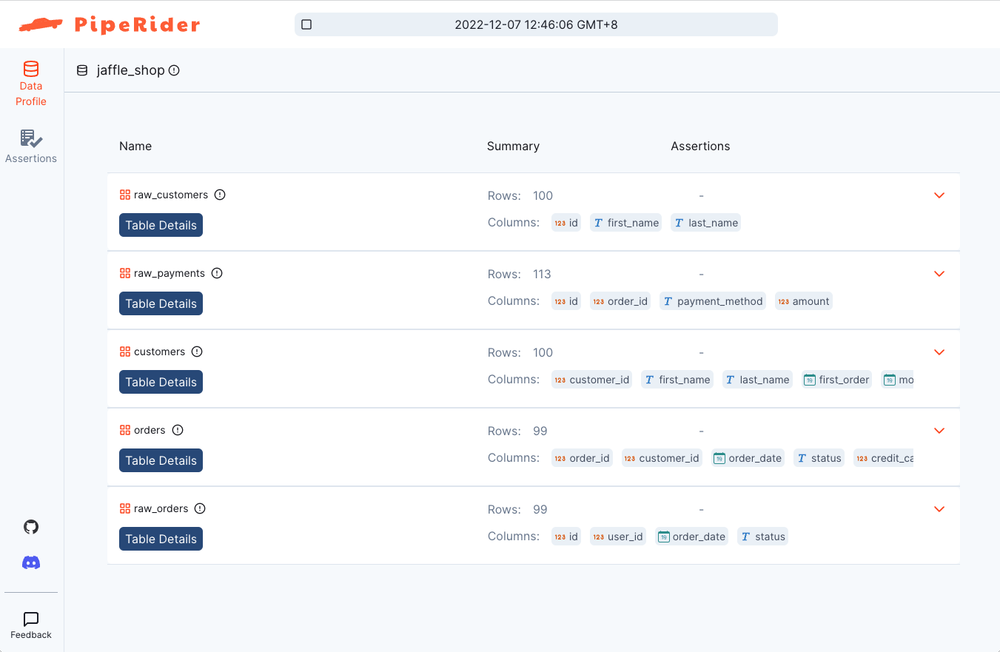
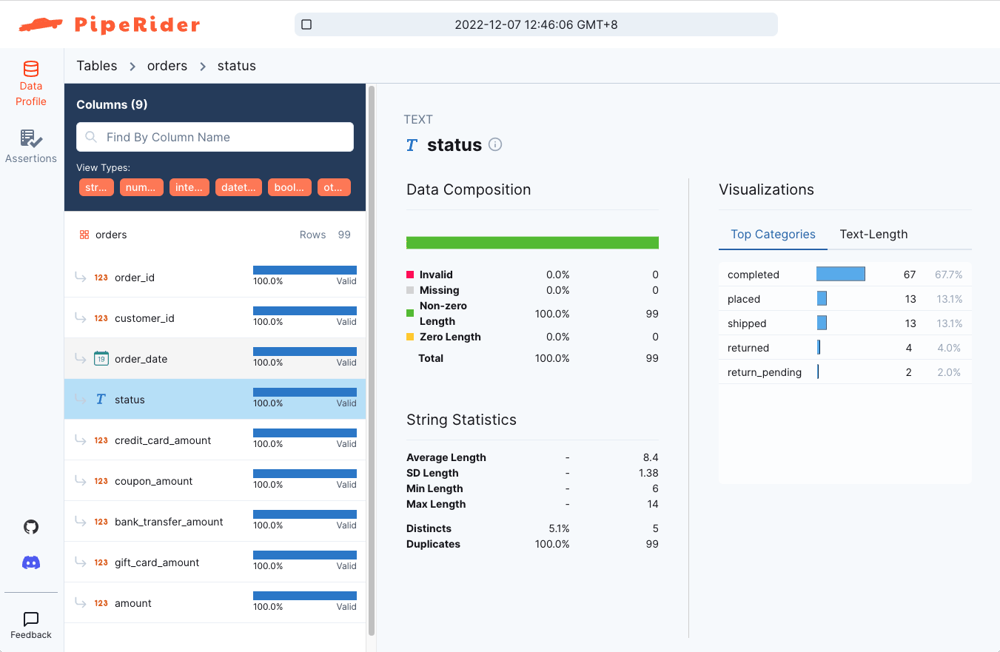
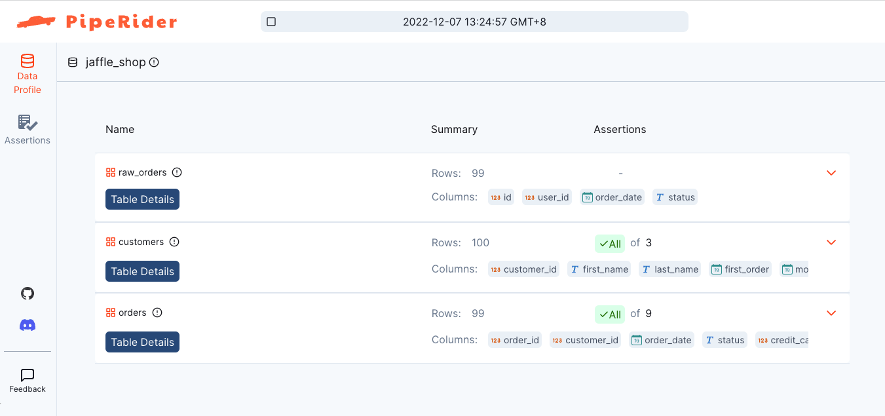
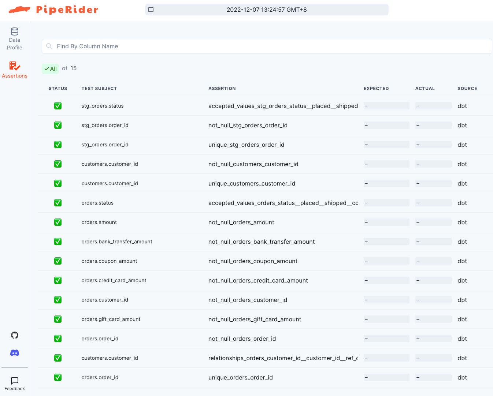
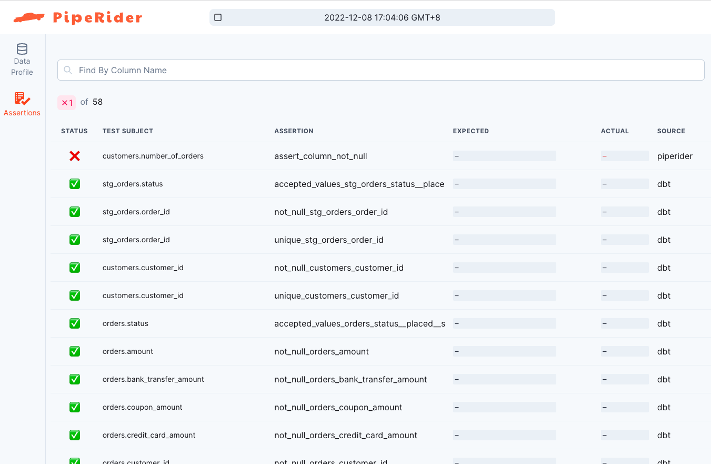

# dbt Integration

Data transformations are an integral part of the modern data stack. Through PipeRider's integration with [dbt](https://www.getdbt.com/), you can run data quality checks against your transformed data and ELT pipeline. PipeRider auto-detects your dbt data warehouse settings, so no extra configuration is required.

This guide demonstrates how to use PipeRider with a dbt project by using dbt’s [Jaffle Shop](https://github.com/dbt-labs/jaffle\_shop) repository as an example. In this guide you will do the following:

1. [Configure the Jaffle Shop project](./#1.-configure-the-jaffle-shop-project)
2. [Install and add PipeRider to the Jaffle Shop project](./#2.-install-and-add-piperider-to-the-jaffle-shop-project)
3. [Run PipeRider to generate a data profile report](./#3.-run-piperider-to-generate-a-data-profile-report)
4. [Use dbt node selection with PipeRider](./#4.-use-dbt-node-selection-with-piperider)
5. [Next step: Data assertions](./#5.-next-step-data-assertions)

## 1. Configure the Jaffle Shop project

dbt Labs provide the Jaffle Shop project as a way to quickly get up and running with a dbt project. This project also serves as a convenient example to demonstrate how to use PipeRider inside a non-production dbt project.

Follow the ‘[Running this project](https://github.com/dbt-labs/jaffle\_shop#running-this-project)’ instructions in the [Jaffle shop](https://github.com/dbt-labs/jaffle\_shop) repository to install and configure the dbt project.

Once configured, or if you already have a dbt project you want to use, proceed to step #2.

## 2. Install and add PipeRider to the Jaffle Shop project

PipeRider supports many data sources through connectors. For a full list, please refer to [Supported Data Sources](../supported-data-sources/).

### Install PipeRider

Install PipeRider with the required connector for the data source you used to configure the Jaffle Shop project in step #1.

For example, to install PipeRider with the Snowflake connector, you would use the following command:

```bash
pip install -U 'piperider[snowflake]'
```

### Initialize PipeRider

Ensure you are inside the Jaffle Shop project directory, and then run the following command to initialize a new PipeRider project.

```bash
piperider init
```

PipeRider will auto-detect the dbt project settings and display the contents of  your PipeRider configuration file, located at `.piperider/config.yml`

```
$ piperider init
Initialize piperider to path /path/to/jaffle-shop/.piperider
[ DBT ] Use the existing dbt project file: /path/to/jaffle-shop/dbt_project.yml
────────────────────────────────────────────── .piperider/config.yml ───────────────────────────────────────────────
   1 dataSources:
   2 - name: jaffle_shop
   3   type: postgres
   4   dbt:
   5     profile: jaffle_shop
   6     target: dev
   7     projectDir: .
   8
   9 profiler:
  10 #   table:
  11 #     # the maximum row count to profile. (Default unlimited)
  12 #     limit: 1000000
  13 #     duplicateRows: false
  14
  15 # The tables to include/exclude
  16 # includes: []
  17 # excludes: []
  18
  19 # tables:
  20 #   my-table-name:
  21 #     # description of the table
  22 #     description: "this is a table description"
  23 #     columns:
  24 #       my-col-name:
  25 #         # description of the column
  26 #         description: "this is a column description"
  27
  28 telemetry:
  29   id: abc123
  30

Next step:
  Please execute command 'piperider diagnose' to verify configuration
```


See [config.yml](../project-structure/config.yml.md) for details of available settings


### Verify PipeRider configuration

Ensure that PipeRider can connect to the data source by running the `diagnose` command.

```bash
piperider diagnose
```

```
$ piperider diagnose
Diagnosing...
PipeRider Version: 0.14.0
Check config files:
  /path/to/jaffle-shop/.piperider/config.yml: [OK]
✅ PASS

Check format of data sources:
  jaffle_shop: [OK]
✅ PASS

Check connections:
  DBT: postgres > jaffle_shop > dev [OK]
  Name: jaffle_shop
  Type: postgres
  connector: [OK]
  Available Tables: ['raw_customers', 'orders', 'raw_orders', 'raw_payments', 'customers']
  Connection: [OK]
✅ PASS

Check assertion files:
✅ PASS

🎉 You are all set!


Next step:
  Please execute command 'piperider run' to generate your first report
```

If everything is configured corrected you’ll see the 'You are all set!’ message.

## 3. Run PipeRider to generate a data profile report

Run PipeRider to profile the data source and create your first HTML report:

```bash
piperider run
```

PipeRider will profile the available tables and output the link for the HTML report.

```
$ piperider run
DataSource: jaffle_shop
──────────────────────────────────────────────────── Validating ────────────────────────────────────────────────────
everything is OK.
──────────────────────────────────────────────────── Profiling ─────────────────────────────────────────────────────
Fetch metadata  ━━━━━━━━━━━━━━━━━━━━━━━━━━━━━━━━━━━━━━━━━━━━━━━━━━━━━━━━━━━━━━━━━━━━━━━━━━━━━━━━   5/5 0:00:00

[1/5] raw_customers ━━━━━━━━━━━━━━━━━━━━━━━━━━━━━━━━━━━━━━━━━━━━━━━━━━━━━━━━━━━━━━━━━━━━━━━━━━━━━━━━   3/3 0:00:00
[2/5] raw_payments  ━━━━━━━━━━━━━━━━━━━━━━━━━━━━━━━━━━━━━━━━━━━━━━━━━━━━━━━━━━━━━━━━━━━━━━━━━━━━━━━━   4/4 0:00:00
[3/5] customers     ━━━━━━━━━━━━━━━━━━━━━━━━━━━━━━━━━━━━━━━━━━━━━━━━━━━━━━━━━━━━━━━━━━━━━━━━━━━━━━━━   7/7 0:00:00
[4/5] orders        ━━━━━━━━━━━━━━━━━━━━━━━━━━━━━━━━━━━━━━━━━━━━━━━━━━━━━━━━━━━━━━━━━━━━━━━━━━━━━━━━   9/9 0:00:00
[5/5] raw_orders    ━━━━━━━━━━━━━━━━━━━━━━━━━━━━━━━━━━━━━━━━━━━━━━━━━━━━━━━━━━━━━━━━━━━━━━━━━━━━━━━━   4/4 0:00:00
───────────────────────────────────────────────────── Summary ──────────────────────────────────────────────────────

  Table Name      #Columns Profiled   #Tests Executed   #Tests Failed
 ━━━━━━━━━━━━━━━━━━━━━━━━━━━━━━━━━━━━━━━━━━━━━━━━━━━━━━━━━━━━━━━━━━━━━
  raw_customers                   3                 0               0
  raw_payments                    4                 0               0
  customers                       7                 0               0
  orders                          9                 0               0
  raw_orders                      4                 0               0

Generating reports from: /path/to/jaffle-shop/.piperider/outputs/latest/run.json
Report generated in /path/to/jaffle-shop/.piperider/outputs/latest/index.html

Next step:
  Please execute command 'piperider run' to generate your second report
```

The report contains detailed data profile metrics for each of the profiled tables.&#x20;

<figure><figcaption><p>PipeRider Jaffle Shop Report Overview</p></figcaption></figure>

<figure><figcaption><p>PipeRider Jaffle Shop Data Profile Sample</p></figcaption></figure>

## 4. Use dbt node selection with PipeRider

PipeRider supports profiling and testing dbt 'state', so it’s possible to use node selection to build and then run PipeRider on a subset of resources.

### Build a subset of resources

Use dbt node selection to select and build a sub-set of resources.

```bash
dbt build -s raw_orders+
```

dbt will seed, build, and test the `raw_orders` table and any children.

### Run PipeRider on the dbt state

Run PipeRider again, this time specifying the location of the dbt state (the default folder for dbt artifacts is `target`).

```bash
piperider run --dbt-state target
```

PipeRider will now only run on the `raw_orders` table, and the two child models, `customers` and `orders`.

```
$ piperider run --dbt-state target
DataSource: jaffle_shop
─────────────────────────────────────────────────── Validating ───────────────────────────────────────────────────
everything is OK.
─────────────────────────────────────────────────── Profiling ────────────────────────────────────────────────────
Fetch metadata  ━━━━━━━━━━━━━━━━━━━━━━━━━━━━━━━━━━━━━━━━━━━━━━━━━━━━━━━━━━━━━━━━━━━━━━━━━━━━━━━━   3/3 0:00:00

[1/3] raw_orders    ━━━━━━━━━━━━━━━━━━━━━━━━━━━━━━━━━━━━━━━━━━━━━━━━━━━━━━━━━━━━━━━━━━━━━━━━━━━━━━━━   4/4 0:00:00
[2/3] customers     ━━━━━━━━━━━━━━━━━━━━━━━━━━━━━━━━━━━━━━━━━━━━━━━━━━━━━━━━━━━━━━━━━━━━━━━━━━━━━━━━   7/7 0:00:00
[3/3] orders        ━━━━━━━━━━━━━━━━━━━━━━━━━━━━━━━━━━━━━━━━━━━━━━━━━━━━━━━━━━━━━━━━━━━━━━━━━━━━━━━━   9/9 0:00:00
─────────────────────────────────────────────── Assertion Results ────────────────────────────────────────────────
────────────────────────────────────────────────────── dbt ───────────────────────────────────────────────────────

  Status     Test Subject                  Assertion                                                     Message
 ────────────────────────────────────────────────────────────────────────────────────────────────────────────────
  [  OK  ]   stg_orders.status             accepted_values_stg_orders_status__placed__shipped__comple…
  [  OK  ]   stg_orders.order_id           not_null_stg_orders_order_id
  [  OK  ]   stg_orders.order_id           unique_stg_orders_order_id
  [  OK  ]   customers.customer_id         not_null_customers_customer_id
  [  OK  ]   customers.customer_id         unique_customers_customer_id
  [  OK  ]   orders.status                 accepted_values_orders_status__placed__shipped__completed_…
  [  OK  ]   orders.amount                 not_null_orders_amount
  [  OK  ]   orders.bank_transfer_amount   not_null_orders_bank_transfer_amount
  [  OK  ]   orders.coupon_amount          not_null_orders_coupon_amount
  [  OK  ]   orders.credit_card_amount     not_null_orders_credit_card_amount
  [  OK  ]   orders.customer_id            not_null_orders_customer_id
  [  OK  ]   orders.gift_card_amount       not_null_orders_gift_card_amount
  [  OK  ]   orders.order_id               not_null_orders_order_id
  [  OK  ]   customers.customer_id         relationships_orders_customer_id__customer_id__ref_custome…
  [  OK  ]   orders.order_id               unique_orders_order_id

──────────────────────────────────────────────────── Summary ─────────────────────────────────────────────────────
────────────────────────────────────────────────────── dbt ───────────────────────────────────────────────────────

  Table Name   #DBT Tests Executed   #DBT Tests Failed
 ━━━━━━━━━━━━━━━━━━━━━━━━━━━━━━━━━━━━━━━━━━━━━━━━━━━━━━
  stg_orders                     3                   0
  customers                      3                   0
  orders                         9                   0

─────────────────────────────────────────────────── PipeRider ────────────────────────────────────────────────────

  Table Name   #Columns Profiled   #Tests Executed   #Tests Failed
 ━━━━━━━━━━━━━━━━━━━━━━━━━━━━━━━━━━━━━━━━━━━━━━━━━━━━━━━━━━━━━━━━━━
  raw_orders                   4                 0               0
  customers                    7                 0               0
  orders                       9                 0               0

Generating reports from: /path/to/jaffle-shop/.piperider/outputs/latest/run.json
Report generated in  /path/to/jaffle-shop/.piperider/outputs/latest/index.html
```

### View report and dbt test results

The resulting report contains the data profile for the three resources on the node we specified in the last step.

<figure><figcaption><p>PipeRider Report based on dbt State</p></figcaption></figure>

The Assertions tab also contains the dbt test results.

<figure><figcaption><p>PipeRider Report with dbt Test Results</p></figcaption></figure>

## 5. Next step: Data assertions

In addition to showing dbt test results on the PipeRider report, PipeRider also features its own suite of data assertions.

### Recommended assertions

To save time writing data assertions from scratch, you can use the `generate-assertions` command to auto-generate assertions based on the current state of the data.

Use the following command to generate assertions for your project:

```bash
piperider generate-assertions
```

Assertion files are stored in `.piperider/assertions` and are named according to table. If the `generate-assertions` command was used, assertion files will be prepended with `recommended_`.

### Edit assertions

If you ran PipeRider now, the assertions would all pass, so we'll first make a change to one of the assertions.

The `customers` model has some entries for customers without any orders. These rows have `null` values in the order related columns. Let's pretend that we only wanted customers who had actually placed an order to appear in this table, so we can add an assertion to alert us if any customers have zero (null) orders.

Open `.piperider/recommended_customers.yml` in your text editor.

Find the `number_of_orders` table, it should look like this:

```bash
number_of_orders:
  tests:
  - name: assert_column_schema_type
    assert:
      schema_type: BIGINT
    tags:
    - RECOMMENDED
```

Add a new test to assert that this **column must not be null:**

```bash
number_of_orders:
  tests:
  - name: assert_column_schema_type
    assert:
      schema_type: BIGINT
    tags:
    - RECOMMENDED
  - name: assert_column_not_null
```

Save the file.

#### Run PipeRider

Now that you have edited the assertions to better meet your needs, run PipeRider again.

```bash
piperider run --dbt-state target
```

This time, because assertion files exist, PipeRider will profile the data source _and_ test it against the data assertions we edited in the last step.

The generated report will show the failed assertion at the top.

<figure><figcaption><p>PipeRider Report with Failed Assertion</p></figcaption></figure>

Check the [Data Quality Assertions](../data-quality-assertions/) section for more information on PipeRider's suite of data assertions.

