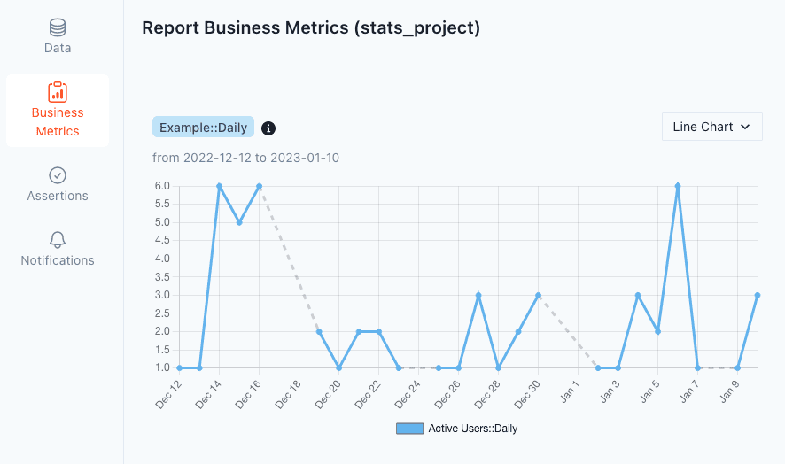
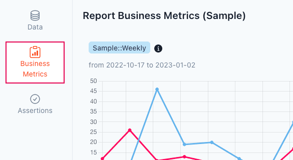
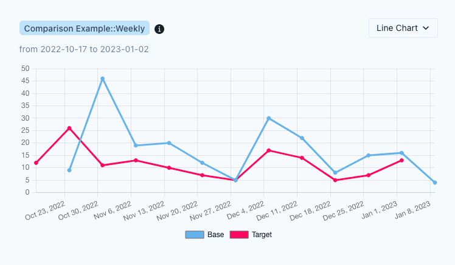

# Metrics

[dbt Metrics](https://docs.getdbt.com/docs/build/metrics) provide a way to track key business metrics as time series data. Using PipeRider reports you can now visualize your time-series business metrics and compare metrics to different reports.&#x20;

<figure><figcaption><p>Example of dbt metrics in PipeRider report</p></figcaption></figure>

### Expose dbt metrics to PipeRider

For PipeRider to see your metrics, you must add the `piperider` tag to the metric definition yaml file in your dbt project.&#x20;

Add the following line to the metrics you wish to track in PipeRider:.

```
tags: ['piperider']
```

For example:


```yaml
metrics:
  - name: revenue
    label: Revenue
    model: ref('orders')
    description: "The total revenue of our jaffle business"

    calculation_method: sum
    expression: amount 

    timestamp: order_date
    time_grains: [day, week, month, year]
    ...
    ...
    tags: ['piperider']
```


#### Derived metrics

PipeRider also supports querying derived metrics by adding the PipeRider tag, E.g.


```
metrics:
  - name: average_revenue_per_customer
    label: Average Revenue Per Customer
    description: "The average revenue received per customer"

    calculation_method: derived
    expression: "{{metric('total_revenue')}} / {{metric('count_of_customers')}}"
    tags: ['piperider']
```


Now, when you run PipeRider against your dbt state, metrics will be queried and included in your PipeRider report.

```
piperider run --dbt-state target/
```

### View metrics in your PipeRider Report

Metrics can be accessed by click the `Business Metrics` icon in the left sidebar of your report.

<figure><figcaption><p>Click the Business Metrics icon to view metric charts</p></figcaption></figure>

### Comparison reports

With PipeRider's compare reports feature, you're also able to compare metrics between reports, which is particularly useful when analyzing the impact of data model changes.

<figure><figcaption><p>Compare metrics</p></figcaption></figure>

### Compatibility

PipeRider supports the follow dbt metric properties.

| Field               | Support                                                 |
| ------------------- | ------------------------------------------------------- |
| name                | yes                                                     |
| model               | yes                                                     |
| label               | yes                                                     |
| description         | yes                                                     |
| calculation\_method | count, count\_distinct, sum, average, min, max, derived |
| expression          | yes                                                     |
| timestamp           | yes                                                     |
| time\_grains        | yes                                                     |
| dimensions          | Dimensions are currently not shown on metric charts     |
| window              | No. Support for 'window' is coming soon                 |


Metrics that use the 'window' property are currently **not** supported and will not be queried. Support for 'window' is will be added in an upcoming release.


### How do metrics affect the number of queries performed?

dbt metric files serve only to _define_ the metrics, the way metrics are queried depends on the application.

PipeRider queries each `time_grain` _except_ `all_time` and, as `dimensions` are currently not considered, this results in a **maximum of 5 queries per metric**.

For instance, given the following metric, PipeRider would perform three queries: `month`, `quarter`, and `year`.

```yaml
metrics:
  - name: new_customers
    label: New Customers
    model: ref('dim_customers')
    calculation_method: count_distinct
    expression: user_id 
    timestamp: signup_date
    time_grains: [month, quarter, year, all_time]
    dimensions: [country, city]
```

### Time grain range

PipeRider uses the following maximum ranges for each time\_grain.

| time\_grain | start\_date                   |
| ----------- | ----------------------------- |
| day         | current date - 30 days        |
| week        | current week - 12 weeks       |
| month       | current month - 12 months     |
| quarter     | current quarter - 10 quarters |
| year        | current year - 10 years       |


