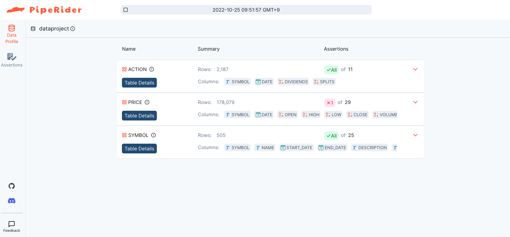
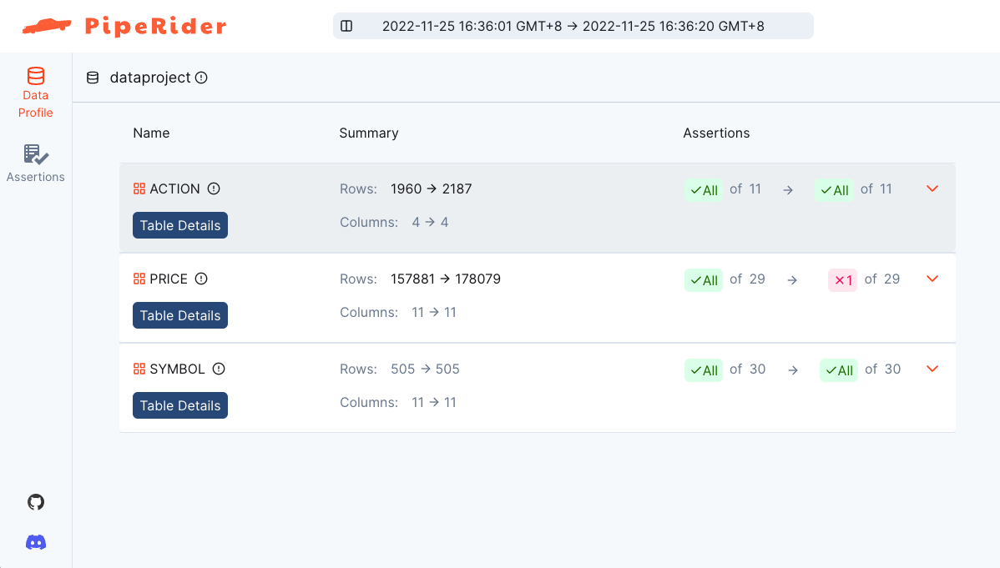
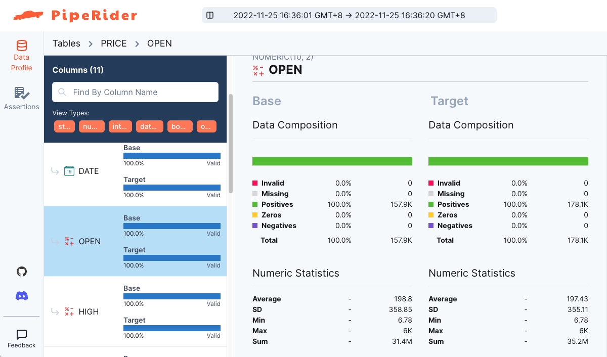
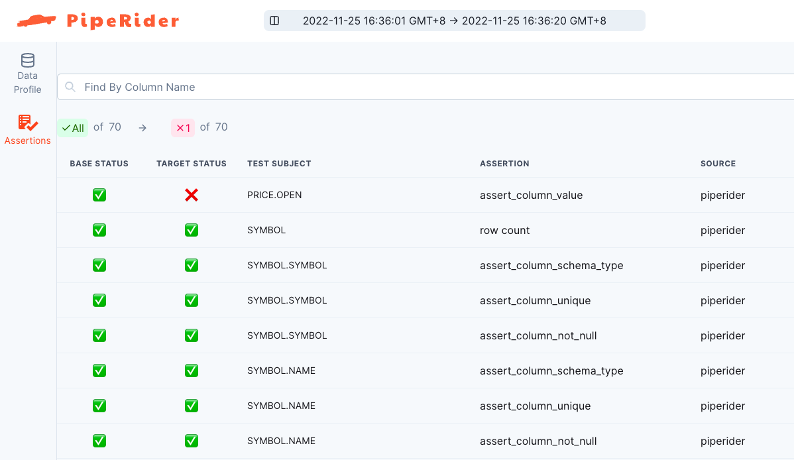

# Quick Start

This quick start guide will show you how to:

* [Install PipeRider](quick-start.md#install-piperider-via-pip)
* [Prepare a SQLite data source](quick-start.md#prepare-sqlite-database)
* [Initialize a new PipeRider project](quick-start.md#initialize-a-new-piperider-project)
* [Run PipeRider](quick-start.md#run-piperider-profile-data-test-assertions-generate-report)
* [Generate Data Assertions](quick-start.md#generate-data-assertions)
* [Adjust data assertions](quick-start.md#adjust-data-assertions)
* [Compare reports](quick-start.md#compare-reports)

For this guide you will be using SQLite. PipeRider also supports many other [data sources](supported-data-sources/) including Snowflake, BigQuery, Redshift, and more.

### Before you start

Ensure you have the following installed:

* Python 3.7+

### Install PipeRider via pip

PipeRider can be installed via pip with the following command.

```shell
pip install piperider -U
```

### Prepare SQLite database

Create a directory for the new project, then download the sample database below.

```shell
mkdir dataproject && cd dataproject
curl -o sp500.db https://piperider-data.s3.ap-northeast-1.amazonaws.com/getting-started/sp500_20220401.db
```

### Initialize a new PipeRider project

Initialize a new PipeRider project with the following command.

```shell
piperider init
```


The `init` command creates a `.piperider` directory inside the current directory. This is where all of the [project files](project-structure/) will be stored, including data source configuration, data quality assertions, data profiling information, and generated report files.


When prompted, enter a name for a your project, e.g. `dataproject`.

```shell
What is your data source name? (alphanumeric and underscore are allowed)
```

Using the arrow keys, select `sqlite` as the data source you would like to connect to.

```
Which data source would you like to connect to?
> sqlite
```

Enter the path to the SQLite database file, `sp500.db`

```
Path of database file: sp500.db
```

The contents of the PipeRider [config.yml file](project-structure/config.yml.md) will be displayed on the command line.&#x20;

#### Verify project configuration

Use the `diagnose` command to check the project settings and ensure that PipeRider can connect to the data source.

```
piperider diagnose
```

Example output:

```
Diagnosing...
PipeRider Version: x.x.x
Check config files:
  /path/to/dataproject/.piperider/config.yml: [OK]
✅ PASS

Check format of data sources:
  dataproject: [OK]
✅ PASS

Check connections:
  Name: dataproject
  Type: sqlite
  connector: [OK]
  Available Tables: ['ACTION', 'PRICE', 'SYMBOL']
  Connection: [OK]
✅ PASS

Check assertion files:
✅ PASS

Check cloud account:
  Run as user: dave@infuseai.io
    User Name:
    Full Name:
  Auto Upload: False
✅ PASS

🎉 You are all set!

Next step:
  Please execute command 'piperider run' to generate your first report
```

### Run PipeRider - Profile data and generate report

Run PipeRider to profile the data source:

```
piperider run
```

The `run` command performs the following functions.

* Analyzes the data source and generates a data profile.
* (If data assertion files exist) Tests the data source with assertions.
* Generates an HTML report.

Example output for the first run.

```shell
DataSource: dataproject
────────────────────────────────── Validating ───────────────────────────────────
everything is OK.
─────────────────────────────────── Profiling ───────────────────────────────────
Fetch metadata  ━━━━━━━━━━━━━━━━━━━━━━━━━━━━━━━━━━━━━━━━━━━━━━━━━━━   3/3 0:00:00

[1/3] ACTION ━━━━━━━━━━━━━━━━━━━━━━━━━━━━━━━━━━━━━━━━━━━━━━━━━━━━━━   4/4 0:00:00
[2/3] PRICE  ━━━━━━━━━━━━━━━━━━━━━━━━━━━━━━━━━━━━━━━━━━━━━━━━━━━━━━ 11/11 0:00:01
[3/3] SYMBOL ━━━━━━━━━━━━━━━━━━━━━━━━━━━━━━━━━━━━━━━━━━━━━━━━━━━━━━ 11/11 0:00:00
──────────────────────────────────── Summary ────────────────────────────────────

  Table Name   #Columns Profiled   #Tests Executed   #Tests Failed
 ━━━━━━━━━━━━━━━━━━━━━━━━━━━━━━━━━━━━━━━━━━━━━━━━━━━━━━━━━━━━━━━━━━
  ACTION                       4                 0               0
  PRICE                       11                 0               0
  SYMBOL                      11                 0               0

Generating reports from: /path/to/dataproject/.piperider/outputs/latest/run.json
Report generated in /path/to/piperider/dataproject/.piperider/outputs/latest/index.html
```

### Generate data assertions

Data assertions are tests of data quality. PipeRider can generate a suite of recommended data assertions for you based on the current state of your data.

```
piperider generate-assertions
```

The generate assertions command will create a YAML data assertions file for each table, located in `.piperider/assertions`

```
dataproject piperider generate-assertions
Generating recommended assertions from:
/path/to/dataproject/.piperider/outputs/latest/run.json
─────────────────────── Generated Recommended Assertions ────────────────────────
Recommended Assertion: /path/to/dataproject/.piperider/assertions/recommended_ACTION.yml
Recommended Assertion: /path/to/dataproject/.piperider/assertions/recommended_PRICE.yml
Recommended Assertion: /path/to/dataproject/.piperider/assertions/recommended_SYMBOL.yml
```

#### Test the data source

To see the assertions in action, run PipeRider again.

```
piperider run
```

PipeRider will now test the data profile against the assertions and display the results on the comand line (the results are also available in the HTML report). A sample of the output is shown below.

```shell-session
──────────────────────────────────────────────── Assertion Results ────────────────────────────────────────────────

  Status     Test Subject                Assertion                   Expected                   Actual
 ─────────────────────────────────────────────────────────────────────────────────────────────────────────────────
  [  OK  ]   SYMBOL                      row count                   ≥ 454                      505
  [  OK  ]   SYMBOL.SYMBOL               assert_column_schema_type   VARCHAR(16777216)          VARCHAR(16777216)
  [  OK  ]   SYMBOL.SYMBOL               assert_column_unique        -                          -
  [  OK  ]   SYMBOL.SYMBOL               assert_column_not_null      -                          -
  [  OK  ]   SYMBOL.NAME                 assert_column_schema_type   VARCHAR(16777216)          VARCHAR(16777216)
  [  OK  ]   SYMBOL.NAME                 assert_column_unique        -                          -
  [  OK  ]   SYMBOL.NAME                 assert_column_not_null      -                          -
  [  OK  ]   SYMBOL.START_DATE           assert_column_schema_type   DATE                       DATE
  [  OK  ]   SYMBOL.START_DATE           assert_column_not_null      -                          -
  [  OK  ]   SYMBOL.END_DATE             assert_column_schema_type   DATE                       DATE
  [  OK  ]   SYMBOL.END_DATE             assert_column_not_null      -                          -
  [  OK  ]   SYMBOL.DESCRIPTION          assert_column_schema_type   VARCHAR(16777216)          VARCHAR(16777216)
  [  OK  ]   SYMBOL.DESCRIPTION          assert_column_not_null      -                          -
  [  OK  ]   SYMBOL.EXCHANGE_CODE        assert_column_schema_type   VARCHAR(16777216)          VARCHAR(16777216)
  [  OK  ]   SYMBOL.EXCHANGE_CODE        assert_column_not_null      -                          -
  [  OK  ]   SYMBOL.EXCHANGE_CODE        assert_column_value         [                          -
                                                                         'NYSE',
                                                                         'NASDAQ',
                                                                         'BATS'
                                                                     ]
                                                                     
───────────────────────────────────────────────────── Summary ─────────────────────────────────────────────────────

  Table Name   #Columns Profiled   #Tests Executed   #Tests Failed
 ━━━━━━━━━━━━━━━━━━━━━━━━━━━━━━━━━━━━━━━━━━━━━━━━━━━━━━━━━━━━━━━━━━
  ACTION                       4                11               0
  PRICE                       11                29               0
  SYMBOL                      11                30               0

Generating reports from: /Users/dave/piperider/dataproject/.piperider/outputs/latest/run.json
Report generated in /Users/dave/piperider/dataproject/.piperider/outputs/latest/index.html
```


The assertions all pass this time because the data has not changed since they were generated


The output includes a summary of the assertion tests, along with the location of two files:

* `run.json` - The data profile used for the assertions test.
* `index.html` - The report that was generated for this run.

Open the HTML report in your browser to see the results.

<figure><figcaption><p>Profiling Report</p></figcaption></figure>


Refer to [How-To: Generate Report](../how-to-guides/generate-report.md) for other methods generate reports


### Adjust data assertions

In your text editor, open the assertions file for the `Price` table, located at `.piperider/assertions/recommended_PRICE.yml` .&#x20;

Find the `OPEN` column and adjust the value for the assertion `assert_column_value` to `5000.00`.  Save and close the file.

```yaml
...
...
    OPEN:
      tests:
      - name: assert_column_schema_type
        assert:
          schema_type: NUMERIC(10, 2)
        tags:
        - RECOMMENDED
      - name: assert_column_not_null
        tags:
        - RECOMMENDED
      - name: assert_column_value
        assert:
          lte: 5000.00
        tags:
        - RECOMMENDED
...
...
```


You can modify these auto-generated [assertion](data-quality-assertions/assertion-configuration.md) logic or add make your own [custom assertions](data-quality-assertions/custom-assertions.md), and then execute `piperider run` again to see the results.\
Refer to [Built-In Assertions](data-quality-assertions/assertion-configuration.md) and [Custom Assertions](data-quality-assertions/custom-assertions.md) for detailed assertion settings


### Add more data

Before running PipeRider again, first simulate a data change by adding some more data. Do this by overwriting the SQLite database file with an updated version.

```
curl -o sp500.db https://piperider-data.s3.ap-northeast-1.amazonaws.com/getting-started/sp500_20220527.db
```

Run PipeRider again to generate new profiling results and a report from the updated database.

```
piperider run
```

You'll see that the assertion we edited now fails.&#x20;

```
                              Failed Assertions

  Status     Test Subject   Assertion             Expected   Actual
 ────────────────────────────────────────────────────────────────────────────
  [FAILED]   PRICE.OPEN     assert_column_value   ≤ 5000.0   [6.78, 5977.61]
```

### Compare reports

The comparison report is useful for seeing how your data has changed over time. Now that you have multiple reports, you can use the this function to show the difference between the data source before, and after, adding data.

```
piperider compare-reports --last
```


The `--last` option automatically selects the last two reports for comparison. Omit this option to manually select the reports you would like to compare.


PipeRider will generate an HTML comparison report, showing the differences between the two profiles.&#x20;

<figure><figcaption><p>Comparison Report Overview</p></figcaption></figure>

Click through to view `Table Details` showing a comparison of the data between the two profiles.

<figure><figcaption><p>Profile comparison</p></figcaption></figure>

Assertion results for each profile are also available.

<figure><figcaption><p>Assertion comparison between profiles</p></figcaption></figure>

### More Things You Can Do

Using settings available through PipeRider's configuration file you are able to adjust the following aspects of your project:

* Which tables to include, or exclude from the profiler
* The maximum number of rows to profile
* Detection of duplicate rows (disabled by default)

Check the [project configuration file](project-structure/config.yml.md) page form more information.

### We'd love to hear from you

We're constantly striving to make PipeRider meet your needs. If you have feedback that could help make it better, we'd love to hear from you.

To send your feedback, click the Feedback link at the bottom-left of your PipeRider report and fill out the form.

<figure><figcaption><p>Feedback</p></figcaption></figure>

Alternaively, use the following command to submit feedback via the CLI.

```
piperider feedback
```
