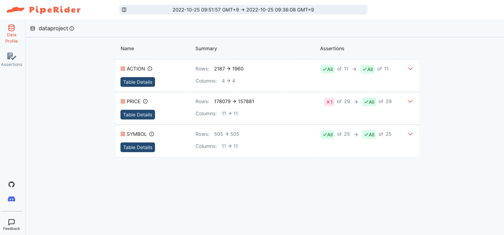
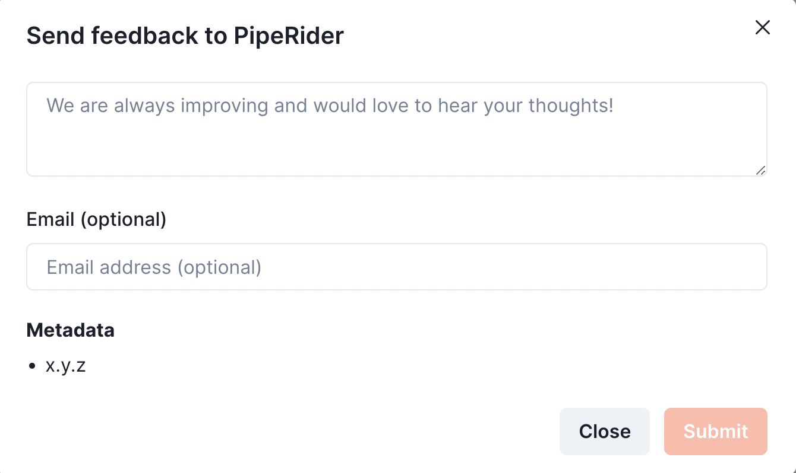

# Quick Start

This quick start guide will show you how to:

* [Install PipeRider](quick-start.md#install-piperider-via-pip)
* [Prepare a SQLite data source](quick-start.md#prepare-sqlite-database)
* [Initialize a new PipeRider project](quick-start.md#initialize-a-new-piperider-project)
* [Run PipeRider](quick-start.md#run-piperider-profile-data-test-assertions-generate-report)
* [Apply data assertions](quick-start.md#apply-data-assertions)
* [Compare reports](quick-start.md#compare-reports)

PipeRider currently supports multiple data sources - SQLite, Postgres, Snowflake, BigQuery and Redshift. In this guide we will be using SQLite.

### Before you start

Ensure you have the following installed:

* Python 3.7+

### Install PipeRider via pip

PipeRider can be installed via pip with the following command.

```shell
pip install piperider -U
```

### Prepare SQLite database

Create a directory for the new project then either place your own SQLite database inside or download the sample database below.

```shell
mkdir dataproject && cd dataproject
curl -o sp500.db https://piperider-data.s3.ap-northeast-1.amazonaws.com/getting-started/sp500_20220401.db
```

### Initialize a new PipeRider project

The `init` command creates a `.piperider` directory, inside the current directory, where all of the project files will be stored. This includes data source configuration, data quality assertions, data profiling information, and generated report files.

```shell
piperider init
```

Enter a name for your project, e.g. `dataproject`.

```shell
What is your data source name? (alphanumeric and underscore are allowed)
```

Using the arrow keys, select `sqlite` as the desired data source.

```
What data source would you like to connect to?
> sqlite
```

Enter the path to the Sqlite db, `sp500.db`

```
Please enter the following fields for sqlite
Path of database file: sp500.db
```

#### Verify project configuration

Use the `diagnose` command to check the project settings and ensure PipeRider can connect to the data source.

```
piperider diagnose
```

Sample output:

```
Diagnosing...
PipeRider Version: x.x.x
Check config files:
  /path/to/dataproject/.piperider/config.yml: [OK]
✅ PASS

Check format of data sources:
  dataproject: [OK]
✅ PASS

Check connections:
  Name: dataproject 
  Type: sqlite
  Available Tables: ['ACTION', 'PRICE', 'SYMBOL']
  Connection: [OK]
✅ PASS

Check dbt catalog files:
  dataproject: [SKIP] provider is not dbt
✅ PASS

Check assertion files:
✅ PASS

🎉 You are all set!

Next step:
  Please execute command 'piperider run' to generate your first report
```

### Run PipeRider - Profile data, test assertions, generate report

The `run` command performs the following functions.

On first run:

* Analyzes the data source and generates a data profile.
* Offers to generate recommended assertions and check the data profile against these assertions.
* Generates blank assertion templates if recommended assertions were not created.
* Generates a report.

On subsequent runs:

* Analyzes the data source and generates a data profile.
* Checks the data profile against any existing assertions.
* Generates a report.

```
piperider run
```

#### Sample output for first run

PipeRider analyzes the data source and generates a data profile.

PipeRider will offer to generate recommended assertions. Answer 'yes'.

```shell
DataSource: dataproject
─────────────────────────────────────────────────────────────────────────────── Validating ────────────────────────────────────────────────────────────────────────────────
everything is OK.
──────────────────────────────────────────────────────────────────────────────── Profiling ────────────────────────────────────────────────────────────────────────────────
fetching metadata
[1/3] ACTION ━━━━━━━━━━━━━━━━━━━━━━━━━━━━━━━━━━━━━━━━━━━━━━━━━━━━━━━━━━━━━━━━━━━━━━━━━━━━━━━━   4/4 0:00:00
[2/3] PRICE  ━━━━━━━━━━━━━━━━━━━━━━━━━━━━━━━━━━━━━━━━━━━━━━━━━━━━━━━━━━━━━━━━━━━━━━━━━━━━━━━━ 11/11 0:00:01
[3/3] SYMBOL ━━━━━━━━━━━━━━━━━━━━━━━━━━━━━━━━━━━━━━━━━━━━━━━━━━━━━━━━━━━━━━━━━━━━━━━━━━━━━━━━ 11/11 0:00:00
No assertion found
Do you want to auto generate recommended assertions for this datasource [Yes/no]? yes
```

A recommended assertion YAML file for each table will be created under `.piperider/assertions/` and you will be prompted to run the recommended assertions. Answer 'yes'.

```
Recommended Assertion: /path/to/dataproject/.piperider/assertions/recommended_ACTION.yml
Recommended Assertion: /path/to/dataproject/.piperider/assertions/recommended_PRICE.yml
Recommended Assertion: /path/to/dataproject/.piperider/assertions/recommended_SYMBOL.yml
```

PipeRider will test the data profile against the assertions and display the result.

```shell-session
──────────────────────────────────────────────────────────────────────────── Assertion Results ────────────────────────────────────────────────────────────────────────────

  Status     Test Subject                Assertion                   Expected            Actual
 ──────────────────────────────────────────────────────────────────────────────────────────────────────────
  [  OK  ]   SYMBOL                      row count                   ≥ 454               505
  [  OK  ]   SYMBOL.SYMBOL               assert_column_schema_type   VARCHAR(16777216)   VARCHAR(16777216)
  [  OK  ]   SYMBOL.SYMBOL               assert_column_unique        -                   -
  [  OK  ]   SYMBOL.SYMBOL               assert_column_not_null      -                   -
  [  OK  ]   SYMBOL.NAME                 assert_column_schema_type   VARCHAR(16777216)   VARCHAR(16777216)
  [  OK  ]   SYMBOL.NAME                 assert_column_unique        -                   -
  [  OK  ]   SYMBOL.NAME                 assert_column_not_null      -                   -
  [  OK  ]   SYMBOL.START_DATE           assert_column_schema_type   DATE                DATE
  [  OK  ]   SYMBOL.START_DATE           assert_column_not_null      -                   -
  [  OK  ]   SYMBOL.END_DATE             assert_column_schema_type   DATE                DATE
  [  OK  ]   SYMBOL.END_DATE             assert_column_not_null      -                   -
  [  OK  ]   SYMBOL.DESCRIPTION          assert_column_schema_type   VARCHAR(16777216)   VARCHAR(16777216)
  [  OK  ]   SYMBOL.DESCRIPTION          assert_column_not_null      -                   -
  [  OK  ]   SYMBOL.EXCHANGE_CODE        assert_column_schema_type   VARCHAR(16777216)   VARCHAR(16777216)
  [  OK  ]   SYMBOL.EXCHANGE_CODE        assert_column_not_null      -                   -
  [  OK  ]   SYMBOL.MARKET               assert_column_schema_type   VARCHAR(16777216)   VARCHAR(16777216)
  [  OK  ]   SYMBOL.MARKET               assert_column_not_null      -                   -
  [  OK  ]   SYMBOL.COUNTRY              assert_column_schema_type   VARCHAR(16777216)   VARCHAR(16777216)
  [  OK  ]   SYMBOL.COUNTRY              assert_column_not_null      -                   -
  [  OK  ]   SYMBOL.SECTOR               assert_column_schema_type   VARCHAR(16777216)   VARCHAR(16777216)
  [  OK  ]   SYMBOL.SECTOR               assert_column_not_null      -                   -
  [  OK  ]   SYMBOL.INDUSTRY             assert_column_schema_type   VARCHAR(16777216)   VARCHAR(16777216)
  [  OK  ]   SYMBOL.INDUSTRY             assert_column_not_null      -                   -
  [  OK  ]   SYMBOL.RECOMMENDATION_KEY   assert_column_schema_type   VARCHAR(16777216)   VARCHAR(16777216)
  [  OK  ]   SYMBOL.RECOMMENDATION_KEY   assert_column_not_null      -                   -
  [  OK  ]   ACTION                      row count                   ≥ 1764              1960
  [  OK  ]   ACTION.SYMBOL               assert_column_schema_type   VARCHAR(16777216)   VARCHAR(16777216)
  [  OK  ]   ACTION.SYMBOL               assert_column_not_null      -                   -
  [  OK  ]   ACTION.DATE                 assert_column_schema_type   DATE                DATE
  [  OK  ]   ACTION.DATE                 assert_column_not_null      -                   -
  [  OK  ]   ACTION.DIVIDENDS            assert_column_schema_type   NUMERIC(8, 4)       NUMERIC(8, 4)
  [  OK  ]   ACTION.DIVIDENDS            assert_column_not_null      -                   -
  [  OK  ]   ACTION.DIVIDENDS            assert_column_value         ≤ 16.8628           [0, 15.3298]
  [  OK  ]   ACTION.SPLITS               assert_column_schema_type   NUMERIC(10, 2)      NUMERIC(10, 2)
  [  OK  ]   ACTION.SPLITS               assert_column_not_null      -                   -
  [  OK  ]   ACTION.SPLITS               assert_column_value         ≤ 4.4               [0.13, 4]
  [  OK  ]   PRICE                       row count                   ≥ 142092            157881
  [  OK  ]   PRICE.SYMBOL                assert_column_schema_type   VARCHAR(16777216)   VARCHAR(16777216)
  [  OK  ]   PRICE.SYMBOL                assert_column_not_null      -                   -
  [  OK  ]   PRICE.DATE                  assert_column_schema_type   DATE                DATE
  [  OK  ]   PRICE.DATE                  assert_column_not_null      -                   -
  [  OK  ]   PRICE.OPEN                  assert_column_schema_type   NUMERIC(10, 2)      NUMERIC(10, 2)
  [  OK  ]   PRICE.OPEN                  assert_column_not_null      -                   -
  [  OK  ]   PRICE.OPEN                  assert_column_value         ≤ 6575.371          [6.78, 5977.61]
  [  OK  ]   PRICE.HIGH                  assert_column_schema_type   NUMERIC(10, 2)      NUMERIC(10, 2)
  [  OK  ]   PRICE.HIGH                  assert_column_not_null      -                   -
  [  OK  ]   PRICE.HIGH                  assert_column_value         ≤ 6580.695          [6.89, 5982.45]
  [  OK  ]   PRICE.LOW                   assert_column_schema_type   NUMERIC(10, 2)      NUMERIC(10, 2)
  [  OK  ]   PRICE.LOW                   assert_column_not_null      -                   -
  [  OK  ]   PRICE.LOW                   assert_column_value         ≤ 6472.466          [6.6, 5884.06]
  [  OK  ]   PRICE.CLOSE                 assert_column_schema_type   NUMERIC(10, 2)      NUMERIC(10, 2)
  [  OK  ]   PRICE.CLOSE                 assert_column_not_null      -                   -
  [  OK  ]   PRICE.CLOSE                 assert_column_value         ≤ 6555.263          [6.83, 5959.33]
  [  OK  ]   PRICE.VOLUME                assert_column_schema_type   NUMERIC(38, 0)      NUMERIC(38, 0)
  [  OK  ]   PRICE.VOLUME                assert_column_not_null      -                   -
  [  OK  ]   PRICE.VOLUME                assert_column_value         ≤ 351568327.0       [6318, 319607570]
  [  OK  ]   PRICE.ADJCLOSE              assert_column_schema_type   NUMERIC(10, 2)      NUMERIC(10, 2)
  [  OK  ]   PRICE.ADJCLOSE              assert_column_not_null      -                   -
  [  OK  ]   PRICE.ADJCLOSE              assert_column_value         ≤ 6555.263          [6.76, 5959.33]
  [  OK  ]   PRICE.MA5                   assert_column_schema_type   NUMERIC(10, 2)      NUMERIC(10, 2)
  [  OK  ]   PRICE.MA5                   assert_column_value         ≤ 6482.025          [6.63, 5892.75]
  [  OK  ]   PRICE.MA20                  assert_column_schema_type   NUMERIC(10, 2)      NUMERIC(10, 2)
  [  OK  ]   PRICE.MA20                  assert_column_value         ≤ 6398.238          [6.74, 5816.58]
  [  OK  ]   PRICE.MA60                  assert_column_schema_type   NUMERIC(10, 2)      NUMERIC(10, 2)
  [  OK  ]   PRICE.MA60                  assert_column_value         ≤ 6061.715          [5.44, 5510.65]

───────────────────────────────────────────────────────────────────────────────── Summary ─────────────────────────────────────────────────────────────────────────────────

  Table Name   #Columns Profiled   #Tests Executed   #Tests Failed
 ━━━━━━━━━━━━━━━━━━━━━━━━━━━━━━━━━━━━━━━━━━━━━━━━━━━━━━━━━━━━━━━━━━
  ACTION                       4                11               0
  PRICE                       11                29               0
  SYMBOL                      11                25               0

Generating reports from: /Users/gabriel/Workspace/github/pipe_stable/.piperider/outputs/latest/run.json
Report generated in /Users/gabriel/Workspace/github/pipe_stable/.piperider/outputs/latest/index.html

Next step:
  Please execute command 'piperider run' to generate your second report
```

A summary of the assertion tests that were executed is displayed, along with the location of two files:

* `run.json` - The data profile used for the assertions test.
* `index.html` - The report that was generated for this run.

Open the HTML report in the browser to see the visualized results or share it with your team.

<figure><figcaption><p>Profiling Report</p></figcaption></figure>


Refer to [How-To: Generate Report](../how-to-guides/generate-report.md) for other methods generate reports


### Apply data assertions

In your text editor, open `.piperider/assertions/recommended_PRICE.yml` . In column _OPEN_ section, let's modify the assertion, _assert\_column\_value with_ `gte: 6 and lt: 7`_._ This modification will be applied on the next _run_.

```yaml
# Auto-generated by Piperider based on table "PRICE"
PRICE:  # Table Name
  # Test Cases for Table
  tests:
  - metric: row_count
    assert:
      gte: 160271
      lte: 195886
    tags:
    - RECOMMENDED
  columns:
    SYMBOL:  # Column Name
      # Test Cases for Column
      tests:
      - name: assert_column_schema_type
        assert:
          schema_type: VARCHAR(16777216)
        tags:
        - RECOMMENDED
      - name: assert_column_not_null
        tags:
        - RECOMMENDED
    DATE: # Column Name
      # Test Cases for Column
      tests:
      - name: assert_column_schema_type
        assert:
          schema_type: DATE
        tags:
        - RECOMMENDED
      - name: assert_column_not_null
        tags:
        - RECOMMENDED
    OPEN: # Column Name
      # Test Cases for Column
      tests:
      - name: assert_column_schema_type
        assert:
          schema_type: NUMERIC(10, 2)
        tags:
        - RECOMMENDED
      - name: assert_column_not_null
        tags:
        - RECOMMENDED
      - name: assert_column_value
        assert: # Modification
          gte: 6
          lt: 7
        tags:
        - RECOMMENDED
    ...
    ...
    ...
```

You can modify these auto-generated [assertion](data-quality-assertions/assertion-configuration.md) logic or add make your own [custom assertions](data-quality-assertions/custom-assertions.md), and then execute `piperider run` again to see the results.


Refer to [Built-In Assertions](data-quality-assertions/assertion-configuration.md) and [Custom Assertions](data-quality-assertions/custom-assertions.md) for detailed assertion settings


### Compare reports

`compare-reports` enables you to create a comparison report that compares two different reports. The comparison report is useful for seeing how your data has changed over time.

To simulate a change in your data, download the following sqlite database overwriting the existing one.

```
curl -o sp500.db https://piperider-data.s3.ap-northeast-1.amazonaws.com/getting-started/sp500_20220527.db
```

Execute `run` to generate new profiling results and a report from the updated database .

```
piperider run
```

As the data has changed since we modified assertions, you will notice that some assertions now fail.

```
...
  [  OK  ]   PRICE                       row count                   [160271, 195886]    178079
  [  OK  ]   PRICE.SYMBOL                assert_column_schema_type   VARCHAR(16777216)   VARCHAR(16777216)
  [  OK  ]   PRICE.SYMBOL                assert_column_not_null      -                   -
  [  OK  ]   PRICE.DATE                  assert_column_schema_type   DATE                DATE
  [  OK  ]   PRICE.DATE                  assert_column_not_null      -                   -
  [  OK  ]   PRICE.OPEN                  assert_column_schema_type   NUMERIC(10, 2)      NUMERIC(10, 2)
  [  OK  ]   PRICE.OPEN                  assert_column_not_null      -                   -
  [FAILED]   PRICE.OPEN                  assert_column_value         [6, 7)              [6.78, 5977.61]
  [  OK  ]   PRICE.HIGH                  assert_column_schema_type   NUMERIC(10, 2)      NUMERIC(10, 2)
...
```

The Summary also shows which tests failed.

```
Table Name   #Columns Profiled   #Tests Executed   #Tests Failed
 ━━━━━━━━━━━━━━━━━━━━━━━━━━━━━━━━━━━━━━━━━━━━━━━━━━━━━━━━━━━━━━━━━━
  ACTION                       4                11               0
  PRICE                       11                29               1
  SYMBOL                      11                25               0

                              Failed Assertions

  Status     Test Subject   Assertion             Expected   Actual
 ────────────────────────────────────────────────────────────────────────────
  [FAILED]   PRICE.OPEN     assert_column_value   [6, 7)     [6.78, 5977.61]
```

Now that you have a second report, run the `compare-reports` command.

```
piperider compare-reports
```

You will be prompted to select two reports for the comparison. Select the most recent report and one report from before you downloaded the new database.

```
[?] Please select the 2 reports to compare ( SPACE to select, and ENTER to confirm ):
   X dataproject  #table=3      #pass=65    #fail=1     2022-06-23T13:01:37.543978Z
 > X dataproject  #table=3      #pass=66    #fail=0     2022-06-23T12:48:11.794525Z
```

PipeRider will generate an HTML report of the comparison.

```
Selected reports:
  Base:  /path/to/dataproject/.piperider/outputs/dataproject-20220623130137/run.json
  Input: /path/to/dataproject/.piperider/outputs/dataproject-20220623124811/run.json

Comparison report: /path/to/dataproject/.piperider/comparisons/20220623130337/index.html
```

Open the HTML comparison report in your browser to review any changes or share it with your team.

<figure><figcaption><p>Comparing Report</p></figcaption></figure>

### More Things You Can Do

PipeRider provides advanced project-wise configuration that allows you to change default behaviours of the profiler. Such as to limit the amount of row which the profiler can analyze or to include/exclude specific tables in the analysis. Please check [Config.yml](project-structure/config.yml.md) for the detail.

### We'd love to hear from you

PipeRider is constantly being improved - If you have feedback that could help make it better, we'd love to hear from you.

To send your feedback, click the Feedback link at the bottom-left of your report and fill out the form.

<figure><figcaption><p>Feedback</p></figcaption></figure>
