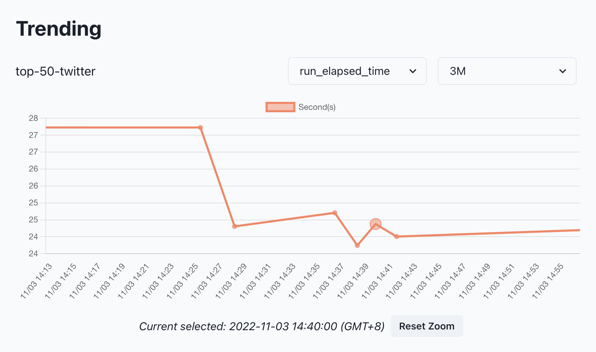

# Get Started

## What Cloud can Do

* Share a profiling report by 1-click&#x20;
* Compare profiling reports online
* The trend chart of profiling metrics

## Access Cloud

### Prerequisite

In order to have the authorization to access the cloud, the installed PipeRider CLI is required.

Install **PipeRider CLI** if you haven't

```bash
pip install piperider
```

### Login as Sign-up

Using CLI to login as the sign-up

```bash
piperider cloud login
```

You will be prompted to configure the behaviour of the auto upload, email account and API token.

```
Please select default behavior for auto upload
[?] Auto upload reports to cloud (Y/n): Y
Please provide available email account to login
[?] Email address: knightrider@piperider.io
Please paste the api token from magic link. The link has been sent to your email address.
[?] API token:
```


Once _Auto-upload_ is enabled, PipeRider CLI will upload every profiling result automatically.


Let's hang on there. You will receive an email from PipeRider Cloud, visit the link in the email to initiate your account and retrieve the token.

Fill in the information and copy the token, that is the most important thing.

<figure><figcaption><p>Initiate an account</p></figcaption></figure>


Back to the terminal and past the token&#x20;

```
[?] API token:<paste_your_token_here>
```

You can verify it by `piperider diagnose` . You should see the output containing

```
Check cloud account:
  Run as user: knightrider@piperider.io
✅ PASS
```

You are all set!


The token is stored in your local file, `~/.piperider/profile.yml`.


### Upload Profiling Results

Now you have the access to the PipeRider Cloud. Let's try to upload a few profiling results.

```
piperider cloud upload-report
```

To select multiple reports by _SPACE_ then _Enter_ to confirm.

Back to [https://cloud.piperider.io](https://cloud.piperider.io) to view reports.

## Cloud Overview

<figure><figcaption><p>Landing Page</p></figcaption></figure>

1. Data source name
2. Current Report context
3. Data / Assertions tab
4. Navigation bar
5. Report sharing button
6. Profile dropdown
7. Community channels

By default, the landing page shows the context of latest report.

### Navigate Reports

Click the _navigation bar_, the pop-up will list the all of upload reports and comparison reports if any.

Click on a run to view the report.

<figure><figcaption><p>Navigate Reports</p></figcaption></figure>

### Metric Monitoring

Once multiple profiling results are uploaded under the _same data source_. PipeRider Cloud will analyze and display the trending of a few metrics that it could help you monitor/capture if any considerable changes.

<figure><figcaption><p>Metrics Trending</p></figcaption></figure>


Select a metric or a timespan from drop-downs or drag/scroll on the area of the chart to zoom in/out.


### Compare Reports

Select any two of reports for the comparison. Click _Cancel_ to clear the selection.

<figure><figcaption><p>Compare Reports</p></figcaption></figure>

### Share Report

Click _Share_ to toggle the sharing and gain the sharable URL.

### User Profile

View/Edit the profile and retrieve the token again.

<figure><figcaption><p>User Profile</p></figcaption></figure>
