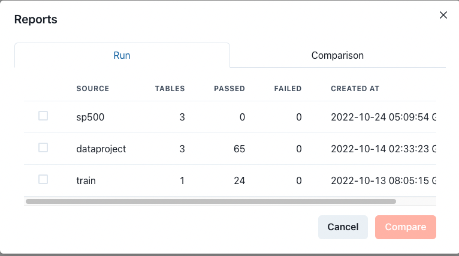

# Get Started

## PipeRider Cloud features

* Share reports online
* Compare profiling reports online
* View time-series data for certain metrics
* Create monitoring alerts and forward alert notifications to email or Slack

## How PipeRider Cloud works

PipeRider Cloud works by uploading reports via PipeRider CLI. Reports can be configured to automatically upload, or can be uploaded manually (see below).

## Access PipeRider Cloud

### Prerequisites

In order to access PipeRider Cloud, you are first required to [install PipeRider CLI](../cli/install-piperider.md).&#x20;

### Log in/Sign up

Currently, the log in and sign method is the same. Use the following command to log in/sign up to PipeRider Cloud.&#x20;

```bash
piperider cloud login
```

Enter your email address when prompted.


```
$ piperider cloud login
Please provide available email account to login
[?] Email address: support@piperider.io
Please paste the api token from magic link. The link has been sent to your email address.
[?] API token:
```


**Follow the link in your email** to obtain your API token.

<figure><figcaption><p>PipeRider User Profile</p></figcaption></figure>

Copy the API Token and paste into the terminal. If your log in was successful, you'll see your User Profile details:

```
[?] API token: abc123
───────────────────────────── Login Successful ─────────────────────────────
                                User Profile

  Email                  Username      Full Name    Storage Location   Timezone
 ───────────────────────────────────────────────────────────────────────────
  support@piperider.io   Support       PipeRider    North America      Asia/Taipei
```

Select if you would like reports to be automatically uploaded to your PipeRider Cloud account.

```
Please select default behavior for auto upload
[?] Auto upload reports to cloud (Y/n): Y

[Config] Default auto upload behavior is set to True
```

If you selected yes, the `auto_upload` configuration option will be set to `true` in your PipeRider configuration file `~/.piperider/profile.yml`


```yaml
user_id: user123
...
...
api_token: ABC123
cloud_config:
  auto_upload: true
```



If _Auto-upload_ is enabled, PipeRider CLI will upload every report automatically during `piperider run`


## Verify PipeRider Cloud connection

Verify your connection to PipeRider Cloud by running the diagnose command.

```
piperider diagnose
```

If correctly configured, you should see the following message in the output.

```
Check cloud account:
  Run as user: support@infuseai.io
    User Name: Support
    Full Name: PipeRider Support
  Auto Upload: True
✅ PASS
```

## Manually upload reports

Use the following command to manually select reports to upload.

```
piperider cloud upload-report
```

Use the arrow keys to navigate the list, and press space to select the reports you would like to upload.

```
$ piperider cloud upload-report
────────────────────────── Select Reports to Upload ───────────────────────────────
[?] Please select the reports to upload ( SPACE to select, and ENTER to confirm ):
   o jaffle_shop  #table=5      #pass=61    #fail=1     2022-12-14T09:37:14.342456Z
   X jaffle_shop  #table=5      #pass=60    #fail=1     2022-12-13T11:26:33.315632Z
   X jaffle_shop  #table=3      #pass=57    #fail=1     2022-12-08T17:04:06.084280Z
   o jaffle_shop  #table=5      #pass=80    #fail=1     2022-12-08T17:03:32.378543Z
```

Press the return key to upload the reports.&#x20;

URLs for uploaded reports will be shown in the CLI output. You can also go directly to [https://cloud.piperider.io](https://cloud.piperider.io) to view all uploaded reports.

## Cloud Overview

<figure><figcaption><p>Landing Page</p></figcaption></figure>

1. Data source name
2. Current Report context
3. Data / Assertions tab
4. Navigation bar
5. Report sharing button
6. Profile dropdown
7. Community channels

By default, the landing page shows the context of latest report.

### Navigate Reports

Click the _navigation bar_, the pop-up will list the all of upload reports and comparison reports if any.

Click on a run to view the report.

<figure><figcaption><p>Navigate Reports</p></figcaption></figure>

### Metric Monitoring

Once multiple profiling results are uploaded under the _same data source_. PipeRider Cloud will analyze and display the trending of a few metrics that it could help you monitor/capture if any considerable changes.

<figure><figcaption><p>Metrics Trending</p></figcaption></figure>


Select a metric or a timespan from drop-downs or drag/scroll on the area of the chart to zoom in/out.


### Compare Reports

Select any two of reports for the comparison. Click _Cancel_ to clear the selection.

<figure><figcaption><p>Compare Reports</p></figcaption></figure>

### Share Report

Click _Share_ to toggle the sharing and gain the sharable URL.

### User Profile

View/Edit the profile and retrieve the token again.

<figure><figcaption><p>User Profile</p></figcaption></figure>
