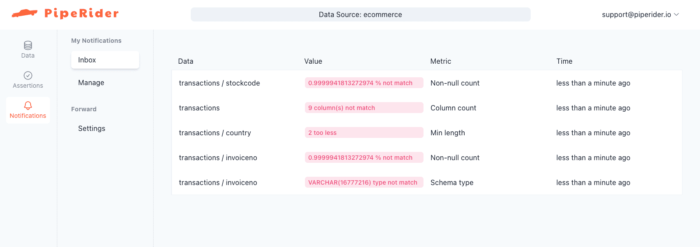
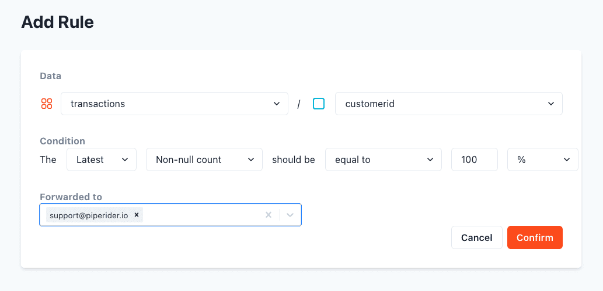
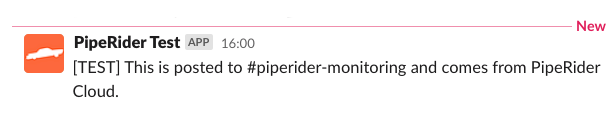

# Notifications

PipeRider Cloud supports rule-based alerts that are triggered when certain conditions are met for a data source.&#x20;

<figure><figcaption>
PipeRider Cloud Notifications Inbox
</figcaption></figure>

Alert notifications for a report can be viewed in the **Notifications Inbox** by clicking `Notifications` in the left sidebar.

In addition to the Notifications Inbox, alerts notifications can also be sent via the following integrations:

* Email
* Slack

### Add notification rule

To add a new notification navigate to `Notifications` -> `Manage` and then the click the `Add Notifications` button.

<figure><figcaption>
PipeRider Cloud - Add Alert Notification Rule
</figcaption></figure>

Add a new rule specifying the table/column and conditions that your data source should meet.

To forward this alert to your email, select your account email address from the `Forwarded to` drop-down. If no value is selected, this alert will _only_ show in your Notifications Inbox.

Click the `Confirm` button to save the Rule.

The next time a report is uploaded, if the conditions for any of your rules are not met, then you will receive an alert by your selected integration.&#x20;

### Slack integration&#x20;

To set up Slack notifications for PipeRider Cloud, you must first create a `Slack App` and obtain your `Incoming Webhook URL`. Instructions on how to do this can be found in the [Slack API documentation](https://api.slack.com/messaging/webhooks).

In PipeRider Cloud, navigate to `Notifications` -> `Settings` and click on the `Add Integration` button.&#x20;

<figure><figcaption>
PipeRider Cloud - Add Integration
</figcaption></figure>

Copy the `Webhook URL` and `Channel` from your Slack `incoming Webhooks` settings page into the PipeRider `Add Integration` form, as shown in the above image.

To test the integration, click the `Test` button on the right side of the `Webhook URL` text field. If succcesful you will see a success message, and a test notification will appear in your selected Slack channel:

<figure><figcaption>
PipeRider Cloud - Test Notification via Slack
</figcaption></figure>

