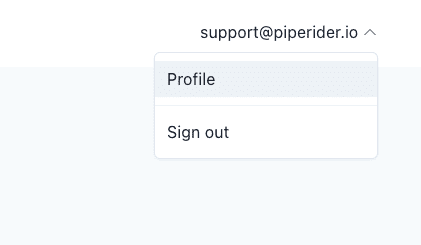
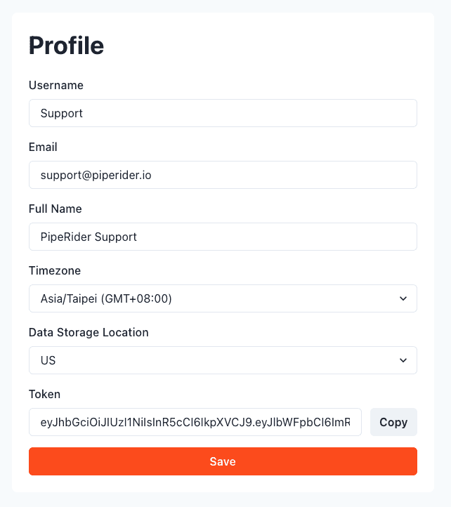
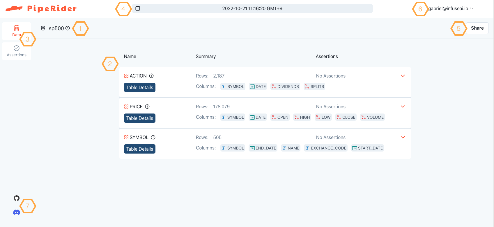
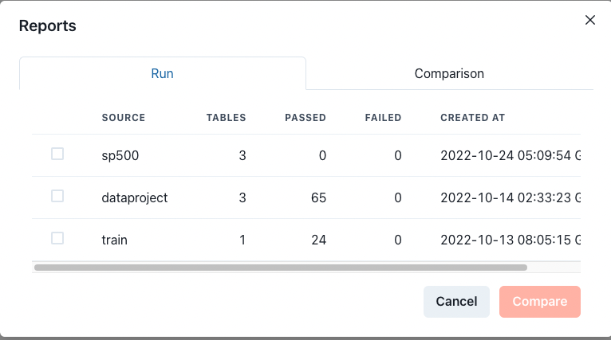
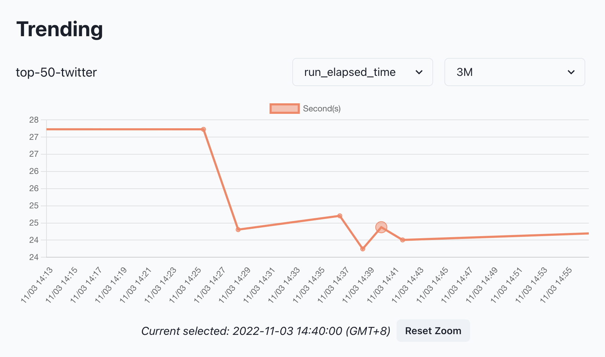
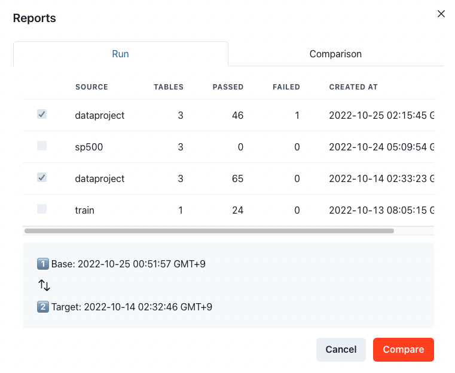
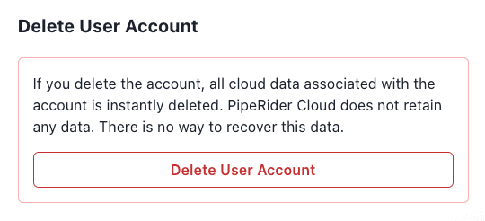
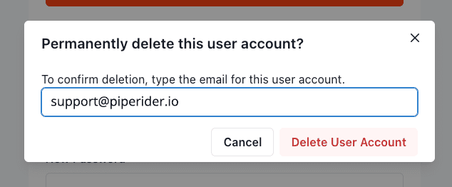

# Get Started

## PipeRider Cloud features

With a PipeRider Cloud account you can upload reports from PipeRider CLI and access the following features:

* Share reports online
* Compare profiling reports online
* View time-series data for certain metrics
* Create monitoring alerts and forward alert notifications to email or Slack

Reports can be configured to automatically upload each time PipeRider is ran, or can be uploaded individually (see below).

## How to access PipeRider Cloud

### Prerequisites

In order to upload reports to PipeRider Cloud, you are first required to [install PipeRider CLI](../get-started/install-piperider.md).&#x20;

### Sign up

To sign up for PipeRider Cloud account please visit the [Sign Up](https://cloud.piperider.io/signup) page and fill out the form.

A verification email will be send to your email address. Follow the link in the verification email to complete your account set up.

### Log in

Reports are uploaded to PipeRider Cloud via PipeRider CLI. To enable report uploading you need to add your API Token to PipeRider CLI.

#### Obtain your API Token

An API token can be obtained from your PipeRider Cloud profile page.

[Sign in](https://cloud.piperider.io/signin), or [Sign up](https://cloud.piperider.io/signup), at PipeRider Cloud. Once logged in, click the account drop-down at the top right and then click `Profile`.

<figure><figcaption><p>Select Profile from the user account drop-down</p></figcaption></figure>

From your Profile, click the `Copy` button next to your token at the bottom to copy your API token to the clipboard.

<figure><figcaption><p>PipeRider User Profile</p></figcaption></figure>

#### Log into the PipeRider Cloud from the CLI

From the command line, use the following command to log into PipeRider Cloud.

```bash
piperider cloud login
```

Enter your email address and API token when prompted.


```
$ piperider cloud login
Please provide available email account to login
[?] Email address: support@piperider.io
Please paste the api token from magic link. The link has been sent to your email address.
[?] API token: abc123
```


If your log in was successful, you'll see your User Profile details:

```
[?] API token: abc123
───────────────────────────── Login Successful ─────────────────────────────
                                User Profile

  Email                  Username      Full Name    Storage Location   Timezone
 ───────────────────────────────────────────────────────────────────────────
  support@piperider.io   Support       PipeRider    North America      Asia/Taipei
```

Select if you would like reports to be automatically uploaded to your PipeRider Cloud account.

```
Please select default behavior for auto upload
[?] Auto upload reports to cloud (Y/n): Y

[Config] Default auto upload behavior is set to True
```

Your API token and default upload settings are stored in your PipeRider profile `~/.piperider/profile.yml`


```yaml
user_id: user123
...
api_token: abc123
cloud_config:
  auto_upload: true
```



If `auto_upload` is enabled, PipeRider CLI will automatically upload every report during `piperider run`


## Verify PipeRider Cloud connection

Verify your connection to PipeRider Cloud by running the diagnose command from inside a PipeRider project.

```
piperider diagnose
```

If correctly configured, you should see the following message in the output.

```
Check cloud account:
  Run as user: support@infuseai.io
    User Name: Support
    Full Name: PipeRider Support
  Auto Upload: True
✅ PASS
```

## Manually upload reports

Use the following command to manually select reports to upload.

```
piperider cloud upload-report
```

Use the arrow keys to navigate the list, and press space to select the reports you would like to upload.

```
$ piperider cloud upload-report
────────────────────────── Select Reports to Upload ───────────────────────────────
[?] Please select the reports to upload ( SPACE to select, and ENTER to confirm ):
   o jaffle_shop  #table=5      #pass=61    #fail=1     2022-12-14T09:37:14.342456Z
   X jaffle_shop  #table=5      #pass=60    #fail=1     2022-12-13T11:26:33.315632Z
   X jaffle_shop  #table=3      #pass=57    #fail=1     2022-12-08T17:04:06.084280Z
   o jaffle_shop  #table=5      #pass=80    #fail=1     2022-12-08T17:03:32.378543Z
```

Press the return key to upload the reports.&#x20;

URLs for uploaded reports will be shown in the CLI output. You can also go directly to [https://cloud.piperider.io](https://cloud.piperider.io) to view all uploaded reports.

## Cloud Overview

<figure><figcaption><p>Landing Page</p></figcaption></figure>

1. Data source name
2. Current Report context
3. Data / Assertions tab
4. Navigation bar
5. Report sharing button
6. Profile dropdown
7. Community channels

By default, the landing page shows the context of latest report.

### Navigate Reports

Click the _navigation bar_, the pop-up will list the all of upload reports and comparison reports if any.

Click on a run to view the report.

<figure><figcaption><p>Navigate Reports</p></figcaption></figure>

### Metric Monitoring

Once multiple profiling results are uploaded under the _same data source_. PipeRider Cloud will analyze and display the trending of a few metrics that it could help you monitor/capture if any considerable changes.

<figure><figcaption><p>Metrics Trending</p></figcaption></figure>


Select a metric or a timespan from drop-downs or drag/scroll on the area of the chart to zoom in/out.


### Compare Reports

Select any two of reports for the comparison. Click _Cancel_ to clear the selection.

<figure><figcaption><p>Compare Reports</p></figcaption></figure>

### Share Report

Click _Share_ to toggle the sharing and gain the sharable URL.

### User Profile

View/Edit the profile and retrieve the token again.

<figure><figcaption><p>User Profile</p></figcaption></figure>


### Delete your account

To delete your account, and all associated data and reports, click the **Delete User Account** button at the bottom of your [User Profile](https://cloud.piperider.io/settings/profile) page.

<figure><figcaption><p>Click the Delete User Account button</p></figcaption></figure>

You will be prompted to enter your account email to confirm you really want to delete the account. Click **Delete User Account** to initiate your account deletion.

<figure><figcaption><p>Enter the email address associated with your account</p></figcaption></figure>

You will be prompted to take the survey, click the **Let's Go** button to start the survey (it's only three questions).

<figure><figcaption><p>Complete the survey to finalize your account deletion</p></figcaption></figure>

Once the survey is complete your account will be deleted and you will receive and confirmation email.


Please note that your account and data is not deleted until the survey has been submitted

