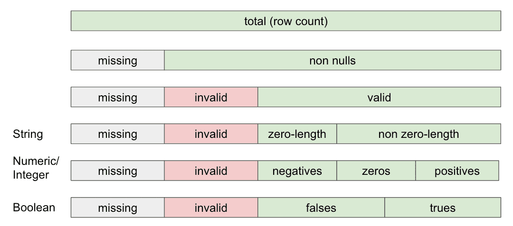

# Metrics

Data profile metrics are divided between table and column level, and column is further analyzed depending on the schema type and generic type (see [Schema](metrics.md#schema) below).

## Table metrics

Data profile metrics that describe the tables in a data source.

| Metric       | Description                        | Profile Field | Supported Since |
| ------------ | ---------------------------------- | ------------- | --------------- |
| Row count    | The number of rows in the table    | `row_count`   | All             |
| Column count | The number of columns in the table | `col_count`   | All             |

## Column metrics

Data profile metrics that describe data at the column level. Depending on the column type, different metrics will be produced.

### Schema

In addition to logging the schema type of a column, PipeRider will also apply a generic schema type to a column that will determine how this column is treated by the profiler.

| Metric       | Description                                                                                                | Column Type | Profile Field | Supported Since |
| ------------ | ---------------------------------------------------------------------------------------------------------- | ----------- | ------------- | --------------- |
| Schema Type  | The column type defined in the data source                                                                 | All         | `schema_type` | All             |
| Generic Type | A generic type of schema type. It can be be `string`, `integer`, `numeric`, `datetime`, `boolean`, `other` | All         | `type`        | All             |

The following metrics are produced based on the generic type that has been applied to the column.

### Data composition

The composition of the data contained within a column. &#x20;

| Metric                       | Description                                                                                                           | Column Type      | Profile Field     | Supported Since |
| ---------------------------- | --------------------------------------------------------------------------------------------------------------------- | ---------------- | ----------------- | --------------- |
| Missing count                | The number of null values                                                                                             | All              | `nulls`           | 0.6.0           |
| Non-null count               | The number of non-null values                                                                                         | All              | `non_nulls`       | All             |
| Invalid count                | The number of values that do not match the column's schema type. E.g. A string in a numeric column. (**SQLite only**) | All              | `invalids`        | 0.6.0           |
| Valid count                  | The count of non-null values minus invalid values                                                                     | All              | `valids`          | 0.6.0           |
| Zero count                   | The number of zeros                                                                                                   | integer, numeric | `zeros`           | 0.6.0           |
| Negative value count         | The number of negative values                                                                                         | integer, numeric | `negatives`       | 0.6.0           |
| Positive value count         | The number of positive values                                                                                         | integer, numeric | `positives`       | 0.6.0           |
| Zero length string count     | The number of empty strings                                                                                           | string           | `zero_length`     | 0.6.0           |
| Non-zero length string count | The number of non-empty strings                                                                                       | string           | `non_zero_length` | 0.6.0           |
| True count                   | The number of true values                                                                                             | boolean          | `trues`           | 0.6.0           |
| False count                  | The number of false values                                                                                            | boolean          | `falses`          | 0.6.0           |

### General statistics

The general statistical information of a column.

| Metric             | Description                      | Column Type                | Profile Field | Supported Since |
| ------------------ | -------------------------------- | -------------------------- | ------------- | --------------- |
| Min                | The minimum value                | integer, numeric, datetime | `min`         | All             |
| Max                | The maximum value                | integer, numeric, datetime | `max`         | All             |
| Average            | The column average               | integer, numeric           | `avg`         | All             |
| Sum                | The column sum                   | integer, numeric           | `sum`         | All             |
| Standard deviation | The standard deviation of values | integer, numeric,          | `stddev`      | 0.4.0           |

### Text length statistics

The text length statistics of a column.

| Metric             | Description                             | Column Type | Profile Field | Since |
| ------------------ | --------------------------------------- | ----------- | ------------- | ----- |
| Min length         | The minimum string length               | string      | `min`         | 0.6.0 |
| Max length         | The maximum string length               | string      | `max`         | 0.6.0 |
| Average length     | The average string length               | string      | `avg`         | 0.6.0 |
| Standard deviation | The standard deviation of string length | string      | `stddev`      | 0.6.0 |

### Uniqueness

The uniqueness of a column.

| Metric              | Description                       | Column Type                        | Profile Field    | Since |
| ------------------- | --------------------------------- | ---------------------------------- | ---------------- | ----- |
| Distinct count      | The number of distinct items      | integer, string, datetime          | `distinct`       | All   |
| Duplicate count     | The number of recurring items     | integer, numeric, string, datetime | `duplicates`     | 0.6.0 |
| Non-duplicate count | The number of non-recurring items | integer, numeric, string, datetime | `non_duplicates` | 0.6.0 |

For example, the following dataset `(NULL, a, a, b, b, c, d, e)` would be categorized as so:

* Distinct count = 5, `(a, b, c, d, e)`
* Duplicate count = 4, `(a, a, b, b)`
* Non-duplicate count = 3, `(c, d, e)`
* Missing values (nulls) = 1

Therefore, the total number of rows for a table = missing (nulls) + duplicates + non-duplicates.

### Quantiles

The calculated quantiles of a numeric or integer column.

| Metric          | Description      | Column Type      | Profile Field | Supported Since |
| --------------- | ---------------- | ---------------- | ------------- | --------------- |
| Minimum         | 0th percentile   | integer, numeric | `min`         | All             |
| 5th Percentile  | 5th percentile   | integer, numeric | `p5`          | 0.4.0           |
| 25th Percentile | 25th percentile  | integer, numeric | `p25`         | 0.4.0           |
| Median          | 50th percentile  | integer, numeric | `p50`         | 0.4.0           |
| 75th Percentile | 75th percentile  | integer, numeric | `p75`         | 0.4.0           |
| 95th Percentile | 95th percentile  | integer, numeric | `p95`         | 0.4.0           |
| Maximum         | 100th percentile | integer, numeric | `max`         | All             |

### Distribution

| Metric                | Description                                                               | Column Type      | Profile Field | Supported Since |
| --------------------- | ------------------------------------------------------------------------- | ---------------- | ------------- | --------------- |
| Top K                 | The most frequently occurring n items and and counts                      | integer, string  | `topk`        | 0.6.0           |
| Histogram             | Evenly-split bins for numerical columns and counts for each bin           | integer, numeric | `histogram`   | 0.6.0           |
| Text length histogram | Evenly-split bins for text length and counts for each bin                 | string           | `histogram`   | 0.6.0           |
| Date histogram        | Histogram of date, month, or year. Bin split depends on the min/max range | datetime         | `histogram`   | 0.6.0           |
