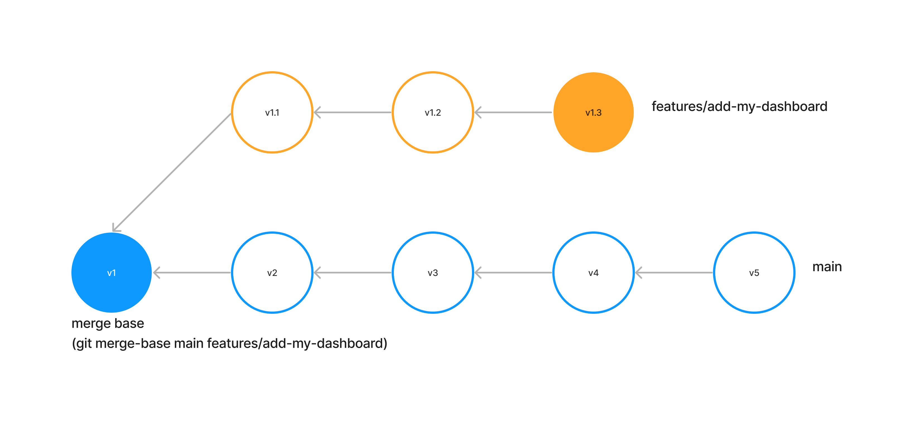

# Compare

Compare two runs and generate an Impact Report. This feature is useful when you want to:

* **Compare the changes from base branch to pull request branch** - This is the main use case of PipeRider
* **Compare the changes between two time points,** such as following a daily or periodic dbt job.&#x20;
* **Compare two data sources**, such as staging and production environments, or a migration source and destination.

## Compare two runs

The easiest way to compare is to compare the last two runs:

```
piperider compare-reports --last
```

You can also compare two runs by specifying two run JSON results:

```
piperider compare-reports --base /tmp/base/run.json --target /tmp/target/run.json
```

### Comparison artifacts

Compare generates two artifacts in the output directory `.piperider/comparisons/<datetime>`

* Impact Report - HTML (`index.html`)
* Impact Summary - Markdown (`summary.md`). This markdown file is used to post on your PR comment for review.

The latest comparison is also sym-linked at `.piperider/outputs/latest`

Use the `--output` option to change the output directory:

```
piperider compare-reports --last --output /tmp/mycompare
```

## Compare for pull requests

From [github document](https://docs.github.com/en/pull-requests/collaborating-with-pull-requests/proposing-changes-to-your-work-with-pull-requests/about-pull-requests)

> Pull requests let you tell others about changes you've pushed to a branch in a repository on GitHub. Once a pull request is opened, you can discuss and review the potential changes with collaborators and add follow-up commits before your changes are merged into the base branch.

In a dbt project, it is a challenge to visualize the data impact for a pull request. By using PipeRider, it streamline the process to understand the impact of the PR.&#x20;

### How to use

To compare a pull requests, run the following code from the branch that is to be merged:

```
piperider compare
```

PipeRider will automatically run the necessary git, dbt, and PipeRider commands to generate an Impact Report.

### How it works

PipeRider Compare performs a comparison equivalent to the way that  `git diff <base>...<branch>` (three-dot diff) works.&#x20;

Given the following example in which the branch `features/add-my-dashboard` originated from main  `v1` , `piperider compare` would **compare the feature branch v1.3 with main v1**, as opposed to comparing v1.3 with main v5 (a two-dot compare). &#x20;


<figure><figcaption></figcaption></figure>

The steps `piperider compare` executes are:

1. Switch to the merge base of the current branch and main (or master)&#x20;
   1. Run dbt
   2. Run PipeRider
2. Switch back to the current working directory. (working tree)
   1. Run dbt
   2. Run PipeRider
3. Compare the two runs from each version of the code

The actual command process looks as follows:

```sh
# Run dbt and piperider against the merge-base commit.
git archive -o /path/to/temp $(git merge-base main features/add-my-dashboard)
dbt deps
dbt build
piperider run

# Working tree
dbt deps
dbt build
piperider run

# Compare
piperider compare-reports --last
```

Please note that the comparison is made between the **working tree** and the **default base** (main or master). It differs slightly from `main....HEAD`

### Compare with the specific branch or git reference

If you have a specific branch other than the default base branch (`main` or the `master`), you can specify a different branch by using the `--base-branch` option.&#x20;

```
piperider compare --base-branch <branch-name>
```

Or any supported git reference in the first argument, such as HEAD, commit hash, or a tag.

```
piperider compare <git-ref>
```

For example:

```
piperider compare --base-branch develop
piperider compare develop
piperider compare HEAD
piperider compare 9ed4e5f
piperider compare v0.32.0
```

### Compare between two git references

In addition to comparing the current working tree with a reference, PipeRider can also perform comparisons of _any_ two commit references. To achieve this, PipeRider employs a three-dot notation similar to `git diff <commit>...<commit>`&#x20;

```
piperider compare <base-ref>...<target-ref>
```

For example:

```
piperider compare develop...feature/my-featur
piperider compare 9ed4e5f...06ec1ef
piperider compare feature/abc...v0.32.0
piperider compare HEAD~1...HEAD
```

The following table illustrates how `compare` works by using the `git diff` equivalents as an example.

| piperider compare                       | git                          |
| --------------------------------------- | ---------------------------- |
| piperider compare                       | git diff --merge-base main   |
| piperider compare --base-branch \<base> | git diff --merge-base base   |
| piperider compare \<base>               | git diff --merge-base base   |
| piperider compare \<base>...\<target>   | git diff \<base>...\<target> |

## Comparison Recipe

A Comparison Recipe is a yaml file that describes how to run a compare. The following is an example of a basic recipe:

```yaml
base:
  ref: <git-ref>
  dbt:
    commands:
    - dbt deps
    - dbt build
  piperider:
    command: piperider run
target:
  dbt:
    commands:
    - dbt deps
    - dbt build
  piperider:
    command: piperider run
```

It is not necessary to create a Compare Recipe as a default recipe will be generated on-the-fly when you executing `piperider compare`.  The default Compare Recipe will compare the current working tree with the base branch `<git-ref>`, either `main` or `master`.

### Custom Recipe

Recipe files should be placed in `.piperider/compare/<recipe>.yml`, then specify the recipe when running `compare`:

```
piperider compare --recipe <recipe>
```

### Recipe Example: Base is from file

A common practice is to provide a base run and then use the "compare" command to compare subsequent runs against this base.

To begin, you can save the output of the base run to `/tmp/base` using the following command:

```
piperider run -o /tmp/base
```

Then you prepare the comparison recipe at `.piperider/compare/compare_from_file.yml`

```yaml
# location: .piperider/compare/compare_from_file.yml
base:
  file: /tmp/base/run.json
target:
  dbt:
    commands:
    - dbt deps
    - dbt build
  piperider:
    command: piperider run

```

Next, you can use the following "compare" command, which will only run the target's dbt and PipeRider, while the base results will come from the file:

```
piperider compare --recipe compare_from_file
```

### Recipe Example: Use environment variable

Jinja templates can also be used recipe files. A common use case is for inserting environment variables:

```yaml
base:
  file: "{{ env_var('BASE') }}"
target:
  dbt:
    commands:
    - dbt deps
    - dbt build
  piperider:
    command: piperider run

```

You can then pass in your environment variable when running the `compare` command:&#x20;

```
BASE=/tmp/base/run.json piperider compare --recipe compare_from_file
```

## **Simulating and interacting for troubleshooting**

To simulate, or step through, the the `piperider compare` process, you can use `--dry-run` and `--interactive` options.

The `--dry-run` option displays the commands that will be executed when running `piperider compare`, without executing them.

The `--interactive` option will execute the commands, but only proceed to the next step upon confirmation by typing "yes". Typing "no" will terminate the process.

## PipeRider Compare GitHub Action

To run `compare` as part of a GitHub Actions workflow, use the official [PipeRider Compare GitHub Action](https://github.com/InfuseAI/piperider-compare-action).&#x20;

The following workflow is a basic example or how to use the Compare action:

```
name: PR with PipeRider

on: [pull_request]

jobs:
  piperider-compare:
    runs-on: ubuntu-latest
    permissions:
      pull-requests: write
    steps:
    - uses: actions/checkout@v3

    - name: PipeRider Compare
      uses: InfuseAI/piperider-compare-action@v1
```

The above workflow will be triggered on every pull request and run the `InfuseAI/piperider-compare-action.`&#x20;

This will compare the current pull request with the target branch, and automatically post an Impact Summary in the comments of the pull request (**Note**: To use this feature, please grant the action **write** permission).

<figure><figcaption><p>Example Impact Summary in GitHub pull request comment</p></figcaption></figure>


