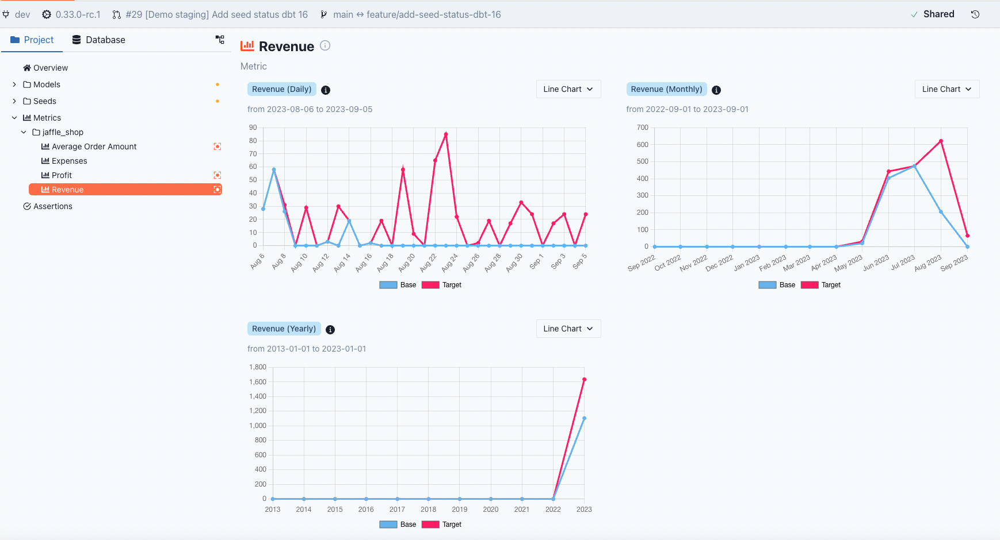

# Metrics


From dbt 1.6, support for the dbt\_metrics package was deprecated and replaced by the Semantic Layer. Likewise, from version 0.33.0 of PipeRider, support for the legacy metric config has also been discontinued. Metrics defined using the old configuration will now be automatically skipped by PipeRider.


PipeRider supports querying [dbt metrics](https://docs.getdbt.com/docs/build/metrics-overview) and analyzing the impact on metrics between two branches.

## How to use

1. Define semantic models and metrics in your dbt project
2. Validate metric configuration
3. Run PipeRider

### 1. Define semantic models and metrics

For full details on how to define metrics, please refer to the official dbt documentation on the[ semantic model](https://docs.getdbt.com/docs/build/semantic-models) and [creating metrics](https://docs.getdbt.com/docs/build/metrics-overview).&#x20;

The following serves as a basic example on how to define a metric. Here, we define a metric **revenue**, which is the sum of the **amount** column with a **status** of **completed**.


```diff
semantic_models:
  - name: orders
    defaults:
      agg_time_dimension: order_date
    model: ref('orders')
    entities:
      - name: order_id
        type: primary
      - name: customer
        type: foreign
        expr: customer_id
    dimensions:
      - name: order_date
        expr: order_date
        type: time
        type_params:
          time_granularity: day
      - name: status
        type: categorical
    measures:
      - name: revenue
        description: "The total revenue of our jaffle business"
        agg: sum
        expr: amount

metrics:
  - name: revenue
    description: "The total revenue of our jaffle business"
    type: simple
    label: Revenue
    type_params:
      measure: revenue
    filter: |
      {{ Dimension('order_id__status') }} = 'completed'
```


### 2. Validate metric configuration

The fastest way to validate the configuration of your dbt project is the [dbt-parse](https://docs.getdbt.com/reference/commands/parse) command:

```
$ dbt-parse
```

dbt has also released a powerful tool, [MetricFlow CLI](https://docs.getdbt.com/docs/build/metricflow-cli#validate-configs) that, among other features, can also validate your metric configuration:

```
$ mf validate-configs
```

MetricFlow CLI can also query the metric to ensure it is functional:

```
$ mf query --metrics revenue --group-by metric_time__month
✔ Success 🦄 - query completed after 0.12 seconds
| metric_time__month   |   revenue |
|:---------------------|----------:|
| 2023-05-01           |     69.00 |
| 2023-06-01           |    420.00 |
| 2023-07-01           |    478.00 |
| 2023-08-01           |    136.00 |
```

### 3. Run PipeRider

Once your metrics are correctly configured, run PipeRider:

```
$ piperider run
```

View metrics in your PipeRider Report by selecting the  `metrics` page form the project sidebar:

<figure><figcaption></figcaption></figure>

## More about metric queries

### How PipeRider queries the dbt metric

PipeRider can run daily, monthly, and yearly queries for your metrics. If the [time\_granularity](https://docs.getdbt.com/docs/build/dimensions#time) is defined, the queries will adhere to these  settings. For example, if the `time_granularity` is `month`, then PipeRider only run the monthly and yearly queries.

For each time grains, PipeRider only queries the last n periods

<table><thead><tr><th width="255">time_grain</th><th>metric query</th></tr></thead><tbody><tr><td>day</td><td>daily result for last 30 days</td></tr><tr><td>month</td><td>monthly result for last 12 months</td></tr><tr><td>year</td><td>yearly result for last 10 years</td></tr></tbody></table>

The behavior is identical to the following command in MetricFlow.

```bash
$ mf query --metrics revenue --group-by metric_time__day --start-time <30d ago>
$ mf query --metrics revenue --group-by metric_time__month --start-time <12m ago>
$ mf query --metrics revenue --group-by metric_time__year --start-time <10y ago>
```

### Limited Support of DBT Metrics

* PipeRider no longer supports metric specification prior to dbt v1.6. dbt provides official documentation on [how to migrate metrics configs to the new spec](https://docs.getdbt.com/guides/migration/sl-migration).
* PipeRider doesn't support metrics that use measures with `agg` , such as `sum_boolean`, `median`, and `percentile`
* PipeRider doesn't support metrics that use [filters](https://docs.getdbt.com/docs/build/metrics-overview#filters) with jinja macros other than `Dimension`&#x20;
* PipeRider doesn't support metrics that use [filters](https://docs.getdbt.com/docs/build/metrics-overview#filters) with `Dimension` macros that require [joins](https://docs.getdbt.com/docs/build/join-logic). Referencing the above metrics example:&#x20;
  * `{{ Dimension('order_id__status') }} = 'completed'` _is_ supported because `order_id` is type of `primary`
  * `{{ Dimension('customer__type') }} = 'vip'` is _not_ supported because `customer` is type of `foreign`, and so requires additional join
* PipeRider doesn't support [derived metrics](https://docs.getdbt.com/docs/build/derived) with `offset_window`
* PipeRider doesn't support [cumulative metrics](https://docs.getdbt.com/docs/build/cumulative).

## Query single metric

When developing a new metric, it is time-consuming to run through all the piperider run to test the metric result. PipeRider support dbt [node selection](https://docs.getdbt.com/reference/node-selection/syntax) to run on single metric

```sh
$ piperider run -s 'metric:jaffle_shop.revenue'
```

## Compare metrics

With PipeRider's **compare** feature, you're also able to compare metrics between reports, which is particularly useful when analyzing the impact of data model or metric definition changes.

<figure><figcaption><p>Metric comparison in a PipeRider Impact Report</p></figcaption></figure>
