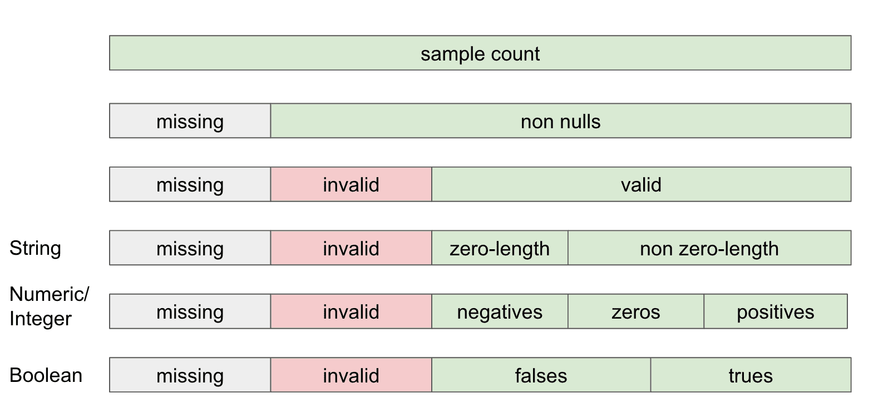

# Profiling

The data profiler is at the core of how PipeRider works. PipeRider helps you understand the structure of your data by providing statistical metrics and data distribution information about the table and columns in your data source. When paired with data assertions, the data profile provides a way to check the quality and reliability of your data.

Each time you run PipeRider, a new data profile is created and stored in the folder for that run. E.g. `.piperider/outputs/<run-name>/run.json`

## Profiling Statistics

Data profile metrics are divided between table and column level, and column is further analyzed depending on the schema type and generic type (see [Schema](profile.md#schema) below).

If a statistic is not available, please ensure you are using the latest version of PipeRider. Check the `PipeRider Version` column to see when a statistic was introduced.

## Table statistics

Data profile metrics that describe the tables in a data source.

| Profile Field           | Description                                                                     | Assertion Available | PipeRider Version |
| ----------------------- | ------------------------------------------------------------------------------- | ------------------- | ----------------- |
| `row_count`             | The number of rows in the table                                                 | ✔                   | All               |
| `col_count`             | The number of columns in the table                                              |                     | All               |
| `samples`               | The number of rows profiled                                                     |                     | 0.10.0            |
| `samples_p`             | The percentage of rows profiled                                                 |                     | 0.11.0            |
| `bytes` \*              | The volume size of the table in bytes                                           | ✔                   | 0.8.0             |
| `created` \*            | The time that the table was created, including time zone, in ISO 8601 format    |                     | 0.8.0             |
| `last_altered` \*       | The last time the table was modified, including time zone, in ISO 8601 format   |                     | 0.8.0             |
| `freshness` \*          | The time differentiation between the current time and table's last altered time | ✔                   | 0.8.0             |
| `duplicate_rows` \*\*   | The number of duplicate rows in the table                                       | ✔                   | 0.10.0            |
| `duplicate_rows_p` \*\* | The percentage of duplicate rows in the table                                   | ✔                   | 0.11.0            |


\* These statistics are only available for certain data sources. Please refer to the **platform dependent statistics** table below for availability information.\
\
\*\* Table-level duplicate row metrics are not enabled by default. To enable this settings please refer to the [Profiler Settings](../../project-structure/config.yml.md#profiler-settings).


### Platform dependent statistics

| Profile Field  | Snowflake | BigQuery | Redshift |
| -------------- | --------- | -------- | -------- |
| `bytes`        | ✔         | ✔        | ✔        |
| `created`      | ✔         | ✔        |          |
| `last_altered` | ✔         | ✔        |          |
| `freshness`    | ✔         | ✔        |          |

## Column statistics

Data profile metrics that describe data at the column level. Depending on the column type, different metrics will be produced.

### Schema

In addition to logging the **schema type** of a column as defined in the data source, PipeRider will also apply a **generic type** to a column that will determine how this column is treated by the PipeRider profiler.

| Profile Field | Description                                                                                | Column Type | PipeRider Version |
| ------------- | ------------------------------------------------------------------------------------------ | ----------- | ----------------- |
| `schema_type` | The column type defined in the data source                                                 | All         | All               |
| `type`        | A generic schema type of `string`, `integer`, `numeric`, `datetime`, `boolean`, or `other` | All         | All               |

The following statistics are produced based on the generic type that has been applied to the column.

### Data composition

The composition of the data contained within a column.

<figure><figcaption>
The generic type of a column determines the available statistics
</figcaption></figure>

| Profile Field       | Description                                                                                                          | Column Type      | Assertion Available | PipeRider Version |
| ------------------- | -------------------------------------------------------------------------------------------------------------------- | ---------------- | ------------------- | ----------------- |
| `total`             | The number of rows in the table                                                                                      | All              | ✔                   | All               |
| `samples`           | The number of rows profiled                                                                                          | All              | ✔                   | 0.10.0            |
| `samples_p`         | The percentage of rows profiled                                                                                      | All              | ✔                   | 0.11.0            |
| `nulls`             | The number of null values                                                                                            | All              | ✔                   | 0.6.0             |
| `nulls_p`           | The percentage of null values                                                                                        | All              | ✔                   | 0.11.0            |
| `non_nulls`         | The number of non-null values                                                                                        | All              | ✔                   | All               |
| `non_nulls_p`       | The percentage of non-null values                                                                                    | All              | ✔                   | 0.11.0            |
| `invalids`          | The number of values that do not match the column's schema type. E.g. A string in a numeric column (**SQLite only**) | All              | ✔                   | 0.6.0             |
| `invalids_p`        | The percentage of invalid values (**SQLite only**)                                                                   | All              | ✔                   | 0.11.0            |
| `valids`            | The count of non-null values minus invalid values                                                                    | All              | ✔                   | 0.6.0             |
| `valids_p`          | The percentage of non-null values, minus invalid values                                                              | All              | ✔                   | 0.11.0            |
| `zeros`             | The number of zeros                                                                                                  | integer, numeric | ✔                   | 0.6.0             |
| `zeros_p`           | The percentage of zeros                                                                                              | integer, numeric | ✔                   | 0.11.0            |
| `negatives`         | The number of negative values                                                                                        | integer, numeric | ✔                   | 0.6.0             |
| `negatives_p`       | The percentage of negative values                                                                                    | integer, numeric | ✔                   | 0.11.0            |
| `positives`         | The number of positive values                                                                                        | integer, numeric | ✔                   | 0.6.0             |
| `positives_p`       | The percentage of positive values                                                                                    | integer, numeric | ✔                   | 0.11.0            |
| `zero_length`       | The number of empty strings                                                                                          | string           | ✔                   | 0.6.0             |
| `zero_length_p`     | The percentage of empty strings                                                                                      | string           | ✔                   | 0.11.0            |
| `non_zero_length`   | The number of non-empty strings                                                                                      | string           | ✔                   | 0.6.0             |
| `non_zero_length_p` | The percentage of non-empty strings                                                                                  | string           | ✔                   | 0.11.0            |
| `trues`             | The number of true values                                                                                            | boolean          | ✔                   | 0.6.0             |
| `trues_p`           | The percentage of true values                                                                                        | boolean          | ✔                   | 0.11.0            |
| `falses`            | The number of false values                                                                                           | boolean          | ✔                   | 0.6.0             |
| `falses_p`          | The percentage of false values                                                                                       | boolean          | ✔                   | 0.11.0            |

### General statistics

The general statistical information of a column.

| Profile Field | Description                      | Column Type                | Assertion Available | PipeRider Version |
| ------------- | -------------------------------- | -------------------------- | ------------------- | ----------------- |
| `min`         | The minimum value                | integer, numeric, datetime | ✔                   | All               |
| `max`         | The maximum value                | integer, numeric, datetime | ✔                   | All               |
| `avg`         | The column average               | integer, numeric           | ✔                   | All               |
| `sum`         | The column sum                   | integer, numeric           | ✔                   | All               |
| `stddev`      | The standard deviation of values | integer, numeric,          | ✔                   | 0.4.0             |

### Text length statistics

The text length statistics of a column.

| Profile Field   | Description                             | Column Type | Assertion Available | PipeRider Version |
| --------------- | --------------------------------------- | ----------- | ------------------- | ----------------- |
| `min_length`    | The minimum string length               | string      | ✔                   | 0.11.0            |
| `max_length`    | The maximum string length               | string      | ✔                   | 0.11.0            |
| `avg_length`    | The average string length               | string      | ✔                   | 0.11.0            |
| `stddev_length` | The standard deviation of string length | string      | ✔                   | 0.11.0            |

### Uniqueness

The uniqueness of a column.

<figure><figcaption>
Column uniqueness
</figcaption></figure>

| Profile Field      | Description                           | Column Type                        | Assertion Available | PipeRider Version |
| ------------------ | ------------------------------------- | ---------------------------------- | ------------------- | ----------------- |
| `distinct`         | The number of distinct items          | integer, string, datetime          | ✔                   | All               |
| `distinct_p`       | The percentage of distinct items      | integer, string, datetime          | ✔                   | 0.11.0            |
| `duplicates`       | The number of recurring items         | integer, numeric, string, datetime | ✔                   | 0.6.0             |
| `duplicates_p`     | The percentage of duplicate items     | integer, numeric, string, datetime | ✔                   | 0.11.0            |
| `non_duplicates`   | The number of non-recurring items     | integer, numeric, string, datetime | ✔                   | 0.6.0             |
| `non_duplicates_p` | The percentage of non-duplicate items | integer, numeric, string, datetime | ✔                   | 0.11.0            |

For example, the following dataset `(NULL, a, a, b, b, c, d, e)` would be categorized as so:

* Distinct count = 5, `(a, b, c, d, e)`
* Duplicate count = 4, `(a, a, b, b)`
* Non-duplicate count = 3, `(c, d, e)`
* Missing values (nulls) = 1

Therefore, the total number of rows for a table = missing (nulls) + duplicates + non-duplicates.

### Quantiles

The calculated quantiles of a numeric or integer column.

| Profile Field | Description      | Column Type      | Assertion Available | PipeRider Version |
| ------------- | ---------------- | ---------------- | ------------------- | ----------------- |
| `min`         | 0th percentile   | integer, numeric | ✔                   | All               |
| `p5`          | 5th percentile   | integer, numeric | ✔                   | 0.4.0             |
| `p25`         | 25th percentile  | integer, numeric | ✔                   | 0.4.0             |
| `p50`         | 50th percentile  | integer, numeric | ✔                   | 0.4.0             |
| `p75`         | 75th percentile  | integer, numeric | ✔                   | 0.4.0             |
| `p95`         | 95th percentile  | integer, numeric | ✔                   | 0.4.0             |
| `max`         | 100th percentile | integer, numeric | ✔                   | All               |

### Distribution

| Profile Field      | Description                                                                   | Column Type      | PipeRider Version |
| ------------------ | ----------------------------------------------------------------------------- | ---------------- | ----------------- |
| `topk`             | The most frequently occurring n items and and counts                          | integer, string  | 0.6.0             |
| `histogram`        | Evenly-split bins for **numerical columns** and counts for each bin           | integer, numeric | 0.6.0             |
| `histogram_length` | Evenly-split bins for text length and counts for each bin                     | string           | 0.6.0             |
| `histogram`        | Histogram of **date, month, or year**. Bin split depends on the min/max range | datetime         | 0.6.0             |
