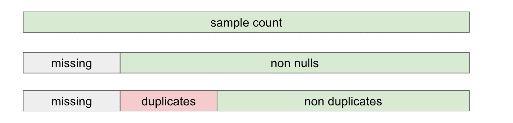

# Profiling

PipeRider helps you understand of your data by providing profile statistics and data distribution information about the table and columns in your data source.&#x20;

## Enable Profiling

Profiling is supported for dbt models, seeds, and sources. To enable the profiling, please add `piperider` tag on the corresponding resources.



```diff
--- models/staging/stg_customers.sql
+{{ config(
+    tags=["piperider"]
+)}}

select ...

```



```diff
# dbt_project.yml
models:
  jaffle_shop:
+     +tags: [piperider]
      materialized: table
      staging:
        materialized: view
seeds:
  jaffle_shop:
+   +tags: [piperider]
```



```diff
# models/resources.yml
version: 2

models:
  - name: customers
    description: This table has basic information about a customer, as well as some derived facts based on a customer's orders
+   config:
+      tags: [piperider]
```



and run the command to check if it is configured correectly.

```
 dbt list -s tag:piperider
```


## Table statistics

| Profile Field           | Description                                                                     |
| ----------------------- | ------------------------------------------------------------------------------- |
| `row_count`             | The number of rows in the table                                                 |
| `col_count`             | The number of columns in the table                                              |
| `samples`               | The number of rows profiled                                                     |
| `samples_p`             | The percentage of rows profiled                                                 |
| `bytes` \*              | The volume size of the table in bytes                                           |
| `created` \*            | The time that the table was created, including time zone, in ISO 8601 format    |
| `last_altered` \*       | The last time the table was modified, including time zone, in ISO 8601 format   |
| `freshness` \*          | The time differentiation between the current time and table's last altered time |
| `duplicate_rows` \*\*   | The number of duplicate rows in the table                                       |
| `duplicate_rows_p` \*\* | The percentage of duplicate rows in the table                                   |


\* These statistics are only available for certain data sources. Please refer to the **platform dependent statistics** table below for availability information.\
\
\*\* Table-level duplicate row are not enabled by default. To enable this settings please refer to the [profiler settings](../../reference/project-structure/config.md).


| Profile Field  | Snowflake | BigQuery | Redshift |
| -------------- | --------- | -------- | -------- |
| `bytes`        | ✔         | ✔        | ✔        |
| `created`      | ✔         | ✔        |          |
| `last_altered` | ✔         | ✔        |          |
| `freshness`    | ✔         | ✔        |          |

## Column statistics

Column statistics are profiling statistics of a column. Some statistics are only avaialble on certain generic type. There are six generic types

* string
* integer
* numeric
* datetime
* boolean
* other

### Schema

In addition to logging the **schema type** of a column as defined in the data source, PipeRider will also apply a **generic type** to a column that will determine how this column is treated by the PipeRider profiler.

<table><thead><tr><th>Profile Field</th><th>Description</th><th width="137">Column Type</th><th>PipeRider Version</th></tr></thead><tbody><tr><td><code>schema_type</code></td><td>The column type defined in the data source</td><td>All</td><td>All</td></tr><tr><td><code>type</code></td><td>A generic schema type of <code>string</code>, <code>integer</code>, <code>numeric</code>, <code>datetime</code>, <code>boolean</code>, or <code>other</code></td><td>All</td><td>All</td></tr></tbody></table>

The following statistics are produced based on the generic type that has been applied to the column.

### Data composition

The composition of the data contained within a column.

<figure><figcaption><p>The generic type of a column determines the available statistics</p></figcaption></figure>

| Profile Field       | Description                                                                                                          | Column Type      | Assertion Available |
| ------------------- | -------------------------------------------------------------------------------------------------------------------- | ---------------- | ------------------- |
| `total`             | The number of rows in the table                                                                                      | All              | ✔                   |
| `samples`           | The number of rows profiled                                                                                          | All              | ✔                   |
| `samples_p`         | The percentage of rows profiled                                                                                      | All              | ✔                   |
| `nulls`             | The number of null values                                                                                            | All              | ✔                   |
| `nulls_p`           | The percentage of null values                                                                                        | All              | ✔                   |
| `non_nulls`         | The number of non-null values                                                                                        | All              | ✔                   |
| `non_nulls_p`       | The percentage of non-null values                                                                                    | All              | ✔                   |
| `invalids`          | The number of values that do not match the column's schema type. E.g. A string in a numeric column (**SQLite only**) | All              | ✔                   |
| `invalids_p`        | The percentage of invalid values (**SQLite only**)                                                                   | All              | ✔                   |
| `valids`            | The count of non-null values minus invalid values                                                                    | All              | ✔                   |
| `valids_p`          | The percentage of non-null values, minus invalid values                                                              | All              | ✔                   |
| `zeros`             | The number of zeros                                                                                                  | integer, numeric | ✔                   |
| `zeros_p`           | The percentage of zeros                                                                                              | integer, numeric | ✔                   |
| `negatives`         | The number of negative values                                                                                        | integer, numeric | ✔                   |
| `negatives_p`       | The percentage of negative values                                                                                    | integer, numeric | ✔                   |
| `positives`         | The number of positive values                                                                                        | integer, numeric | ✔                   |
| `positives_p`       | The percentage of positive values                                                                                    | integer, numeric | ✔                   |
| `zero_length`       | The number of empty strings                                                                                          | string           | ✔                   |
| `zero_length_p`     | The percentage of empty strings                                                                                      | string           | ✔                   |
| `non_zero_length`   | The number of non-empty strings                                                                                      | string           | ✔                   |
| `non_zero_length_p` | The percentage of non-empty strings                                                                                  | string           | ✔                   |
| `trues`             | The number of true values                                                                                            | boolean          | ✔                   |
| `trues_p`           | The percentage of true values                                                                                        | boolean          | ✔                   |
| `falses`            | The number of false values                                                                                           | boolean          | ✔                   |
| `falses_p`          | The percentage of false values                                                                                       | boolean          | ✔                   |

### General statistics

The general statistical information of a column.

| Profile Field | Description                      | Column Type                | Assertion Available | PipeRider Version |
| ------------- | -------------------------------- | -------------------------- | ------------------- | ----------------- |
| `min`         | The minimum value                | integer, numeric, datetime | ✔                   | All               |
| `max`         | The maximum value                | integer, numeric, datetime | ✔                   | All               |
| `avg`         | The column average               | integer, numeric           | ✔                   | All               |
| `sum`         | The column sum                   | integer, numeric           | ✔                   | All               |
| `stddev`      | The standard deviation of values | integer, numeric,          | ✔                   | 0.4.0             |

### Text length statistics

The text length statistics of a column.

<table><thead><tr><th width="184">Profile Field</th><th>Description</th><th>Column Type</th><th>Assertion Available</th></tr></thead><tbody><tr><td><code>min_length</code></td><td>The minimum string length</td><td>string</td><td>✔</td></tr><tr><td><code>max_length</code></td><td>The maximum string length</td><td>string</td><td>✔</td></tr><tr><td><code>avg_length</code></td><td>The average string length</td><td>string</td><td>✔</td></tr><tr><td><code>stddev_length</code></td><td>The standard deviation of string length</td><td>string</td><td>✔</td></tr></tbody></table>

### Uniqueness

The uniqueness of a column.

<figure><figcaption><p>Column uniqueness</p></figcaption></figure>

<table><thead><tr><th>Profile Field</th><th>Description</th><th width="175">Column Type</th><th>Assertion Available</th></tr></thead><tbody><tr><td><code>distinct</code></td><td>The number of distinct items</td><td>integer, string, datetime</td><td>✔</td></tr><tr><td><code>distinct_p</code></td><td>The percentage of distinct items</td><td>integer, string, datetime</td><td>✔</td></tr><tr><td><code>duplicates</code></td><td>The number of recurring items</td><td>integer, numeric, string, datetime</td><td>✔</td></tr><tr><td><code>duplicates_p</code></td><td>The percentage of duplicate items</td><td>integer, numeric, string, datetime</td><td>✔</td></tr><tr><td><code>non_duplicates</code></td><td>The number of non-recurring items</td><td>integer, numeric, string, datetime</td><td>✔</td></tr><tr><td><code>non_duplicates_p</code></td><td>The percentage of non-duplicate items</td><td>integer, numeric, string, datetime</td><td>✔</td></tr></tbody></table>

For example, the following dataset `(NULL, a, a, b, b, c, d, e)` would be categorized as so:

* Distinct count = 5, `(a, b, c, d, e)`
* Duplicate count = 4, `(a, a, b, b)`
* Non-duplicate count = 3, `(c, d, e)`
* Missing values (nulls) = 1

Therefore, the total number of rows for a table = missing (nulls) + duplicates + non-duplicates.

### Quantiles

The calculated quantiles of a numeric or integer column.

| Profile Field | Description      | Column Type      | Assertion Available | PipeRider Version |
| ------------- | ---------------- | ---------------- | ------------------- | ----------------- |
| `min`         | 0th percentile   | integer, numeric | ✔                   | All               |
| `p5`          | 5th percentile   | integer, numeric | ✔                   | 0.4.0             |
| `p25`         | 25th percentile  | integer, numeric | ✔                   | 0.4.0             |
| `p50`         | 50th percentile  | integer, numeric | ✔                   | 0.4.0             |
| `p75`         | 75th percentile  | integer, numeric | ✔                   | 0.4.0             |
| `p95`         | 95th percentile  | integer, numeric | ✔                   | 0.4.0             |
| `max`         | 100th percentile | integer, numeric | ✔                   | All               |

### Distribution

<table><thead><tr><th width="233">Profile Field</th><th>Description</th><th width="159">Column Type</th></tr></thead><tbody><tr><td><code>topk</code></td><td>The most frequently occurring n items and and counts</td><td>integer, string</td></tr><tr><td><code>histogram</code></td><td>Evenly-split bins for <strong>numerical columns</strong> and counts for each bin</td><td>integer, numeric</td></tr><tr><td><code>histogram_length</code></td><td>Evenly-split bins for text length and counts for each bin</td><td>string</td></tr><tr><td><code>histogram</code></td><td>Histogram of <strong>date, month, or year</strong>. Bin split depends on the min/max range</td><td>datetime</td></tr></tbody></table>
