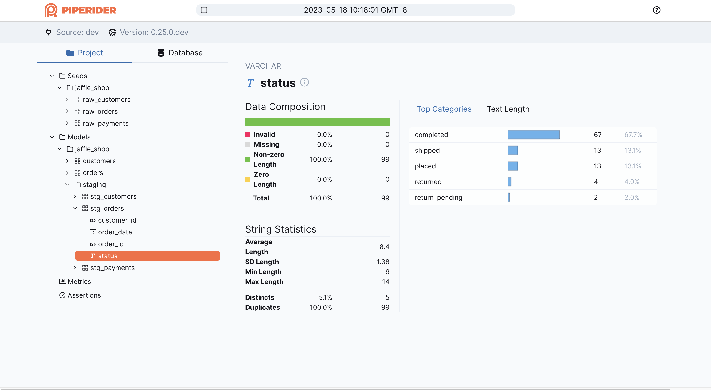
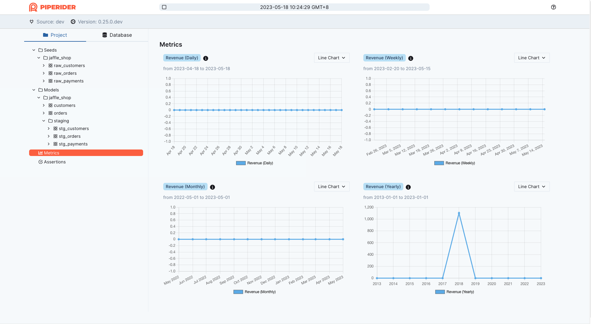
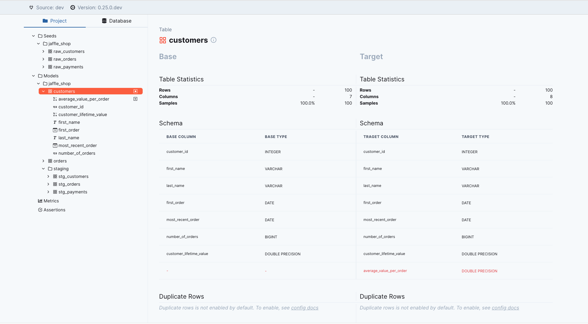
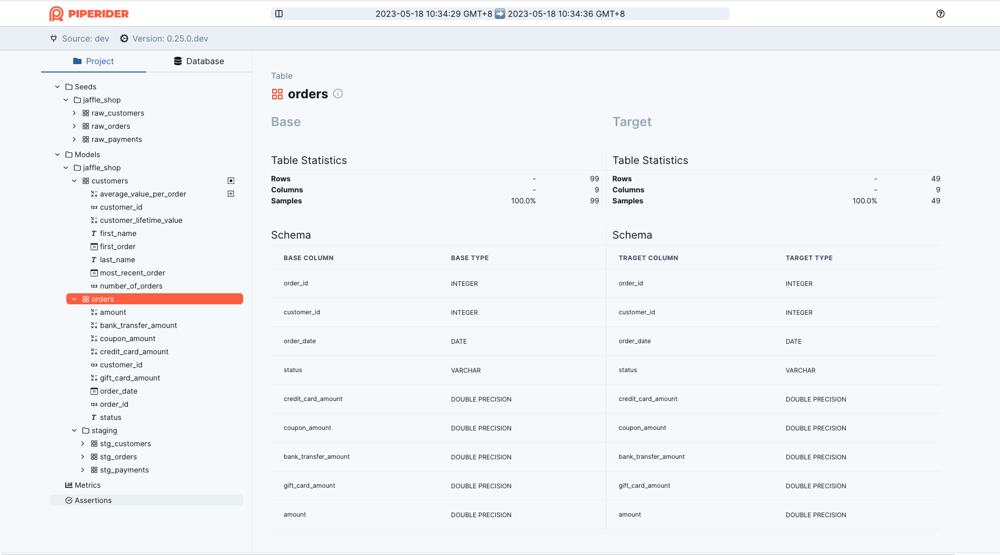
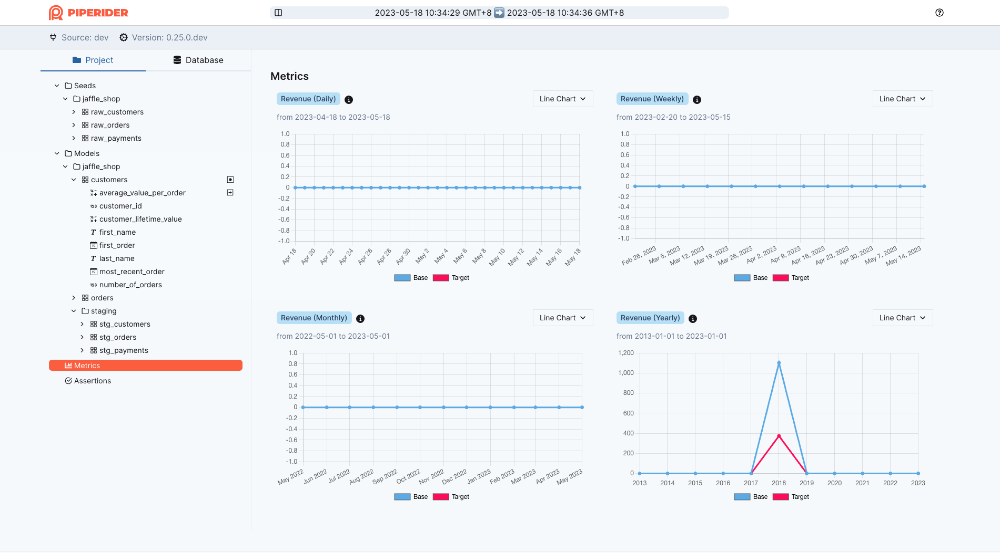
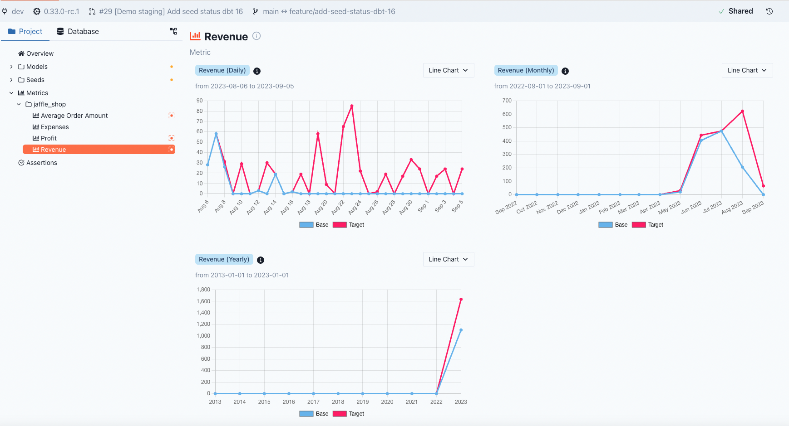

# Jaffle Shop

Incorporating PipeRider into your current dbt project is a seamless process, thanks to PipeRider's built-in, almost zero-configuration, support for dbt.

This guide utilizes the [Jaffle Shop](https://github.com/dbt-labs/jaffle\_shop) project from dbt as a practical illustration of how to effectively employ PipeRider in conjunction with a dbt project.

In this guide you will do the following:

1. [Configure the Jaffle Shop project](dbt.md#1.-configure-the-jaffle-shop-project)
2. [Install and add PipeRider to the Jaffle Shop project](dbt.md#2.-install-and-add-piperider-to-the-jaffle-shop-project)
3. [Run PipeRider](dbt.md#3.-run-piperider)
4. [Add PipeRider to your development workflow](dbt.md#4.-add-piperider-to-your-development-workflow)
5. [Next step: Automate the process in the CI](dbt.md#4.-automate-the-procss-in-the-ci)

## 1. Configure the Jaffle Shop project

Clone the Jaffle Shop repository

```
git clone https://github.com/dbt-labs/jaffle_shop.git
cd jaffle_shop
```

Follow the ‘[Running this project](https://github.com/dbt-labs/jaffle\_shop#running-this-project)’ instructions in the [Jaffle shop](https://github.com/dbt-labs/jaffle\_shop) repository to install and configure the dbt project, or use the instructions below to setup the project using [DuckDB](https://duckdb.org/).

<details>

<summary>Use DuckDB</summary>

(Optional) Setup the virtual env

```
python -m venv ./venv
source ./venv/bin/activate 
```

Install [`dbt-duckdb`](https://docs.getdbt.com/reference/warehouse-setups/duckdb-setup)

```bash
pip install dbt-duckdb
```

Copy the following content to `profiles.yml` and place it under the jaffle\_shop directory.

```yaml
# ./profiles.yml
jaffle_shop:
  target: dev
  outputs:
    dev:
      type: duckdb
      path: jaffle_shop.duckdb
```

Run dbt build and ensure the process completes without error.

```
dbt build
```

</details>

## 2. Install and add PipeRider to the Jaffle Shop project

### Install PipeRider

Install PipeRider with the [required connector](../../reference/supported-data-sources/) for the data source you used to configure the Jaffle Shop project in step #1.

For example, to install PipeRider with the **DuckDB** connector, you would use the following command:

```bash
pip install -U 'piperider[duckdb]'
```

### Verify PipeRider configuration

Ensure that PipeRider can connect to the data source by running the `diagnose` command.

```bash
piperider diagnose
```

```
Diagnosing...
PipeRider Version: 0.25.0.dev
Check config files:
  /private/tmp/jaffle_shop/.piperider/config.yml: [OK]
✅ PASS

Check format of data sources:
  dev: [OK]
✅ PASS

Check connections:
  DBT: duckdb > jaffle_shop > dev [OK]
  Name: dev
  Type: duckdb
  connector: [OK]
  Connection: [OK]
✅ PASS

Check assertion files:
✅ PASS

🎉 You are all set!
```

If everything is configured corrected you’ll see the _**You are all set!**_ message.

## 3. Run PipeRider

You can now run PipeRider to generate your first report, which will list all of the sources, seeds, models, and schema definition. However, **to profile your models you will need to add the PipeRider tag**. Skip to the next section to do this.

```
piperider run
```

### Tag models to enable profiling

Enable profiling by adding the `piperider` tag to the models you wish to be profiled. Here's an example of how to add tags in the project file:

```diff
# dbt_project.yml
models:
  jaffle_shop:
+     +tags: piperider
      materialized: table
      staging:      
        materialized: view
```

Alternatively, you can also add the tag config to the top of individual model files, e.g:

```
# models/my_model.sql
{{ config(tags=['piperider']) }}
...
```

After tagging models, verify your configuration by listing the tagged models.

```
dbt list -s tag:piperider --resource-type model  
```

Run PipeRider again. This time, the report will be filled with the data profiling statistics of your tagged models.

```bash
piperider run
```

The report contains profiling statistics for each of the profiled models.

<figure><figcaption></figcaption></figure>

### Add metrics to query

In dbt, you have the ability to define metrics that specify how to query your time series data. PipeRider offers automatic report generation based on these defined metrics.

To add a metric to your project, create a new file, `models/revenue.yml`, with the following content.

```
# models/revenue.yml
version: 2

metrics:
  - name: revenue
    label: Revenue
    model: ref('orders')
    description: "The total revenue of our jaffle business"

    calculation_method: sum
    expression: amount 

    timestamp: order_date
    time_grains: [day, week, month, year]

    filters:
      - field: status
        operator: '='
        value: "'completed'"

    tags: ['piperider']


```


Note that **metrics also require the `piperider` tag**, indicating that PipeRider should automatically query this metric.


Check the metric is well-configured.

```
dbt list -s tag:piperider --resource-type metric  
```

Run PipeRider again

```
piperider run
```

The report includes metric queries for your data. However, please note that since the Jaffle Shop data is only available for the year 2018, you will only be able to view the data in the yearly report. This report displays the data for the last 10 years.

<figure><figcaption></figcaption></figure>

### Commit the change

In order to follow the compare tutorial below, you will need to first commit the current changes.

```sh
git add profiles.yml # If you configure the dbt profiles in your project
git add '.piperider/*' dbt_project.yml models/revenue.yml
git commit -s -m 'Integrate with PipeRider'
```

## 4. Add PipeRider to your development workflow

When you want to develop a new feature, you likely follow the [GitHub workflow](https://docs.github.com/en/get-started/quickstart/github-flow), which contains the following steps:

1. Create a branch
2. Make changes
3. Create a pull review
4. Address review comments
5. Merge your pull request

Based on these steps, PipeRider can integrate with your process and generate a comparison report to aid with code review in your dbt project.

### Create a branch for development

```
git checkout -b feature/change-my-project
```

### Make changes

Add a new column to the `customers` table.

```diff
# models/customers.sql
...  
  final as (

      select
          customers.customer_id,
          customers.first_name,
          customers.last_name,
          customer_orders.first_order,
          customer_orders.most_recent_order,
+         customer_payments.total_amount / customer_orders.number_of_orders as average_value_per_order,
          customer_orders.number_of_orders,
          customer_payments.total_amount as customer_lifetime_value

      from customers
...
```

Add a filter to the orders table.

```diff
# models/orders.sql
...
final as (

    select
        orders.order_id,
        orders.customer_id,
        orders.order_date,
        orders.status,

        



        order_payments.{{ payment_method }}_amount,

        


        order_payments.total_amount as amount

    from orders


    left join order_payments
        on orders.order_id = order_payments.order_id
    
+   where orders.order_id > 50
)

...
```

### Build the project

Test your changes, and ensure that the project can be built without error.

```
dbt build
```

### Generate a report

if you wish to view the PipeRider report before comparing, you can run PipeRider st this stage:

```
piperider run
```

### Commit your changes

Add your recent changes to source control.

```
git add 'models/*'
git commit -s -m 'Test PipeRide compare'
```

### Create the compare report

The PipeRider compare command will compare your data before and after making dbt project changes.

```
piperider compare
```

The report will show the following changes to your projectL

1. Added a new column
2. Row counts change in the orders table
3. Metric change due to the orders table definition change

<figure><figcaption><p>Added a new column</p></figcaption></figure>

<figure><figcaption><p>Row count changed</p></figcaption></figure>

<figure><figcaption><p>Metric change</p></figcaption></figure>

### Add the comparison summary to your pull request comment

The compare command also outputs a markdown file, [`summary.md`](https://gist.github.com/infuseai-dev/9919580952751a47798198402ddb2339) which is specifically designed to be pasted into a GitHub pull request (PR) comment.

<figure><figcaption><p>summary.md</p></figcaption></figure>

The pull request comment now contains detailed information about how your code changes have affected the data. This improves the code review process and helps ensure that unexpected changes do not make their way into production.

## Next Step: Automate the process in the CI

The process mentioned above is also manual. However, if you wish to automate this action, you can [integrate PipeRider in your CI workflow](../../ci/introduction.md).
