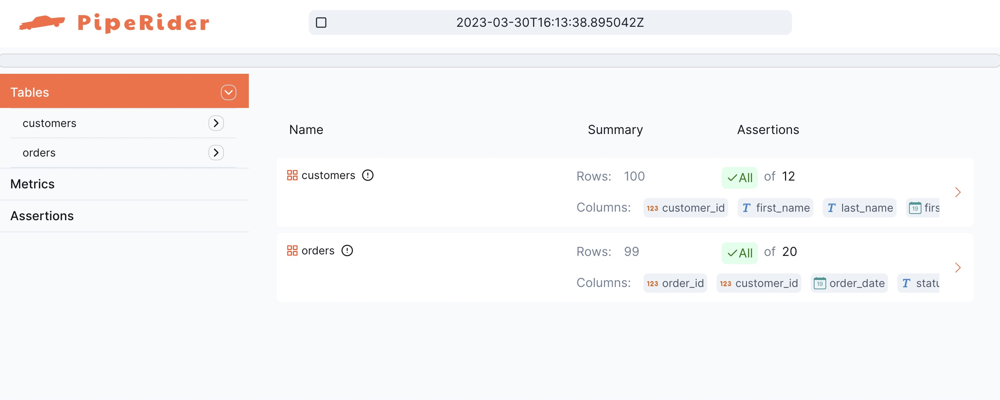
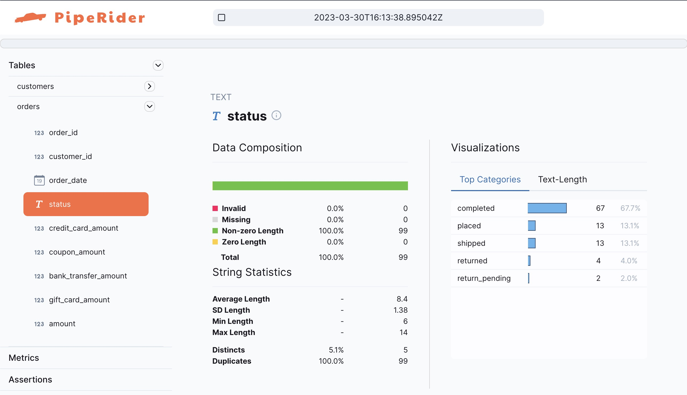
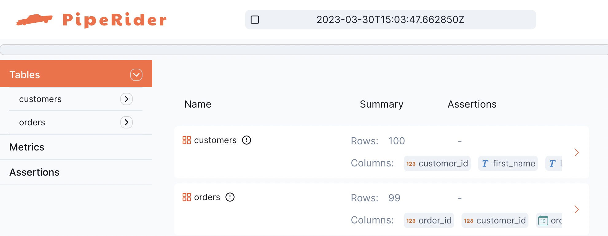
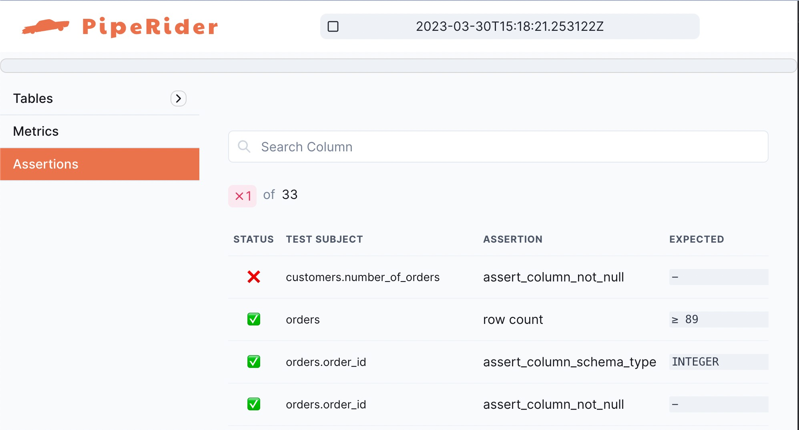

# Jaffle Shop

Integrating PipeRider into your existing dbt project is easy with PipeRider's zero-config support for dbt. Just initialize PipeRider inside your dbt project folder and your data source settings will be automatically configured.

The following guide uses dbt's [Jaffle Shop](https://github.com/dbt-labs/jaffle\_shop) project as an example of how to use PipeRider with a dbt project.

In this guide you will do the following:

1. [Configure the Jaffle Shop project](dbt.md#1.-configure-the-jaffle-shop-project)
2. [Install and add PipeRider to the Jaffle Shop project](dbt.md#2.-install-and-add-piperider-to-the-jaffle-shop-project)
3. [Run PipeRider to generate a data profile report](dbt.md#3.-run-piperider-to-generate-a-data-profile-report)
4. [Use dbt node selection with PipeRider](dbt.md#4.-use-dbt-node-selection-with-piperider)
5. [Next step: Data assertions](dbt.md#5.-next-step-data-assertions)

## 1. Configure the Jaffle Shop project

Follow the ‘[Running this project](https://github.com/dbt-labs/jaffle\_shop#running-this-project)’ instructions in the [Jaffle shop](https://github.com/dbt-labs/jaffle\_shop) repository to install and configure the dbt project.

Once configured, or if you already have a dbt project you want to use, proceed to step #2.

## 2. Install and add PipeRider to the Jaffle Shop project

PipeRider supports many data sources through connectors. For a full list, please refer to [Supported Data Sources](../../reference/supported-data-sources/).

### Install PipeRider

Install PipeRider with the required connector for the data source you used to configure the Jaffle Shop project in step #1.

For example, to install PipeRider with the Postgres connector, you would use the following command:

```bash
pip install -U 'piperider[postgres]'
```

### Initialize PipeRider

Ensure you are inside the Jaffle Shop project directory, and then run the following command to initialize a new PipeRider project.

```bash
piperider init
```

PipeRider will auto-detect the dbt project settings and display the contents of your PipeRider configuration file, located at `.piperider/config.yml`

```
$ piperider init
Initialize piperider to path /path/to/jaffle_shop/.piperider
[ DBT ] Use the existing dbt project file: /path/to/jaffle_shop/dbt_project.yml
────────────────────────────────────────────── .piperider/config.yml ───────────────────────────────────────────────
   1 dataSources: []
   2 dbt:
   3   projectDir: .
   4   # tag: 'piperider'
   5
   6 profiler:
   7 #   table:
   8 #     # the maximum row count to profile. (Default unlimited)
   9 #     limit: 1000000
  10 #     duplicateRows: false
  11
  12 telemetry:
  13   id: abc123
  14

───────────────────────────────────── Recipe: .piperider/compare/default.yml ────────────────────────────────────────
   1 base:
   2   branch: main
   3   dbt:
   4     commands:
   5     - dbt deps
   6     - dbt build
   7   piperider:
   8     command: piperider run
   9 target:
  10   dbt:
  11     commands:
  12     - dbt deps
  13     - dbt build
  14   piperider:
  15     command: piperider run
  16

Next step:
  Please execute command 'piperider diagnose' to verify configuration
```


See [config.yml](../../reference/project-structure/config.md) for details of available settings


### Verify PipeRider configuration

Ensure that PipeRider can connect to the data source by running the `diagnose` command.

```bash
piperider diagnose
```

```
$ piperider diagnose
Diagnosing...
PipeRider Version: 0.14.0
Check config files:
  /path/to/jaffle_shop/.piperider/config.yml: [OK]
✅ PASS

Check format of data sources:
  dev: [OK]
✅ PASS

Check connections:
  DBT: postgres > jaffle_shop > dev [OK]
  Name: dev
  Type: postgres
  connector: [OK]
  Connection: [OK]
✅ PASS

Check assertion files:
✅ PASS

🎉 You are all set!


Next step:
  Please execute command 'piperider run' to generate your first report
```

If everything is configured corrected you’ll see the 'You are all set!’ message.

## 3. Run PipeRider to generate a data profile report

By default, PipeRider will run profile on the models with `piperider` tag, we can add all models with `piperider` tag in the `dbt_project.yml`

```
models:
  jaffle_shop:
      +tags: piperider
      materialized: table
      staging:      
        materialized: view
```

Check all the models are well-configured

```
dbt list -s tag:piperider --resource-type model  
```

Run PipeRider to profile the data source and create your first HTML report:

```bash
piperider run
```

PipeRider will profile all the models and output the link for the HTML report.

```
$ piperider run
DataSource: dev
───────────────────────────────────────────────── Validating ──────────────────────────────────────────────────
everything is OK.
────────────────────────────────────────────────── Profiling ──────────────────────────────────────────────────
[0/7] METADATA                          ━━━━━━━━━━━━━━━━━━━━━━━━━━━━━━━━━━━━━━━━━━━━━━━━━━━━━━━━━━━━━━━━━━━━━━━━━━━━━━━━   7/7 0:00:00
[1/7] int_order_payments_pivoted        ━━━━━━━━━━━━━━━━━━━━━━━━━━━━━━━━━━━━━━━━━━━━━━━━━━━━━━━━━━━━━━━━━━━━━━━━━━━━━━━━ 10/10 0:00:00
[2/7] int_customer_order_history_joined ━━━━━━━━━━━━━━━━━━━━━━━━━━━━━━━━━━━━━━━━━━━━━━━━━━━━━━━━━━━━━━━━━━━━━━━━━━━━━━━━   8/8 0:00:00
...
─────────────────────────────────────────────────── Summary ───────────────────────────────────────────────────

  Table Name                          #Columns Profiled   #Tests Executed   #Tests Failed
 ━━━━━━━━━━━━━━━━━━━━━━━━━━━━━━━━━━━━━━━━━━━━━━━━━━━━━━━━━━━━━━━━━━━━━━━━━━━━━━━━━━━━━━━━━
  int_order_payments_pivoted                          9                 0               0
  int_customer_order_history_joined                   7                 0               0
  ...

Generating reports from: /path/to/jaffle_shop/.piperider/outputs/latest/run.json
Report generated in /path/to/jaffle_shop/.piperider/outputs/latest/index.html

Next step:
  Please execute command 'piperider run' to generate your second report
```

The report contains detailed data profile statistics for each of the profiled tables.

<figure><figcaption><p>PipeRider Jaffle Shop Report Overview</p></figcaption></figure>

<figure><figcaption><p>PipeRider Jaffle Shop Data Profile Sample</p></figcaption></figure>

## 4. Use dbt node selection with PipeRider

PipeRider supports profiling and testing dbt 'state', so it’s possible to use node selection to build and then run PipeRider on a subset of resources.

### Build a subset of resources

Use dbt node selection to select and build a sub-set of resources.

```bash
dbt build -s orders+
```

dbt will seed, build, and test the `orders` table and any children.

### Run PipeRider on the dbt state

Run PipeRider again, this time specifying the location of the dbt state (the default folder for dbt artifacts is `target`).

```bash
piperider run --dbt-state target
```

PipeRider will now only run on the `orders` table, and the two child models, `customers` and `orders`.

```
$ piperider run --dbt-state target
DataSource: dev
───────────────────────────────────────────────── Validating ──────────────────────────────────────────────────
everything is OK.
────────────────────────────────────────────────── Profiling ──────────────────────────────────────────────────
[0/2] METADATA  ━━━━━━━━━━━━━━━━━━━━━━━━━━━━━━━━━━━━━━━━━━━━━━━━━━━━━━━━━━━━━━━━━━━━━━━━━━━━━━━━   2/2 0:00:00
[1/2] customers ━━━━━━━━━━━━━━━━━━━━━━━━━━━━━━━━━━━━━━━━━━━━━━━━━━━━━━━━━━━━━━━━━━━━━━━━━━━━━━━━   8/8 0:00:00
[2/2] orders    ━━━━━━━━━━━━━━━━━━━━━━━━━━━━━━━━━━━━━━━━━━━━━━━━━━━━━━━━━━━━━━━━━━━━━━━━━━━━━━━━ 10/10 0:00:00
─────────────────────────────────────────────────── Summary ───────────────────────────────────────────────────

  Table Name   #Columns Profiled   #Tests Executed   #Tests Failed
 ━━━━━━━━━━━━━━━━━━━━━━━━━━━━━━━━━━━━━━━━━━━━━━━━━━━━━━━━━━━━━━━━━━
  customers                    7                 0               0
  orders                       9                 0               0

Generating reports from: /path/to/jaffle_shop/.piperider/outputs/latest/run.json
Report generated in  /path/to/jaffle_shop/.piperider/outputs/latest/index.html
```

### View report and dbt test results

The resulting report contains the data profile for the three resources on the node we specified in the last step.

<figure><figcaption><p>PipeRider Report based on dbt State</p></figcaption></figure>

## 5. Next step: Data assertions

> <mark style="color:red;">Starting from version 0.25.0 of PipeRider,</mark> <mark style="color:red;"></mark><mark style="color:red;">**non-dbt projects**</mark> <mark style="color:red;"></mark><mark style="color:red;">and</mark> <mark style="color:red;"></mark><mark style="color:red;">**assertions**</mark> <mark style="color:red;"></mark><mark style="color:red;">will be deprecated and, although they will still be supported and usable for now, they are not recommended for use.</mark>

In addition to showing dbt test results on the PipeRider report, PipeRider also features its own suite of data assertions.

### Recommended assertions

To save time writing data assertions from scratch, you can use the `generate-assertions` command to auto-generate assertions based on the current state of the data.

Use the following command to generate assertions for your project:

```bash
piperider generate-assertions
```

Assertion files are stored in `.piperider/assertions` and are named according to table. If the `generate-assertions` command was used, assertion files will be prepended with `recommended_`.

### Edit assertions

If you ran PipeRider now, the assertions would all pass, so we'll first make a change to one of the assertions.

The `customers` model has some entries for customers without any orders. These rows have `null` values in the order related columns. Let's pretend that we only wanted customers who had actually placed an order to appear in this table, so we can add an assertion to alert us if any customers have zero (null) orders.

Open `.piperider/recommended_customers.yml` in your text editor.

Find the `number_of_orders` table, it should look like this:

```bash
number_of_orders:
  tests:
  - name: assert_column_schema_type
    assert:
      schema_type: BIGINT
    tags:
    - RECOMMENDED
```

Add a new test to assert that this **column must not be null:**

```bash
number_of_orders:
  tests:
  - name: assert_column_schema_type
    assert:
      schema_type: BIGINT
    tags:
    - RECOMMENDED
  - name: assert_column_not_null
```

Save the file.

#### Run PipeRider

Now that you have edited the assertions to better meet your needs, run PipeRider again.

```bash
piperider run --dbt-state target
```

This time, because assertion files exist, PipeRider will profile the data source _and_ test it against the data assertions we edited in the last step.

The generated report will show the failed assertion at the top.

<figure><figcaption><p>PipeRider Report with Failed Assertion</p></figcaption></figure>

Check the [Data Quality Assertions](broken-reference/) section for more information on PipeRider's suite of data assertions.
