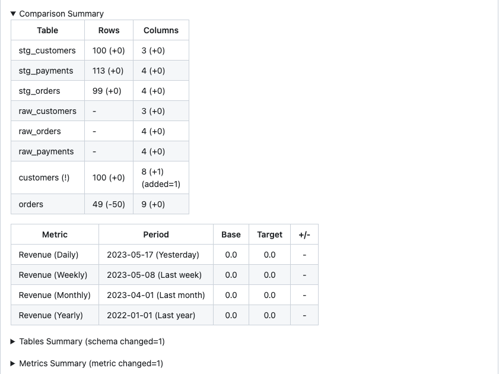

# Jaffle Shop

Incorporating PipeRider into your current dbt project is a seamless process, thanks to PipeRider's built-in zero-configuration support for dbt.

This guide utilizes the [Jaffle Shop](https://github.com/dbt-labs/jaffle\_shop) project from dbt as a practical illustration of how to effectively employ PipeRider in conjunction with a dbt project.

In this guide you will do the following:

1. [Configure the Jaffle Shop project](dbt.md#1.-configure-the-jaffle-shop-project)
2. [Install and add PipeRider to the Jaffle Shop project](dbt.md#2.-install-and-add-piperider-to-the-jaffle-shop-project)
3. [Run PipeRider](dbt.md#3.-run-piperider)
4. [Compare for your pull request](dbt.md#3.-compare-for-a-pull-request.)
5. [Next step: Automate the process in the CI](dbt.md#4.-automate-the-procss-in-the-ci)

## 1. Configure the Jaffle Shop project

Clone the jaffle shop repository

```
git clone https://github.com/dbt-labs/jaffle_shop.git
cd jaffle_shop
```

Follow the ‘[Running this project](https://github.com/dbt-labs/jaffle\_shop#running-this-project)’ instructions in the [Jaffle shop](https://github.com/dbt-labs/jaffle\_shop) repository to install and configure the dbt project or you can follow the following instruction to setup project on [DuckDB](https://duckdb.org/).

<details>

<summary>Use DuckDB</summary>

(Optional) Setup the virtual env

```
python -m venv ./venv
source ./venv/bin/activate 
```

Install [`dbt-duckdb`](https://docs.getdbt.com/reference/warehouse-setups/duckdb-setup)

```bash
pip install dbt-duckdb
```

Copy the following content to `profiles.yml` and place it under the jaffle\_shop directory.

```yaml
# ./profiles.yml
jaffle_shop:
  target: dev
  outputs:
    dev:
      type: duckdb
      path: jaffle_shop.duckdb
```

Run dbt and make sure everything works

```
dbt build
```

</details>

Once configured, or if you already have a dbt project you want to use, proceed to step #2.

## 2. Install and add PipeRider to the Jaffle Shop project

### Install PipeRider

PipeRider supports many data sources through connectors. For a full list, please refer to [Supported Data Sources](../../reference/supported-data-sources/).&#x20;

Install PipeRider with the required connector for the data source you used to configure the Jaffle Shop project in step #1.

For example, to install PipeRider with the **DuckDB** connector, you would use the following command:

```bash
pip install -U 'piperider[duckdb]'
```

### Verify PipeRider configuration

Ensure that PipeRider can connect to the data source by running the `diagnose` command.

```bash
piperider diagnose
```

```
Diagnosing...
PipeRider Version: 0.25.0.dev
Check config files:
  /private/tmp/jaffle_shop/.piperider/config.yml: [OK]
✅ PASS

Check format of data sources:
  dev: [OK]
✅ PASS

Check connections:
  DBT: duckdb > jaffle_shop > dev [OK]
  Name: dev
  Type: duckdb
  connector: [OK]
  Connection: [OK]
✅ PASS

Check assertion files:
✅ PASS

🎉 You are all set!
```

If everything is configured corrected you’ll see the '_You are all set!_’ message.

## 3. Run PipeRider

Run your first report

```
piperider run
```

It will list all the sources, seeds, and models and the schema definition. However, at this step, the report doesn't contain much information. You can add model profiling and metric querying in the subsequent steps.

### Enable profiling on your models

By default, PipeRider does not profile any models. However, you can enable profiling by adding the `piperider` tag to the models you wish to be profiled. Here's an example of how to add tags in the project file

```diff
# dbt_project.yml
models:
  jaffle_shop:
+     +tags: piperider
      materialized: table
      staging:      
        materialized: view
```

Check all the models are well-configured

```
dbt list -s tag:piperider --resource-type model  
```

Run PipeRider again

```bash
piperider run
```

The report contains profiling statistics for each of the profiled models.

<figure><figcaption></figcaption></figure>

### Add metric to query

In dbt, you have the ability to define metrics that specify how to query your time series data. PipeRider offers automatic report generation based on these defined metrics.

To add a metric to your project, you can include the following content in the `models/revenue.yml` file. Note that the metric has the `piperider` tag, indicating that PipeRider should automatically query this metric:

```
# models/revenue.yml
version: 2

metrics:
  - name: revenue
    label: Revenue
    model: ref('orders')
    description: "The total revenue of our jaffle business"

    calculation_method: sum
    expression: amount 

    timestamp: order_date
    time_grains: [day, week, month, year]

    filters:
      - field: status
        operator: '='
        value: "'completed'"

    tags: ['piperider']


```

Check the metric is well-configured

```
dbt list -s tag:piperider --resource-type metric  
```

Run PipeRider again

```
piperider run
```

The report includes metric queries for your data. However, please note that since the Jaffle Shop data is only available for the year 2018, you will only be able to view the data in the yearly report. This report displays the data for the last 10 years.

<figure><figcaption></figcaption></figure>

### Commit the change

In order for compare tutorial below, we need to commit current changes.

```sh
git add profiles.yml # If you configure the dbt profiles in your project
git add '.piperider/*' dbt_project.yml models/revenue.yml
git commit -s -m 'Integrate with PipeRider'
```

## 3. Compare for a pull request.

When we want to develop a new feature, we may follow the [GitHub workflow](https://docs.github.com/en/get-started/quickstart/github-flow), which contains the following steps

1. Create a branch
2. Make changes
3. Create a pull review
4. Address review comments
5. Merge your pull request

PipeRider can help you generate the compare report for code review in your dbt project.

### Create a branch for develop

```
git checkout -b feature/change-my-project
```

### Make changes

First, we add a new column to the `customers` table

```diff
# models/customers.sql
...  
  final as (

      select
          customers.customer_id,
          customers.first_name,
          customers.last_name,
          customer_orders.first_order,
          customer_orders.most_recent_order,
+         customer_payments.total_amount / customer_orders.number_of_orders as average_value_per_order,
          customer_orders.number_of_orders,
          customer_payments.total_amount as customer_lifetime_value

      from customers
...
```

Next, we add a filter to the orders table.

```diff
# models/customers.sql
...
final as (

    select
        orders.order_id,
        orders.customer_id,
        orders.order_date,
        orders.status,

        


        order_payments.{{ payment_method }}_amount,

        


        order_payments.total_amount as amount

    from orders


    left join order_payments
        on orders.order_id = order_payments.order_id
    
+   where orders.order_id > 50
)

...
```

Test your changes, make sure it can run successfully

```
dbt build
```

You can also run PipeRider again to see the report

```
piperider run
```

Commit your changes

```
git add 'models/*'
git commit -s -m 'Test PipeRide compare'
```

### Create the compare report

```
piperider compare
```

You can find the change in the report

1. Add new column
2. The row counts change in the orders table
3. The metric change because the orders table definition change.

<figure><figcaption><p>Add new column</p></figcaption></figure>

<figure><figcaption><p>The row count changes</p></figcaption></figure>

<figure><figcaption><p>The metric change</p></figcaption></figure>

### Add comparison summary to your pull request comment

You can also paste the comparison summary `summary.md` to a PR comment.

<figure><figcaption></figcaption></figure>

## Next Step: Automate the process in the CI

The process mentioned above is also manual. However, if you wish to automate this action, you can [integrate PipeRider in your CI workflow](../../ci/introduction.md).


