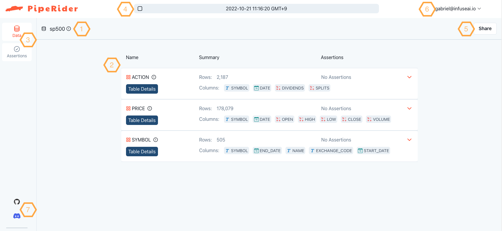
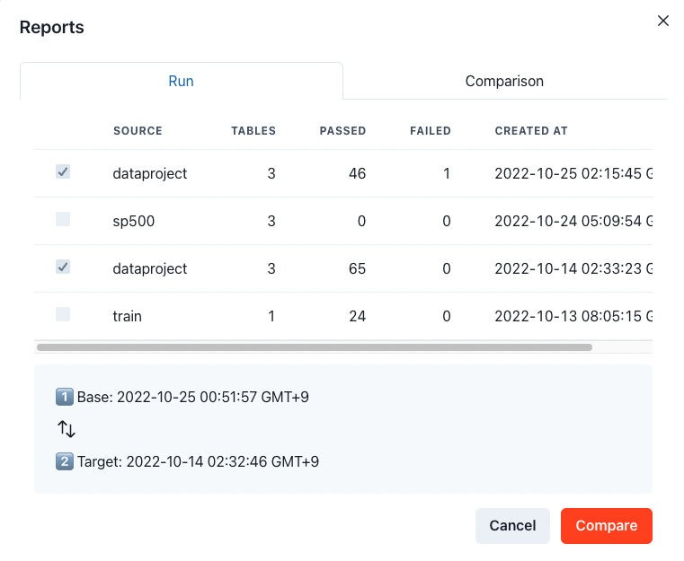
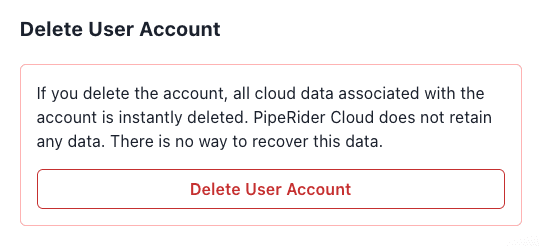

# Get Started

## PipeRider Cloud features

With a [PipeRider Cloud](https://cloud.piperider.io) account you can upload reports from PipeRider CLI and access the following features:

* Create workspaces to organize reports and share with team members
* Share reports online
* Compare reports online
* View time-series data for certain profile statistics

Reports can be configured to automatically upload each time PipeRider is ran, or can be uploaded individually (see below).

## Sign up for PipeRider Cloud

There are two ways to sign up for PipeRider Cloud, either via the website, or by using PipeRider CLI.&#x20;

It is preferable to sign up via the CLI as this will simultanously create an account and enable you to configure your API key for report uploading.

### Website

To sign up for PipeRider Cloud via the website navigate to the [sign up page](https://cloud.piperider.io/signup) and fill out the sign up form.

### PipeRider CLI

The PipeRider CLI signup method if geared towards users who want to obtain an API token, and therefore entering the API token is part of the process:

1. Ensure that you have installed [PipeRider CLI](../get-started/quick-start.md).
2. Run `piperider cloud signup`.
3. Enter your email address.
4. Open your email account and find the 'welcome' email.
5. Click the 'Get API Token' button in the email.
6. Set your account password  by filling out `New Password` and `Confirm New Password` (leave `Current Password` blank), and then click `Update Password`.
7. Copy the API token.
8. Go back to the command line and paste the API token.
9. Your account is now created and you are logged in via PipeRider CLI

### Log in

If you have already created a PipeRider Cloud account and need to log in via the CLI, you need to obtain the API token from your account.&#x20;

1. Navigate to your [PipeRider Cloud profile page](https://cloud.piperider.io/settings/profile).
2. Copy the Token.
3. On the command line run `piperider cloud login`.
4. Enter your email address.
5. Paste the API token.

If successful, your account details will be displayed in the output.

```
[?] API token: abc123
───────────────────────────── Login Successful ───────────────────────────────────
                                User Profile

  Email                  Username      Full Name    Storage Location   Timezone
──────────────────────────────────────────────────────────────────────────────────
  support@piperider.io   Support       PipeRider    North America      Asia/Taipei
  
  [Config] Default project is set to 'workspace/default'\
```

### Verify PipeRider Cloud connection

If you need to verify that your current PipeRider Cloud connection settings are valid, run the following command from inside your project:&#x20;

```
piperider diagnose
```

If correctly configured, you should see `PASS` for the `Check cloud account` test.

```
Check cloud account:
  Run as user: support@infuseai.io
    User Name: Support
    Full Name: PipeRider Support
  Auto Upload: False
  Default project: workspace-name/project-name
✅ PASS
```

By default, Auto Upload is not configured. See below for instructions on how to upload reports.

## How to upload reports to PipeRider Cloud

Reports can either be uploaded on a per-report basis, or PipeRider can be configured to automatically upload all reports.

### Manually upload reports to PipeRider Cloud

Reports can be uploaded on a per-run basis using the `--upload` option.

```
piperider run --upload
```

Existing reports can also be uploaded with the following command:

```
piperider cloud upload-report
```

You will be prompted to select the reports you wish to upload from a list.

### Automatically upload reports

Upload settings are configured in your PipeRider profile, located at  `~/.piperider/profile.yml`.

To enable autotomatic uploading, add `auto_upload: true` to the `cloud_config` section of your PipeRider profile:


```yaml
user_id: user123
...
api_token: abc123
cloud_config:
  default_project: workspace-name/project-name
  auto_upload: true
```


If enabled, `auto_upload` will automatically upload reports, without prompt, as they are generated. Such as with `piperider run` or `piperider compare-reports`. &#x20;

## Cloud Overview

<figure><figcaption><p>Landing Page</p></figcaption></figure>

1. Data source name
2. Current Report context
3. Data / Assertions tab
4. Navigation bar
5. Report sharing button
6. Profile dropdown
7. Community channels

By default, the landing page shows the context of latest report.

### Navigate Reports

Click the _navigation bar_, the pop-up will list the all of upload reports and comparison reports if any.

Click on a run to view the report.

<figure><figcaption><p>Navigate Reports</p></figcaption></figure>

### Metric Monitoring

Once multiple profiling results are uploaded under the _same data source_. PipeRider Cloud will analyze and display the trending of a few metrics that it could help you monitor/capture if any considerable changes.

<figure><figcaption><p>Metrics Trending</p></figcaption></figure>


Select a metric or a timespan from drop-downs or drag/scroll on the area of the chart to zoom in/out.


### Compare Reports

Select any two of reports for the comparison. Click _Cancel_ to clear the selection.

<figure><figcaption><p>Compare Reports</p></figcaption></figure>

### Share Report

Click _Share_ to toggle the sharing and gain the sharable URL.

### User Profile

View/Edit the profile and retrieve the token again.

<figure><figcaption><p>User Profile</p></figcaption></figure>

### Delete your account

To delete your account, and all associated data and reports, click the **Delete User Account** button at the bottom of your [User Profile](https://cloud.piperider.io/settings/profile) page.

<figure><figcaption><p>Click the Delete User Account button</p></figcaption></figure>

You will be prompted to enter your account email to confirm you really want to delete the account. Click **Delete User Account** to initiate your account deletion.

<figure><figcaption><p>Enter the email address associated with your account</p></figcaption></figure>

You will be prompted to take the survey, click the **Let's Go** button to start the survey (it's only three questions).

<figure><figcaption><p>Complete the survey to finalize your account deletion</p></figcaption></figure>

Once the survey is complete your account will be deleted and you will receive and confirmation email.


Please note that your account and data is not deleted until the survey has been submitted

