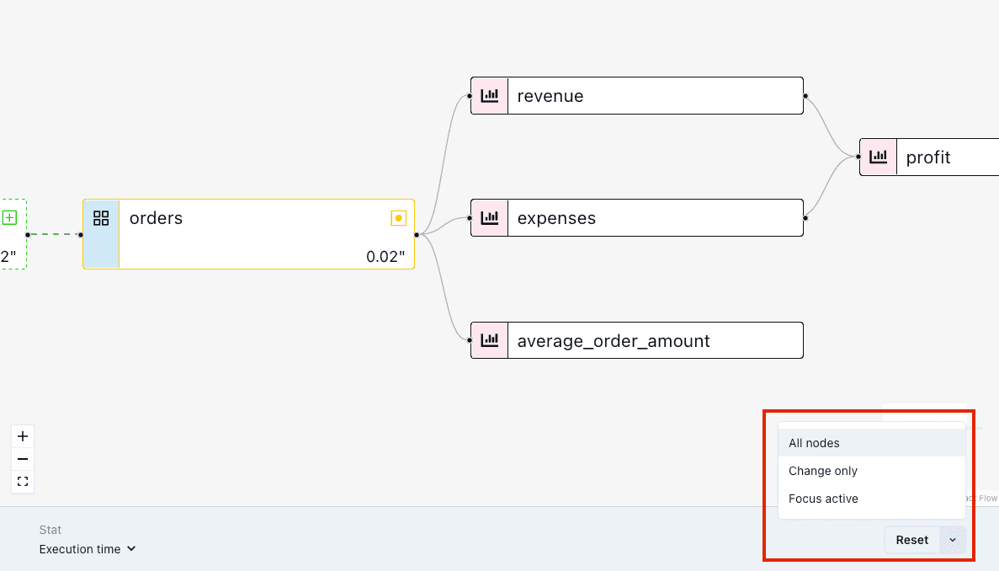

# Lineage Diff

**Lineage Diff** is a PipeRider Cloud feature that enables you to compare the lineage of your dbt project before and after making code changes. Using a DAG (Directed Acyclic Graph), Lineage Diff highlights the models and metrics in your project that have been impacted by changes to your code or data.

## How to Use Lineage Diff


This documentation assumes that you have already created a PipeRider Cloud account and **uploaded at least two reports** for your project


To open the lineage DAG, click the. ‘Show Graph’ button at the bottom right of the comparison report. The ‘Change Only’ view is shown by default, which shows impacted nodes.

<figure><figcaption>
View the Lineage Diff (lineage change) for your dbt project
</figcaption></figure>

### Select nodes

Use the node selector at the bottom right of the lineage graph to switch between:

* All nodes - view the whole project (or that which was included in this PipeRider run).
* Change only - view only impacted nodes.
* Focus active - view the active node and its lineage (click a node to focus it).

<figure><figcaption>
Select which nodes to view using the node selector at the bottom right
</figcaption></figure>

### Show stats

The following stats can be displayed for nodes:

* Row count
* Execution time (dbt build time)

<figure><figcaption>
Display stats for nodes using the Stat selector at the bottom left
</figcaption></figure>
