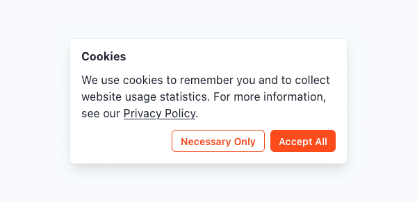

# Telemetry

In order to provide a better user experience, PipeRider collects telemetry data about how the software and website are used. Telemetry gathering for PipeRider CLI and PipeRider Cloud is handled separately. Please refer to the relevant section to see what information is collected and how to opt-out.

* [PipeRider CLI telemetry](telemetry.md#piperider-cli-telemtry)
* [PipeRider Cloud telemetry](telemetry.md#piperider-cloud-telemetry)

## PipeRider CLI telemetry

PipeRider CLI gathers telemetry data per-user and project.

### User Telemetry

A `user_id` is stored in in your profile.yml file located in `~/.piperider/profile.yml`

```yaml
user_id: abc123
anonymous_tracking: true
```

#### Opt-out of user telemetry

To opt-out of _all_ telemetry tracking change the value of `anonymous_tracking` to false.

```yaml
anonymous_tracking: false
```

### **Project telemetry**

Each time you create a PipeRider project a telemetry ID will be created. This telemetry ID is linked to your `user_id`.

#### Opt-out of project telemtry

To opt-out of tracking on a per-project basis, you can remove the telemetry ID located in your project's configuration file, `.piperider/config.yml` .

```yaml
telemetry:
  id: xyz123
```

### What information is stored?

For each `user_id` the following information is stored:

#### User information

* First seen: The date that you first used PipeRider
* Last seen: The date of the last time you used PipeRider
* Location: Country and region (via IP address)
* Platform: Operating system
* Device ID: A unique identifier for your device
* Python version

#### Project information

* Project ID (telemetry ID)
* Current PipeRider version
* Initial PipeRider version (the first version installed)
* Data source type E.g. Snowflake, Postgres, etc.
* The following information is also stored on a per event\* basis
  * Number of tables in the data source
  * Number of columns and rows in the data source
  * Number of built-in assertions in use
  * Number of custom assertions in use
  * Number of passed and failed assertions

\* An event refers to a PipeRider command such as `run`, `generate-assertions`, `generate-report` etc.

## PipeRider Cloud telemetry

When logging into PipeRider Cloud you will be presented with the Cookies notification. There are two options, Accept All, and Necessary Only.

<figure><figcaption><p>PipeRider Cloud cookie notification</p></figcaption></figure>

### Accept All

Selecting Accept All will use a cookie to allow you to log in and remember your session; and also enable PipeRider Cloud telemetry. Please [see below](telemetry.md#what-information-is-stored-1) for a list of information that is stored.

### Necessary Only

Selecting Necessary Only will use a cookie to allow you to log in and remember you session, PipeRider Cloud telemetry will _not_ be gathered.

Use this option if you wish to op-out of PipeRider Cloud telemetry.

### What information is stored?

When enabled, PipeRider Cloud will gather telemetry data about the following actions:

* Visited pages
* Sources used for report comparison
* Metrics selected when using the historical trend graph
* Actions performed on the site, such as
  * Logging in/out
  * Updating user profile
  * Uploading a report
  * Sharing a report
  * Opening the feedback form
  * Submitting feedback
  * Comparing reports

## Privacy Policy and Terms of Use

Please refer to our [Privacy Policy](privacy-policy.md) and [Terms of Use](terms-of-use.md) for more information.
