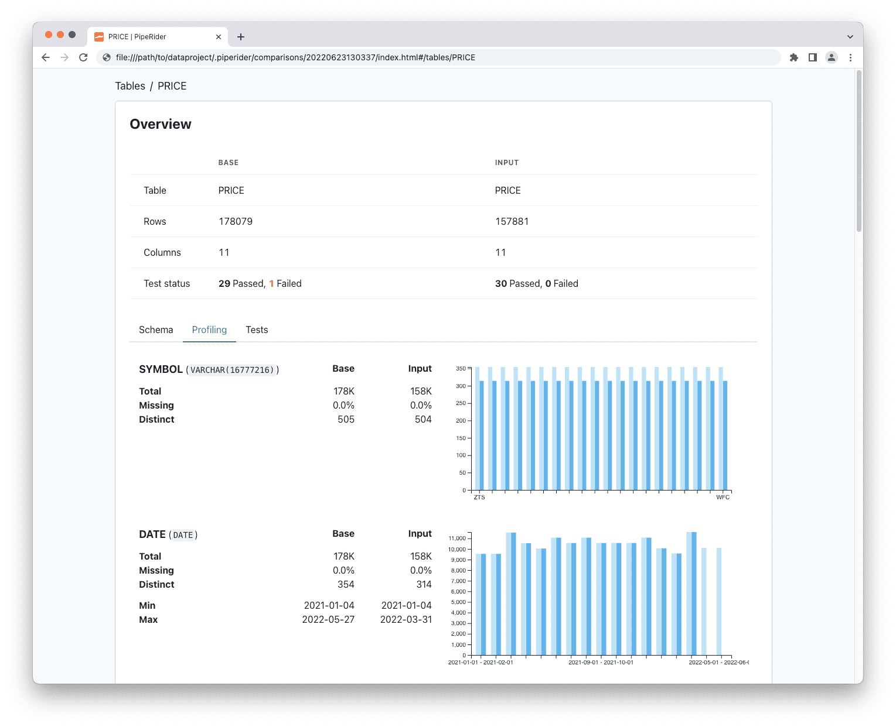

# Quick Start

This quick start guide will show you how to:

* [Install PipeRider](quick-start.md#install-piperider-via-pip)
* [Prepare a SQLite data source](quick-start.md#prepare-sqlite-database)
* [Initialize a new PipeRider project](quick-start.md#initialize-a-new-piperider-project)
* [Run PipeRider](quick-start.md#run-piperider-profile-data-test-assertions-generate-report)
* [Apply data assertions](quick-start.md#apply-data-assertions)
* [Compare reports](quick-start.md#compare-reports)

PipeRider currently supports three data sources - SQLite, Postgres, and Snowflake. In this guide we will be using SQLite.

### Before you start

Ensure you have the following installed:

* Python 3.7+

### Install PipeRider via pip

PipeRider can be installed via pip with the following command.

```shell
pip install piperider -U
```

### Prepare SQLite database

Create a directory for the new project then either place your own SQLite database inside or download the sample database below.

```shell
mkdir dataproject && cd dataproject
curl -o sp500.db https://piperider-data.s3.ap-northeast-1.amazonaws.com/getting-started/sp500_20220401.db
```

### Initialize a new PipeRider project

The `init` command creates a `.piperider` directory, inside the current directory, where all of the project files will be stored. This includes data source configuration, data quality assertions, data profiling information, and generated report files.

```shell
piperider init
```

Enter a a name for your project, e.g. `dataproject`.

```shell
What is your project name? (alphanumeric only)
```

Using the arrow keys, select `sqlite` as the desired data source.

```
What data source would you like to connect to?
  snowflake
  postgres
> sqlite
```

#### Verify project configuration

Use the `diagnose` command to check the project settings and ensure PipeRider can connect to the data source.

```
piperider diagnose
```

Sample output:

```
Diagnosing...
PipeRider Version: x.x.x
Check config files:
  /path/to/dataproject/.piperider/config.yml: [OK]
✅ PASS

Check format of data sources:
  dataproject: [OK]
✅ PASS

Check connections:
  Name: dataproject 
  Type: sqlite
  Available Tables: ['ACTION', 'PRICE', 'SYMBOL']
  Connection: [OK]
✅ PASS

Check dbt catalog files:
  dataproject: [SKIP] provider is not dbt
✅ PASS

Check assertion files:
✅ PASS

🎉 You are all set!
```

### Run PipeRider - Profile data, test assertions, generate report

The `run` command performs the following functions.

On first run:

* Analyzes the data source and generates a data profile.
* Offers to generate recommended assertions and check the data profile against these assertions.
* Generates blank assertion templates if recommended assertions were not created.
* Generates a report.

On subsequent runs:

* Analyzes the data source and generates a data profile.
* Checks the data profile against any existing assertions.
* Generates a report.

```
piperider run
```

#### Sample output for first run

PipeRider analyzes the data source and generates a data profile.

```shell
DataSource: dataproject
─────────────────────────────────────────────────────────────────────────────────────── Profiling ────────────────────────────────────────────────────────────────────────────────────────
fetching metadata
profiling [ACTION.SYMBOL] type=VARCHAR(16777216)
profiling [ACTION.DATE] type=DATE
profiling [ACTION.DIVIDENDS] type=NUMERIC(8, 4)
profiling [ACTION.SPLITS] type=NUMERIC(10, 2)
profiling [PRICE.SYMBOL] type=VARCHAR(16777216)
profiling [PRICE.DATE] type=DATE
profiling [PRICE.OPEN] type=NUMERIC(10, 2)
profiling [PRICE.HIGH] type=NUMERIC(10, 2)
profiling [PRICE.LOW] type=NUMERIC(10, 2)
profiling [PRICE.CLOSE] type=NUMERIC(10, 2)
profiling [PRICE.VOLUME] type=NUMERIC(38, 0)
profiling [PRICE.ADJCLOSE] type=NUMERIC(10, 2)
profiling [PRICE.MA5] type=NUMERIC(10, 2)
profiling [PRICE.MA20] type=NUMERIC(10, 2)
profiling [PRICE.MA60] type=NUMERIC(10, 2)
profiling [SYMBOL.SYMBOL] type=VARCHAR(16777216)
profiling [SYMBOL.NAME] type=VARCHAR(16777216)
profiling [SYMBOL.START_DATE] type=DATE
profiling [SYMBOL.END_DATE] type=DATE
profiling [SYMBOL.DESCRIPTION] type=VARCHAR(16777216)
profiling [SYMBOL.EXCHANGE_CODE] type=VARCHAR(16777216)
profiling [SYMBOL.MARKET] type=VARCHAR(16777216)
profiling [SYMBOL.COUNTRY] type=VARCHAR(16777216)
profiling [SYMBOL.SECTOR] type=VARCHAR(16777216)
profiling [SYMBOL.INDUSTRY] type=VARCHAR(16777216)
profiling [SYMBOL.RECOMMENDATION_KEY] type=VARCHAR(16777216)
```

PipeRider will offer to generate recommended assertions. Answer 'yes'.

```
No assertion found
Do you want to auto generate recommended assertions for this datasource [Yes/no]? Yes
```

A recommended assertion YAML file for each table will be created under `.piperider/assertions/` and you will be prompted to run the recommended assertions. Answer 'yes'.

```
Recommended Assertion: /path/to/dataproject/.piperider/assertions/recommended_ACTION.yml
Recommended Assertion: /path/to/dataproject/.piperider/assertions/recommended_PRICE.yml
Recommended Assertion: /path/to/dataproject/.piperider/assertions/recommended_SYMBOL.yml
Do you want to run above recommended assertions for this datasource [yes/no]? yes
```

PipeRider will test the data profile against the assertions and display the results.

```shell-session
──────────────────────────────────────────── Assertion Results ────────────────────────────────────────────
[  OK  ] SYMBOL                     assert_row_count_in_range   Expected: {'count': [454, 555]} Actual: 505
[  OK  ] SYMBOL.SYMBOL              assert_column_type          Expected: {'type': 'string'} Actual: string
[  OK  ] SYMBOL.SYMBOL              assert_column_unique        Expected: {'success': True} Actual: {'success': True}
[  OK  ] SYMBOL.NAME                assert_column_type          Expected: {'type': 'string'} Actual: string
[  OK  ] SYMBOL.NAME                assert_column_unique        Expected: {'success': True} Actual: {'success': True}
[  OK  ] SYMBOL.START_DATE          assert_column_type          Expected: {'type': 'datetime'} Actual: datetime
[  OK  ] SYMBOL.END_DATE            assert_column_type          Expected: {'type': 'datetime'} Actual: datetime
...
...
...
[  OK  ] PRICE.MA60                 assert_column_max_in_range  Expected: {'max': [4959.585, 6061.715]} Actual:
{'max': 5510.65}

──────────────────────────────────────────────── Summary ───────────────────────────────────────────────────────
Table 'ACTION'
  4 columns profiled
  9 test executed

Table 'PRICE'
  11 columns profiled
  30 test executed

Table 'SYMBOL'
  11 columns profiled
  14 test executed
  
Generating reports from: /path/to/dataproject/.piperider/outputs/latest/run.json
Report generated in /path/to/dataproject/.piperider/outputs/latest/index.html
```

A summary of the assertion tests that were executed is displayed, along with the location of two files:

* `run.json` - The data profile used for the assertions test.
* `index.html` - The report that was generated for this run.

Open the HTML report in the browser to see the visualized results or share it with your team.


Refer to [How-To: Generate Report](how-to/generate-report.md) for other methods generate reports


### Apply data assertions

In your text editor, open `.piperider/assertions/recommended_PRICE.yml` . The auto-generated assertions file will look like this:

```yaml
# Auto-generated by Piperider based on table "PRICE"
PRICE:  # Table Name
  description: Stock price
  # Test Cases for Table
  tests:
  - name: assert_row_count_in_range
    assert:
      count:
      - 160271
      - 195886
    tags:
    - RECOMMENDED
  columns:
    SYMBOL:  # Column Name
      description: Stock symbol
      # Test Cases for Column
      tests:
      - name: assert_column_type
        assert:
          type: string
        tags:
        - RECOMMENDED
    DATE: # Column Name
      description: Record date
      # Test Cases for Column
      tests:
      - name: assert_column_type
        assert:
          type: datetime
        tags:
        - RECOMMENDED
    OPEN: # Column Name
      description: Opening price
      # Test Cases for Column
      tests:
      - name: assert_column_type
        assert:
          type: numeric
        tags:
        - RECOMMENDED
      - name: assert_column_min_in_range
        assert:
          min:
          - 6
          - 7
        tags:
        - RECOMMENDED
...
...
...
```

You can modify these auto-generated [assertion](data-quality-assertions/assertion-configuration.md) logic or add make your own [custom assertions](data-quality-assertions/custom-assertions.md), and then execute `piperider run` again to see the results.


Refer to [Built-In Assertions](data-quality-assertions/assertion-configuration.md) and [Custom Assertions](data-quality-assertions/custom-assertions.md) for detailed assertion settings


### Compare reports

`compare-reports` enables you to create a comparison report that compares two different reports. The comparison report is useful for seeing how your data has changed over time.

To simulate a change in your data, download the following sqlite database overwriting the existing one.

```
curl -o sp500.db https://piperider-data.s3.ap-northeast-1.amazonaws.com/getting-started/sp500_20220527.db
```

Execute `run` to generate new profiling results and a report from the updated database .

```
piperider run
```

As the data has changed since we generated assertions, you will notice that some assertions now fail.

```
──────────────────────────────────────────── Assertion Results ────────────────────────────────────────────
...
[  OK  ] SYMBOL.RECOMMENDATION_KEY  assert_column_type          Expected: {'type': 'string'} Actual: string
[FAILED] ACTION                     assert_row_count_in_range   Expected: {'count': [1764, 2156]} Actual: 2187
[  OK  ] ACTION.SYMBOL              assert_column_exist         Expected: {'success': True} Actual: {'success': True}
[  OK  ] ACTION.SPLITS              assert_column_min_in_range  Expected: {'min': [0.117, 0.14300000000000002]} Actual: {'min': 0.13}
...
[FAILED] PRICE                      assert_row_count_in_range   Expected: {'count': [142092, 173669]} Actual: 178079
[  OK  ] PRICE.SYMBOL               assert_column_type          Expected: {'type': 'string'} Actual: string
...
```

The Summary also shows which tests failed.

```
──────────────────────────────────────────────── Summary ───────────────────────────────────────────────────────
Table 'ACTION'
  4 columns profiled
  9 test executed
  1 of 9 tests failed:
  [FAILED] ACTION assert_row_count_in_range  Expected: {'count': [1764, 2156]} Actual: 2187

Table 'PRICE'
  11 columns profiled
  30 test executed
  1 of 30 tests failed:
  [FAILED] PRICE assert_row_count_in_range  Expected: {'count': [142092, 173669]} Actual: 178079

Table 'SYMBOL'
  11 columns profiled
  14 test executed
```

Now that you have a second report, run the `compare-reports` command.

```
piperider compare-reports
```

You will be prompted to select two reports for the comparison. Select the most recent report and one report from before you downloaded the new database.

```
[?] Please select the 2 reports to compare ( SPACE to select, and ENTER to confirm ):
   X dataproject  #table=3      #pass=51    #fail=2     2022-06-23T13:01:37.543978Z
 > X dataproject  #table=3      #pass=53    #fail=0     2022-06-23T12:48:11.794525Z
```

PipeRider will generate an HTML report of the comparison.

```
Selected reports:
  Base:  /path/to/dataproject/.piperider/outputs/dataproject-20220623130137/run.json
  Input: /path/to/dataproject/.piperider/outputs/dataproject-20220623124811/run.json

Comparison report: /path/to/dataproject/.piperider/comparisons/20220623130337/index.html
```

Open the HTML comparison report in your browser to review any changes or share it with your team.



\----

From the output you can see the results in the following format:

Furthermore, you will see the profiling and assertions results, and with a generated `run.json` and a generated HTML report, `index.html`.

| Result | Table\[.Column] | Used Assertion                 | Justification                                     |
| ------ | --------------- | ------------------------------ | ------------------------------------------------- |
| OK     | SYMBOL          | assert\_row\_count\_in\_range  | `Expected: {'count': [454, 555]} Actual: 505`     |
| FAILED | ACTION.SPLITS   | assert\_column\_min\_in\_range | `Expected: {'min': [0, 0]} Actual: {'min': 0.13}` |
| OK     | PRICE.SYMBOL    | assert\_column\_type           | `Expected: {'type': 'string'} Actual: string`     |
